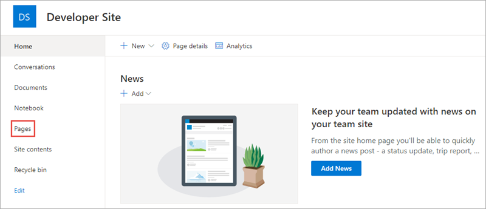
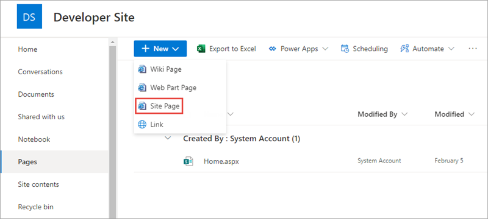
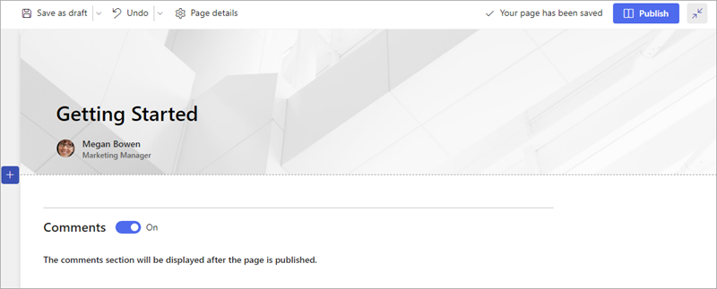
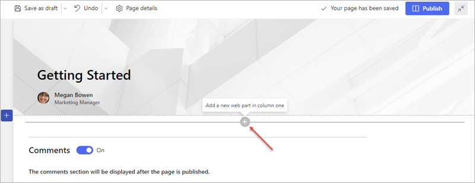
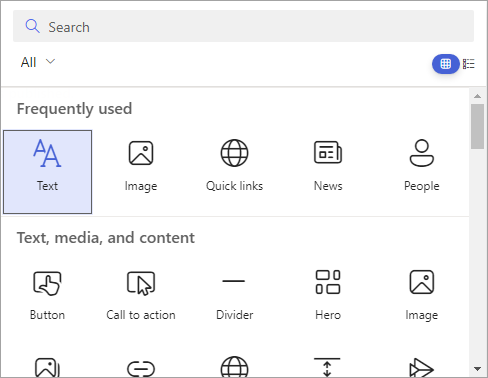
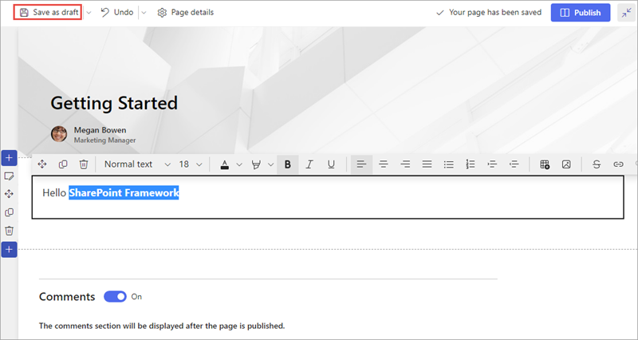
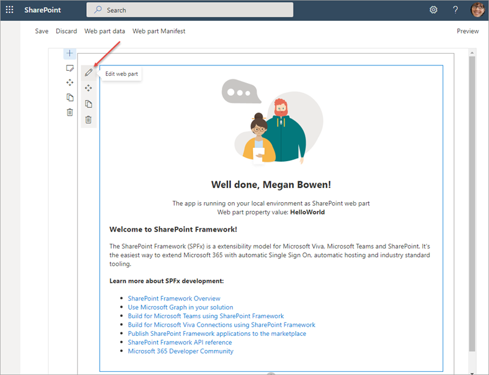
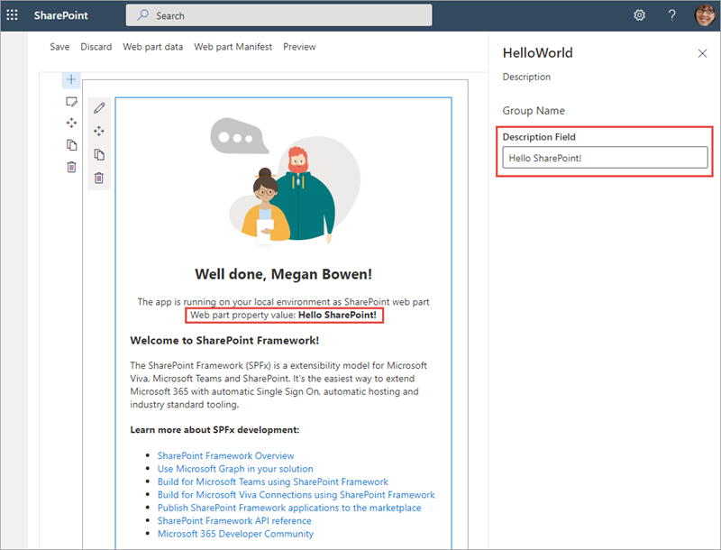

In this exercise, you'll add and interact with SharePoint Framework-based client-side web parts in a SharePoint Online modern site collection.

Open a browser and navigate to the developer site you created in the first exercise. If prompted, log in using your Work or School credentials.

Select the **Pages** link in the left-hand Quick Launch navigation menu.



In the **Pages** library, select the **New** button from the toolbar and select **Site Page** to create a new page.



Set the name of the page to **Getting Started**.



Select the web part icon button to open the list of available web parts.



Select the web part **Text**.



When the web part is added to the page, add some text and use the rich-text formatting tools provided in the toolbar.


Select **Save as draft** to see the page as your users will see it.




## Verify your developer environment is properly configured

> [!NOTE]
> The instructions below assume you're using v1.13.1 of the SharePoint Framework Yeoman generator.

Use the tools installed in the second exercise to create a new SharePoint Framework component and test it using the local workbench.

Open a command prompt and change to an empty folder where you want to store the files for the project.

Run the SharePoint Yeoman generator by executing the following command:

```console
yo @microsoft/sharepoint
```

Use the following to complete the prompt that is displayed:

* **What is your solution name?**: HelloWorld
* **Only SharePoint Online (latest) is supported.  For earlier versions of SharePoint (2016 and 2019) please use the 1.4.1 version of the generator**: SharePoint Online only (latest)
* **Where do you want to place the files?**: Use the current folder
* **Do you want to allow the tenant admin the choice of being able to deploy the solution to all sites immediately without running any feature deployment or adding apps in sites?**: No
* **Will the components in the solution require permissions to access web APIs that are unique and not shared with other components in the tenant?**: No
* **Which type of client-side component to create?**: WebPart
* **What is your Web part name?**: HelloWorld
* **What is your Web part description?**: HelloWorld description
* **Which framework would you like to use?**: No JavaScript framework

After provisioning the folders required for the project, the generator will install all the dependency packages using NPM.

When NPM completes downloading all dependencies, install the developer certificate by executing the following command:

```console
gulp trust-dev-cert
```

Run the project by executing the following command:

```console
gulp serve --nobrowser
```

The SharePoint Framework's gulp **serve** task with the **nobrowser** switch will build the project and start a local web server.

Wait for the **reload** subtask to finish executing. At this point, the web part will be ready for testing.


Open a browser and navigate to the developer site you created in the first exercise. If prompted, log in using your Work or School credentials. Append the following to the end of the site's URL: **/_layouts/workbench.aspx**. This is the SharePoint Online hosted workbench.


Select the web part icon button to open the list of available web parts and select the **HelloWorld** web part from the **Local** section.


Edit the web part's properties by selecting the pencil (edit) icon in the toolbar to the left of the web part.



In the property pane that opens, change the value of the **Description Field**. Notice how the web part updates as you make changes to the text.



Close the browser and stop the local web server by pressing <kbd>CTRL</kbd>+<kbd>C</kbd> in the command prompt.

## Summary

In this exercise, you added and interacted with SharePoint Framework-based client-side web parts in a SharePoint Online modern site collection.
