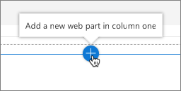
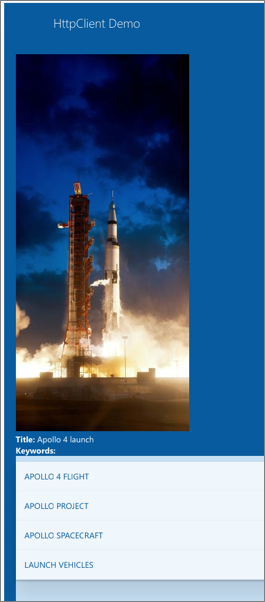

In this exercise, you'll create a new SharePoint Framework project with a single client-side web part that uses React to display the results from a call to an anonymous third-party API: the [NASA Image REST API](https://images.nasa.gov/docs/images.nasa.gov_api_docs.pdf).

## Create the SharePoint Framework solution

> [!IMPORTANT]
> The instructions below assume you are using v1.11.0 of the SharePoint Framework Yeoman generator.

Open a command prompt and change to the folder where you want to create the project. Run the SharePoint Yeoman generator by executing the following command:

```shell
yo @microsoft/sharepoint
```

Use the following to complete the prompt that is displayed (*if additional options are presented, accept the default answer)*:

- **What is your solution name?**: SPFxHttpClient
- **Which baseline packages do you want to target for your component(s)?**: SharePoint Online only (latest)
- **Where do you want to place the files?**: Use the current folder
- **Do you want to allow the tenant admin the choice of being able to deploy the solution to all sites immediately without running any feature deployment or adding apps in sites?**: No
- **Will the components in the solution require permissions to access web APIs that are unique and not shared with other components in the tenant?**: No
- **Which type of client-side component to create?**: WebPart
- **What is your Web part name?**: SPFxHttpClient
- **What is your Web part description?**: SPFxHttpClient description
- **Which framework would you like to use?**: React

After provisioning the folders required for the project, the generator will install all the dependency packages by running `npm install` automatically. When NPM completes downloading all dependencies, open the project in **Visual Studio Code**.

## Update the public interface for the React component

Locate and open the file **./src/webparts/spFxHttpClient/components/ISpFxHttpClientProps.ts**. This is the interface for the public properties on the React component.

Update the interface to replace the existing `description` property with a property that will hold a custom object. This object is complex and, while you could create an interface to represent it, in this lab you'll set that complexity aside and focus on consuming an untyped TypeScript object.

```typescript
export interface ISpFxHttpClientDemoProps {
  apolloMissionImage: any;
}
```

## Implement the user interface for the web part

Locate and open the file **./src/webparts/spFxHttpClient/components/SpFxHttpClient.module.scss**.

Add the following classes to the bottom of the file, immediately before the closing `}`:

```scss
.list {
  color: $ms-color-themeDark;
  background-color: $ms-color-themeLight;
  font-family: 'Segoe UI Regular WestEuropean', 'Segoe UI', Tahoma, Arial, sans-serif;
  font-size: 14px;
  font-weight: normal;
  box-sizing: border-box;
  margin: 0 0;
  padding: 10px 0 100px 0;
  line-height: 50px;
  list-style-type: none;
}

.item {
  color: $ms-color-themeDark;
  background-color: $ms-color-themeLighterAlt;
  vertical-align: center;
  font-family: 'Segoe UI Regular WestEuropean', 'Segoe UI', Tahoma, Arial, sans-serif;
  font-size: 14px;
  font-weight: normal;
  box-sizing: border-box;
  margin: 0;
  padding: 0;
  box-shadow: none;
  *zoom: 1;
  padding: 0 15px;
  position: relative;
  box-shadow: 0 2px 4px 0 rgba(0, 0, 0, 0.2), 0 25px 50px 0 rgba(0, 0, 0, 0.1);
}
```

Locate and open the file **./src/webparts/spFxHttpClient/components/SpFxHttpClient.tsx**.

Update the markup returned by the `render()` method to the following code. This will create a list using the CSS classes where each item displays an image, the title of the image, and a list of keywords associated with the image.

```tsx
<div className={ styles.spFxHttpClient }>
  <div className={ styles.container }>
    <div className={ styles.row }>
      <div className={ styles.column }>
        <span className={ styles.title }>HttpClient Demo</span>
      </div>
    </div>

    <div className={ styles.row }>
      
      <div><strong>Title:</strong> { this.props.apolloMissionImage.data[0].title }</div>
      <div><strong>Keywords:</strong></div>
      <ul className={ styles.list }>
        { this.props.apolloMissionImage &&
          this.props.apolloMissionImage.data[0].keywords.map( (keyword) =>
            <li key={ keyword} className={ styles.item }>
              { keyword }
            </li>
          )
        }
      </ul>
    </div>

  </div>
</div>
```

## Implement the web part logic

Locate and open the **./src/webparts/spFxHttpClient/SpFxHttpClientWebPart.ts** file.

Add the following `import` statement to the top of the file after the existing `import` statements:

```typescript
import {
  HttpClient,
  HttpClientResponse
} from '@microsoft/sp-http';
```

Add the following method to the `SpFxHttpClientWebPart` class:

```typescript
private _getApolloImage(): Promise<any> {
  return this.context.httpClient.get(
    `https://images-api.nasa.gov/search?q=Apollo%204&media_type=image`,
    HttpClient.configurations.v1
  )
  .then((response: HttpClientResponse) => {
    return response.json();
  })
  .then(jsonResponse => {
    return jsonResponse;
  }) as Promise<any>;
}
```

This method uses the `HttpClient` available from the current SharePoint context and issues an HTTP GET request to the NASA Image REST API with the query equal to **Apollo 4**. After processing the response to JSON, its returned to the caller as an untyped `any` object.

Update the contents of the `render()` method to the following code:

```typescript
public render(): void {
  if (!this.renderedOnce) {
    this._getApolloImage()
      .then(response => {
        const element: React.ReactElement<ISpFxHttpClientProps > = React.createElement(
          SpFxHttpClient,
          {
            apolloMissionImage: response.collection.items[0]
          }
        );

        ReactDom.render(element, this.domElement);
      });
  }
}
```

In this code, we've added a check to see if the web part has already been rendered on the page. If not, it calls the `_getApolloImage()` method previously added. When it receives a response, it attaches the first item in the results returned by the NASA Imagery REST API.

## Test the web part

Start the local web server and test the web part in the local workbench:

```shell
gulp serve
```

When the workbench loads in a browser, select the *plus* icon to open the toolbox:



Select the web part from the toolbox:


Observe when the web part renders, it shows data from the NASA Imagery REST API:



Stop the local web server by pressing <kbd>CTRL</kbd>+<kbd>C</kbd> in the console/terminal window.

## Summary

In this exercise, you created a new SharePoint Framework project with a single client-side web part that uses React to display the results from a call to an anonymous third-party API: the [NASA Image REST API](https://images.nasa.gov/docs/images.nasa.gov_api_docs.pdf).
