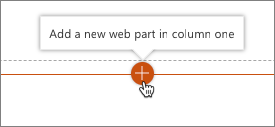
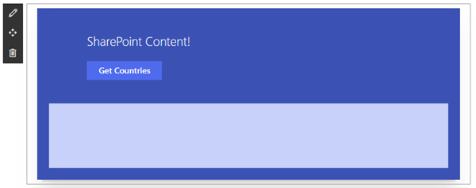
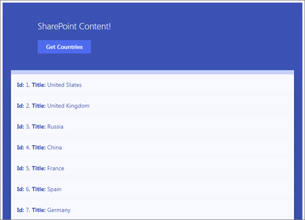

In this exercise, you'll create a SharePoint Framework (SPFx) web part that will get and display data from a SharePoint list using the SharePoint REST API.

## Create a SharePoint list to use for testing

Before you can get display data from a SharePoint list using the SharePoint REST API, you'll first need to create a list and populate it with some data.

In a browser, navigate to a site collection in SharePoint Online. Select **Site Contents** in the left-hand navigation and then select **New > List** in the toolbar.

Set the list name to **Countries** and select **Create**.


Add items to the list by entering the names of different countries as shown in the following image.


## Create the web part to display data using the SharePoint REST API

Open a command prompt and change to the folder where you want to create the project.

> [!IMPORTANT]
> The instructions below assume you are using v1.11.0 of the SharePoint Framework Yeoman generator.

Run the SharePoint Yeoman generator by executing the following command:

```shell
yo @microsoft/sharepoint
```

Use the following to complete the prompt that is displayed (*if additional options are presented, accept the default answer)*:

- **What is your solution name?**: SpFxHttpClientDemo
- **Which baseline packages do you want to target for your component(s)?**: SharePoint Online only (latest)
- **Where do you want to place the files?**: Use the current folder
- **Do you want to allow the tenant admin the choice of being able to deploy the solution to all sites immediately without running any feature deployment or adding apps in sites?**: No
- **Will the components in the solution require permissions to access web APIs that are unique and not shared with other components in the tenant?**: No
- **Which type of client-side component to create?**: Web Part
- **What is your Web Part name?**: SPFxHttpClientDemo
- **What is your Web Part description?**: SPFxHttpClientDemo description
- **Which framework would you like to use?** React

After provisioning the folders required for the project, the generator will install all the dependency packages by running `npm install` automatically. When NPM completes downloading all dependencies, test the default project provisioned by the generator.

Open the project in **Visual Studio Code**.

### Create an interface for the SharePoint list items

Locate the **./src** folder in the project. Create a new subfolder **models** in the **src** folder.

Create a new file **ICountryListItem.ts** in the **models** folder and add the following code to it:

```typescript
export interface ICountryListItem {
  Id: string;
  Title: string;
}
```

### Create a type for a button click event handler

Create a new file **ButtonClickedCallback.ts** in the **models** folder and add the following code to it:

```typescript
export type ButtonClickedCallback = () => void;
```

### Create a barrel for the types implemented in the models folder

Create a new file **index.ts** in the **models** folder and add the following code to it:

```typescript
export * from './ButtonClickedCallback';
export * from './ICountryListItem';
```

### Update the public interface for the React component

Locate and open the file **./src/webparts/spFxHttpClientDemo/components/ISpFxHttpClientDemoProps.ts**. This is the interface for the public properties of the React component. It will need to display a list of items, so update the signature to accept a list of items.

Add the following code to the top of the file:

```typescript
import {
  ButtonClickedCallback,
  ICountryListItem
} from '../../../models';
```

Update the interface to replace the existing `description` property to be a collection of items to be passed in and add an event when a button is selected:

```typescript
export interface ISpFxHttpClientDemoProps {
  spListItems: ICountryListItem[];
  onGetListItems?: ButtonClickedCallback;
}
```

### Implement the user interface for the web part

Locate and open the file **./src/webparts/spFxHttpClientDemo/components/SpFxHttpClientDemo.module.scss**.

Add the following classes to the bottom of the file, immediately before the closing `}`:

```scss
.list {
  color: $ms-color-themeDark;
  background-color: $ms-color-themeLight;
  font-family: 'Segoe UI Regular WestEuropean', 'Segoe UI', Tahoma, Arial, sans-serif;
  font-size: 14px;
  font-weight: normal;
  box-sizing: border-box;
  margin: 0 0;
  padding: 10px 0 100px 0;
  line-height: 50px;
  list-style-type: none;
}

.item {
  color: $ms-color-themeDark;
  background-color: $ms-color-themeLighterAlt;
  vertical-align: center;
  font-family: 'Segoe UI Regular WestEuropean', 'Segoe UI', Tahoma, Arial, sans-serif;
  font-size: 14px;
  font-weight: normal;
  box-sizing: border-box;
  margin: 0;
  padding: 0;
  box-shadow: none;
  *zoom: 1;
  padding: 0 15px;
  position: relative;
  box-shadow: 0 2px 4px 0 rgba(0, 0, 0, 0.2), 0 25px 50px 0 rgba(0, 0, 0, 0.1);
}
```

Locate and open the file **./src/webparts/spFxHttpClientDemo/components/SpFxHttpClientDemo.tsx**.

Update the markup returned by the `render()` method to the following code. This will create a list displaying the data contained in the `spListItems` property rendered using the CSS classes added in the previous step. Also notice that there's an anchor tag `<a>` that acts as a button and has an `onClick` handler wired up to it.

```html
<div className={ styles.spFxHttpClientDemo }>
  <div className={ styles.container }>
    <div className={ styles.row }>
      <div className={ styles.column }>
        <p className={ styles.title }>SharePoint Content!</p>
        <a href="#" className={ styles.button } onClick={ this.onGetListItemsClicked }>
          <span className={ styles.label }>Get Counties</span>
        </a>
      </div>
    </div>

    <div className={ styles.row }>
      <ul className={ styles.list }>
        { this.props.spListItems &&
          this.props.spListItems.map((list) =>
            <li key={list.Id} className={styles.item}>
              <strong>Id:</strong> {list.Id}, <strong>Title:</strong> {list.Title}
            </li>
          )
        }
      </ul>
    </div>

  </div>
</div>
```

Add the following event handler to the `SpFxHttpClientDemo` class to handle the click event on the button. This code will prevent the default action of the `<a>` element from navigating away from (or refreshing) the page and call the callback set on the public property, notifying the consumer of the component an event occurred.

```typescript
private onGetListItemsClicked = (event: React.MouseEvent<HTMLAnchorElement>): void => {
  event.preventDefault();

  this.props.onGetListItems();
}
```

### Retrieve data from the SharePoint REST API

Locate and open the **./src/webparts/spFxHttpClientDemo/SpFxHttpClientDemoWebPart.ts** file.

After the existing `import` statements at the top of the file, add the following import statements:

```typescript
import { SPHttpClient, SPHttpClientResponse } from '@microsoft/sp-http';
import { ICountryListItem } from '../../models';
```

Locate the class `SpFxHttpClientDemoWebPart` and add the following private member to it:

```typescript
private _countries: ICountryListItem[] = [];
```

Locate the `render()` method. Notice that this method is creating an instance of the component `SpFxHttpClientDemo` and then setting its public properties. The default code sets the `description` property, however this was removed from the interface `ISpFxHttpClientDemoProps` in the previous steps. Update the properties to set the list of countries to the private member added above and attach to the event handler:

```typescript
spListItems: this._countries,
onGetListItems: this._onGetListItems
```

Add the following method as an event handler to the `SpFxHttpClientDemoWebPart` class. This method calls another method (*that you'll add in the next step*) that returns a collection of list items. Once those items are returned via a JavaScript Promise, the method updates the internal `_countries` member and re-renders the web part. This will bind the collection of countries returned by the `_getListItems()` method to the public property on the React component that will render the items.

```typescript
private _onGetListItems = (): void => {
  this._getListItems()
    .then(response => {
      this._countries = response;
      this.render();
    });
}
```

Add the following method to the `SpFxHttpClientDemoWebPart` class. The method retrieves list items from the **Countries** list using the SharePoint REST API. It will use the `spHttpClient` object to query the SharePoint REST API. When it receives the response, it calls `response.json()` that will process the response as a JSON object and then returns the `value` property in the response to the caller. The `value` property is a collection of list items that match the interface created previously.

```typescript
private _getListItems(): Promise<ICountryListItem[]> {
  return this.context.spHttpClient.get(
    this.context.pageContext.web.absoluteUrl + `/_api/web/lists/getbytitle('Countries')/items?$select=Id,Title`,
    SPHttpClient.configurations.v1)
    .then(response => {
      return response.json();
    })
    .then(jsonResponse => {
      return jsonResponse.value;
    }) as Promise<ICountryListItem[]>;
}
```

## Test the web part

Run the following command to start the local web server:

```shell
gulp serve
```

The browser will load the local workbench, but you cannot use this for testing because there's no SharePoint context in the local workbench. Instead, navigate to the SharePoint Online site where you created the **Countries** list, and load the hosted workbench at **https://[sharepoint-online-site]/_layouts/workbench.aspx**.

Add the web part to the page: Select the **Add a new web part** control...



...then select the expand toolbox icon in the top-right...


...and select the **SPFxHttpClientDemo** web part to add the web part to the page.


The web part will appear on the page with a single button and no data in the list.



Select the **Get Countries** button and notice the list will display the data from the SharePoint REST API.



Stop the local web server by pressing <kbd>CTRL</kbd>+<kbd>C</kbd> in the console/terminal window.

## Summary

In this exercise, you created a SharePoint Framework (SPFx) web part that retrieved and displayed data from a SharePoint list using the SharePoint REST API.
