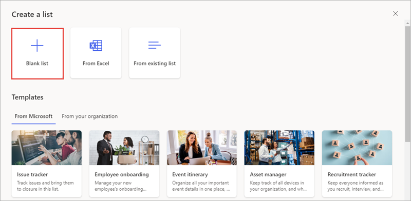
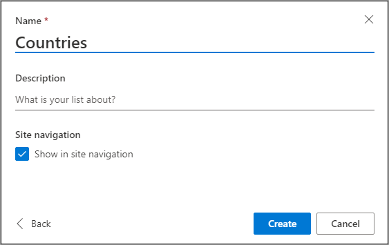
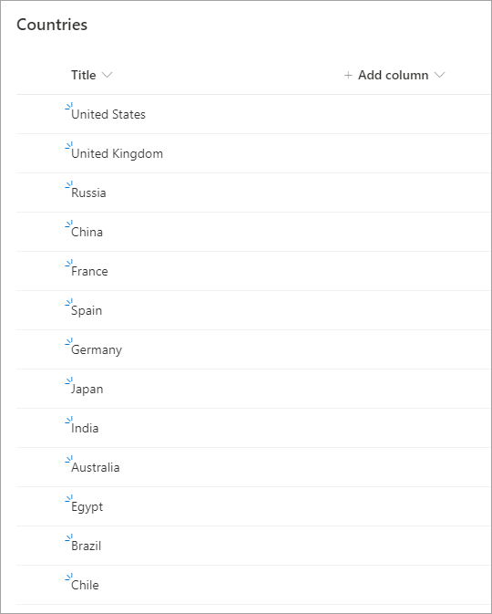
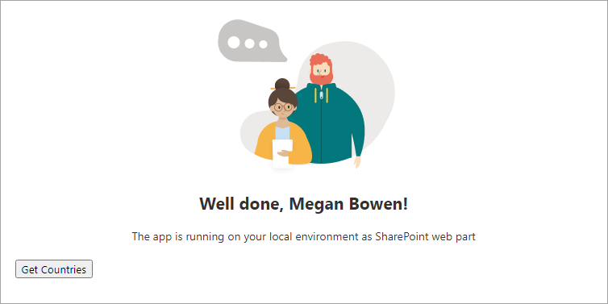

In this exercise, you'll create a SharePoint Framework (SPFx) web part that will get and display data from a SharePoint list using the SharePoint REST API.

## Create a SharePoint list to use for testing

Before you can get display data from a SharePoint list using the SharePoint REST API, you'll first need to create a list and populate it with some data.

In a browser, navigate to a site collection in SharePoint Online. Select **Site Contents** in the left-hand navigation and then select **New > List** in the toolbar.

Select the **Blank list** template.



Set the list name to **Countries** and select **Create**.



Add items to the list by entering the names of different countries as shown in the following image.



## Create the web part to display data using the SharePoint REST API

Open a command prompt and change to the folder where you want to create the project.

> [!IMPORTANT]
> The instructions below assume you're using v1.14.0 of the SharePoint Framework Yeoman generator. For more information on the use of the SharePoint Framework Yeoman generator, see [Yeoman generator for the SharePoint Framework](https://aka.ms/spfx-yeoman-info).

Run the SharePoint Yeoman generator by executing the following command:

```console
yo @microsoft/sharepoint
```

Use the following to complete the prompt that is displayed (*if more options are presented, accept the default answer)*:

- **What is your solution name?**: SPFxHttpClientDemo
- **Which type of client-side component to create?**: Web Part
- **What is your Web Part name?**: SPFxHttpClientDemo
- **Which framework would you like to use?** React

After provisioning the folders required for the project, the generator will install all the dependency packages by running `npm install` automatically. When npm completes downloading all dependencies, open the project in **Visual Studio Code**.

### Create an interface for the SharePoint list items

Locate the **./src** folder in the project. Create a new subfolder **models** in the **src** folder.npm

Create a new file **ICountryListItem.ts** in the **models** folder and add the following code to it:

```typescript
export interface ICountryListItem {
  Id: string;
  Title: string;
}
```

### Create a type for a button click event handler

Create a new file **ButtonClickedCallback.ts** in the **models** folder and add the following code to it:

```typescript
export type ButtonClickedCallback = () => void;
```

### Create a barrel for the types implemented in the models folder

Create a new file **index.ts** in the **models** folder and add the following code to it:

```typescript
export * from './ButtonClickedCallback';
export * from './ICountryListItem';
```

### Update the public interface for the React component

Locate and open the file **./src/webparts/spFxHttpClientDemo/components/ISpFxHttpClientDemoProps.ts**. This is the interface for the public properties of the React component. It will need to display a list of items, so update the signature to accept a list of items.

Add the following code to the top of the file:

```typescript
import {
  ButtonClickedCallback,
  ICountryListItem
} from '../../../models';
```

Update the interface to replace the existing `description` property to be a collection of items to be passed in and add an event when a button is selected:

```typescript
export interface ISpFxHttpClientDemoProps {
  spListItems: ICountryListItem[];
  onGetListItems?: ButtonClickedCallback;
  isDarkTheme: boolean;
  environmentMessage: string;
  hasTeamsContext: boolean;
  userDisplayName: string;
}
```

### Implement the user interface for the web part

Locate and open the file **./src/webparts/spFxHttpClientDemo/components/SpFxHttpClientDemo.module.scss**.

Add the following to the bottom of the file:

```scss
.buttons {
  padding-top: 20px;
  > button {
    margin-right: 10px;
  }
}
```

Locate and open the file **./src/webparts/spFxHttpClientDemo/components/SpFxHttpClientDemo.tsx**.

Locate the `render()` method and replace it with the following code. This will create a list displaying the data contained in the `spListItems` property. Also notice that there's a button that has an `onClick` handler wired up to it.

```html
public render(): React.ReactElement<ISpFxHttpClientDemoProps> {
  const {
    spListItems,
    onGetListItems,
    isDarkTheme,
    environmentMessage,
    hasTeamsContext,
    userDisplayName
  } = this.props;

  return (
    <section className={`${styles.spFxHttpClientDemo} ${hasTeamsContext ? styles.teams : ''}`}>
      <div className={styles.welcome}>
        
        <h2>Well done, {escape(userDisplayName)}!</h2>
        <div>{environmentMessage}</div>
      </div>
      <div className={styles.buttons}>
        <button type="button" onClick={this.onGetListItemsClicked}>Get Countries</button>
      </div>
      <div>
        <ul>
          {spListItems && spListItems.map((list) =>
            <li key={list.Id}>
              <strong>Id:</strong> {list.Id}, <strong>Title:</strong> {list.Title}
            </li>
          )
          }
        </ul>
      </div>
    </section>
  );
}
```

Add the following event handler to the `SpFxHttpClientDemo` class to handle the click event on the button. This code will prevent the default action of the `<a>` element from navigating away from (or refreshing) the page and call the callback set on the public property, notifying the consumer of the component an event occurred.

```typescript
private onGetListItemsClicked = (event: React.MouseEvent<HTMLButtonElement>): void => {
  event.preventDefault();

  this.props.onGetListItems();
}
```

### Retrieve data from the SharePoint REST API

Locate and open the **./src/webparts/spFxHttpClientDemo/SpFxHttpClientDemoWebPart.ts** file.

After the existing `import` statements at the top of the file, add the following import statements:

```typescript
import { SPHttpClient, SPHttpClientResponse } from '@microsoft/sp-http';
import { ICountryListItem } from '../../models';
```

Locate the class `SpFxHttpClientDemoWebPart` and add the following private member to it:

```typescript
private _countries: ICountryListItem[] = [];
```

Locate the `render()` method. Notice that this method is creating an instance of the component `SpFxHttpClientDemo` and then setting its public properties. The default code sets the `description` property, however this was removed from the interface `ISpFxHttpClientDemoProps` in the previous steps. Remove the `description` property and add the following properties to set the list of countries to the private member added above and attach to the event handler:

```typescript
spListItems: this._countries,
onGetListItems: this._onGetListItems,
```

Add the following method as an event handler to the `SpFxHttpClientDemoWebPart` class. This method calls another method (*that you'll add in the next step*) that returns a collection of list items. Once those items are returned via a JavaScript Promise, the method updates the internal `_countries` member and re-renders the web part. This will bind the collection of countries returned by the `_getListItems()` method to the public property on the React component that will render the items.

```typescript
private _onGetListItems = (): void => {
  this._getListItems()
    .then(response => {
      this._countries = response;
      this.render();
    });
}
```

Add the following method to the `SpFxHttpClientDemoWebPart` class. The method retrieves list items from the **Countries** list using the SharePoint REST API. It will use the `spHttpClient` object to query the SharePoint REST API. When it receives the response, it calls `response.json()` that will process the response as a JSON object and then returns the `value` property in the response to the caller. The `value` property is a collection of list items that match the interface created previously.

```typescript
private _getListItems(): Promise<ICountryListItem[]> {
  return this.context.spHttpClient.get(
    this.context.pageContext.web.absoluteUrl + `/_api/web/lists/getbytitle('Countries')/items?$select=Id,Title`,
    SPHttpClient.configurations.v1)
    .then(response => {
      return response.json();
    })
    .then(jsonResponse => {
      return jsonResponse.value;
    }) as Promise<ICountryListItem[]>;
}
```

## Test the web part

Run the following command to ensure the developer certificate is installed:

```console
gulp trust-dev-cert
```

Run the following command to start the local web server:

```console
gulp serve --nobrowser
```

The SharePoint Framework's gulp **serve** task with the **nobrowser** switch will build the project and start a local web server.

Wait for the **reload** subtask to finish executing. At this point, the web part will be ready for testing.

Open a browser and navigate to the SharePoint Online site where you created the **Countries** list. Append the **/_layouts/workbench.aspx** to the end of the site's URL to open the SharePoint-hosted workbench.


Select the web part icon button to open the list of available web parts, and select the **SPFxHttpClientDemo** web part from the **Local** section:


The web part will appear on the page with a single button and no data in the list.



Select the **Get Countries** button and notice the list will display the data from the SharePoint REST API.


Stop the local web server by pressing <kbd>CTRL</kbd>+<kbd>C</kbd> in the console/terminal window.

## Summary

In this exercise, you created a SharePoint Framework (SPFx) web part that retrieved and displayed data from a SharePoint list using the SharePoint REST API.
