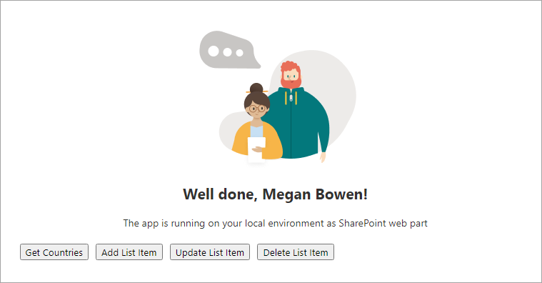
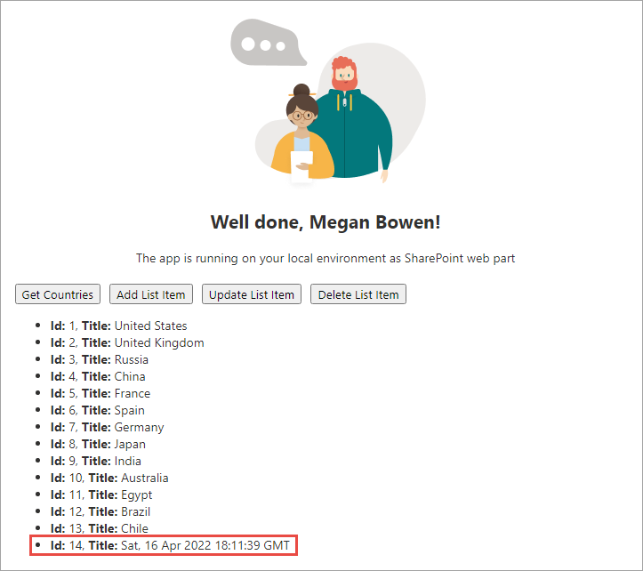
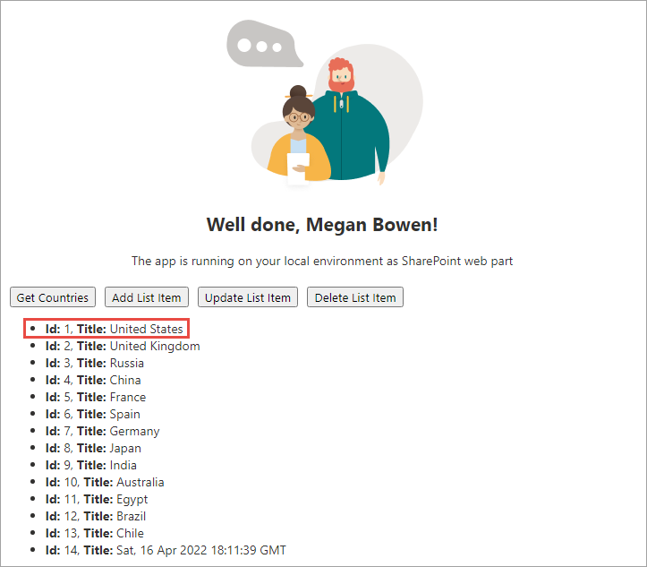
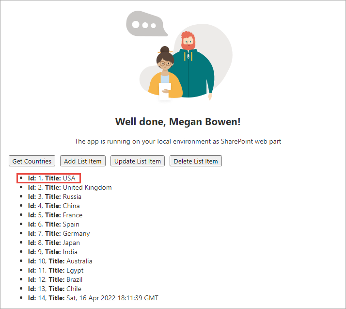

In this exercise, you'll extend the SharePoint Framework project from the previous exercise to add write capabilities using the SharePoint REST API.

## Add the add, update, and delete operations

Locate and open the **./src/webparts/spFxHttpClientDemo/components/ISpFxHttpClientDemoProps.ts** file.

Add the following properties to the `ISpFxHttpClientDemoProps` interface.

```typescript
onAddListItem?: ButtonClickedCallback;
onUpdateListItem?: ButtonClickedCallback;
onDeleteListItem?: ButtonClickedCallback;
```

Locate and open the **./src/webparts/spFxHttpClientDemo/components/SpFxHttpClientDemo.tsx** file.

Within the `render()` method in the `SpFxHttpClientDemo` class, locate the button **Get Countries**. Add the following markup to add three more buttons to the user interface:

```html
<a href="#" className={ styles.button } onClick={ this.onAddListItemClicked }>
  <span className={ styles.label }>Add List Item</span>
</a>
<a href="#" className={ styles.button } onClick={ this.onUpdateListItemClicked }>
  <span className={ styles.label }>Update List Item</span>
</a>
<a href="#" className={ styles.button } onClick={ this.onDeleteListItemClicked }>
  <span className={ styles.label }>Delete List Item</span>
</a>
```

Add the following event handlers to the `SpFxHttpClientDemo` class:

```typescript
private onAddListItemClicked = (event: React.MouseEvent<HTMLAnchorElement>): void => {
  event.preventDefault();

  this.props.onAddListItem();
}

private onUpdateListItemClicked = (event: React.MouseEvent<HTMLAnchorElement>): void => {
  event.preventDefault();

  this.props.onUpdateListItem();
}

private onDeleteListItemClicked = (event: React.MouseEvent<HTMLAnchorElement>): void => {
  event.preventDefault();

  this.props.onDeleteListItem();
}
```

Locate and open the **./src/webparts/spFxHttpClientDemo/SpFxHttpClientDemoWebpart.ts** file.

Within the `render()` method in the `SpFxHttpClientDemoWebPart` class, locate the code where the public properties are set on the React component `SpFxHttpClientDemo`. It will look like this:

```typescript
{
  spListItems: this._countries,
  onGetListItems: this._onGetListItems
}
```

Update the public properties to add handlers for the events when buttons are pressed in the component:

```typescript
{
  spListItems: this._countries,
  onGetListItems: this._onGetListItems,
  onAddListItem: this._onAddListItem,
  onUpdateListItem: this._onUpdateListItem,
  onDeleteListItem: this._onDeleteListItem
}
```

Implement the three event handlers you just added.

```typescript
private _onAddListItem = (): void => {
  this._addListItem()
    .then(() => {
      this._getListItems()
        .then(response => {
          this._countries = response;
          this.render();
        });
    });
}

private _onUpdateListItem = (): void => {
  this._updateListItem()
    .then(() => {
      this._getListItems()
        .then(response => {
          this._countries = response;
          this.render();
        });
    });
}

private _onDeleteListItem = (): void => {
  this._deleteListItem()
    .then(() => {
      this._getListItems()
        .then(response => {
          this._countries = response;
          this.render();
        });
    });
}
```

These event handlers will call different methods, which you'll add in the rest of this exercise. Each one will add, update, or delete an item in the SharePoint list, call the existing `_getListItems()` method you created in the previous exercise, and refresh the web part by calling `render()`.

Add the following methods to the `SpFxHttpClientDemoWebPart` class to add a new item to the list:

```typescript
private _getItemEntityType(): Promise<string> {
  return this.context.spHttpClient.get(
      this.context.pageContext.web.absoluteUrl + `/_api/web/lists/getbytitle('Countries')?$select=ListItemEntityTypeFullName`,
      SPHttpClient.configurations.v1)
    .then(response => {
      return response.json();
    })
    .then(jsonResponse => {
      return jsonResponse.ListItemEntityTypeFullName;
    }) as Promise<string>;
}

private _addListItem(): Promise<SPHttpClientResponse> {
  return this._getItemEntityType()
    .then(spEntityType => {
      const request: any = {};
      request.body = JSON.stringify({
        Title: new Date().toUTCString(),
        '@odata.type': spEntityType
      });

      return this.context.spHttpClient.post(
        this.context.pageContext.web.absoluteUrl + `/_api/web/lists/getbytitle('Countries')/items`,
        SPHttpClient.configurations.v1,
        request);
      }
    ) ;
}
```

The method `_getItemEntityType()` will get the type of data that the **Countries** list expects. This is done by:

- Using the `spHttpClient` API's `get()` method to issue an HTTP GET request to the SharePoint REST API. This method requires two parameters: (1) the endpoint to query and (2) the configuration to use.
- After processing the response body as JSON...
- It returns the `ListItemEntityTypeFullName` as a single string value to the caller.

The method `_addListItem()` first obtains the data type supported by the list needed when creating a new item. Then it creates a new item by:

- Creating a new object with a new `Title`, set to the current UTC timestamp, and the `@odata.type` property that is set to the value obtained in the `_getItemEntityType()` method.
- This new object is set to the `body` property as a string on a `request` object that will be sent in the HTTP POST.
- Then, using the `spHttpClient` API's `post()` method, set the endpoint to the list's `items` collection, with the specified configuration and then set the `request` object as the third parameter for the `post()` method. This will tell the `spHttpClient` API to send the new object as part of the body in the HTTP request.

Add the following method to the `SpFxHttpClientDemoWebPart` class to update an item in the list:

```typescript
private _updateListItem(): Promise<SPHttpClientResponse> {
  // get the first item
  return this.context.spHttpClient.get(
      this.context.pageContext.web.absoluteUrl + `/_api/web/lists/getbytitle('Countries')/items?$select=Id,Title&$filter=Title eq 'United States'`,
      SPHttpClient.configurations.v1)
    .then(response => {
      return response.json();
    })
    .then(jsonResponse => {
      return jsonResponse.value[0];
    })
    .then((listItem: ICountryListItem) => {
      // update item
      listItem.Title = 'USA';
      // save it
      const request: any = {};
      request.headers = {
        'X-HTTP-Method': 'MERGE',
        'IF-MATCH': (listItem as any)['@odata.etag']
      };
      request.body = JSON.stringify(listItem);

      return this.context.spHttpClient.post(
        this.context.pageContext.web.absoluteUrl + `/_api/web/lists/getbytitle('Countries')/items(${listItem.Id})`,
        SPHttpClient.configurations.v1,
        request);
    });
}
```

This method will update an existing item in the list by doing the following steps:

- It first gets a reference to a single item in the list with the `Title` = **United States**. This is done using the OData `$filter` operator on the URL parameters of the HTTP GET request endpoint.
- Upon receiving the response, after processing the response as JSON, it gets the first item in the `value` collection, which is an array. This will contain the single item in our query results.
- Once the item is retrieved, the `Title` property is changed to **USA**.
- A new request object is created to submit to the SharePoint REST API:
  - The headers are set to instruct the REST API you wish to do a **MERGE** operation and...
  - The item that will be updated on the server should have the same version, as indicated by the `@odata.etag` property, as the item that is submitted in the HTTP request.
- Similar to the add operation, using the `spHttpClient` API's `post()` method, the specific item in the SharePoint list is updated by using the endpoint of the specific item, the wanted configuration, and the request object this method constructed.

Add the following method to the `SpFxHttpClientDemoWebPart` class to delete the last item in the list:

```typescript
private _deleteListItem(): Promise<SPHttpClientResponse> {
  // get the last item
  return this.context.spHttpClient.get(
      this.context.pageContext.web.absoluteUrl + `/_api/web/lists/getbytitle('Countries')/items?$select=Id,Title&$orderby=ID desc&$top=1`,
      SPHttpClient.configurations.v1)
    .then(response => {
      return response.json();
    })
    .then(jsonResponse => {
      return jsonResponse.value[0];
    })
    .then((listItem: ICountryListItem) => {
      const request: any = {};
      request.headers = {
        'X-HTTP-Method': 'DELETE',
        'IF-MATCH': '*'
      };
      request.body = JSON.stringify(listItem);

      return this.context.spHttpClient.post(
        this.context.pageContext.web.absoluteUrl + `/_api/web/lists/getbytitle('Countries')/items(${listItem.Id})`,
        SPHttpClient.configurations.v1,
        request);
    });
}
```

This method will delete the last item in the list by doing the following steps:

- It first gets a reference to the last item in the list by sorting the list in descending order by the `ID` property and taking just the first result. This is done using the OData `$orderby` and `$top` operators on the URL parameters of the HTTP GET request endpoint.
- A new request object is created to submit to the SharePoint REST API:
  - The headers are set to instruct the REST API you wish to do a **DELETE** operation and...
  - The item that will be deleted can match any version.
- Using the `spHttpClient` API's `post()` method, the specific item in the SharePoint list is deleted by using the endpoint of the specific item, the wanted configuration, and the request object this method constructed.

## Test the web part

Run the following command to ensure the developer certificate is installed:

```console
gulp trust-dev-cert
```

Start the local web server and test the web part in the hosted workbench:

```console
gulp serve
```

The browser will loads the local workbench, but you can't use this for testing because there's no SharePoint context in the local workbench. Instead, navigate to the SharePoint Online site where you created the **Countries** list, and load the hosted workbench at **https://[sharepoint-online-site]/_layouts/workbench.aspx**.

Add the web part to the page: Select the **Add a new web part** control...


Then search for **spfxhttp** select the **SPFxHttpClientDemo** web part to add the web part to the page.


The web part will appear on the page with a single button and no data in the list.



Select the **Get Countries** button and examine the results returned. Scroll to the bottom of the list and notice there's no entry with a timestamp for the **Title**.

Select the **Add List item** button and scroll to the end of the results returned. Notice the new item that appears with a timestamp as the **Title**.



Ensure there's an item in the list with the title equal to **United States**. 



Test the update process by selecting the **Update List Item** button. Notice after selecting the button, the title has changed from **United States** to **USA**.



Note the title of the last item in the list. Test the delete process by selecting the **Delete List Item** button. Notice after selecting the button, the last item in the list has been removed.

Stop the local web server by pressing <kbd>CTRL</kbd>+<kbd>C</kbd> in the console/terminal window.

## Summary

In this exercise, you extended the SharePoint Framework project from the previous exercise to add write capabilities using the SharePoint REST API.
