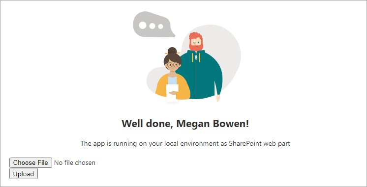
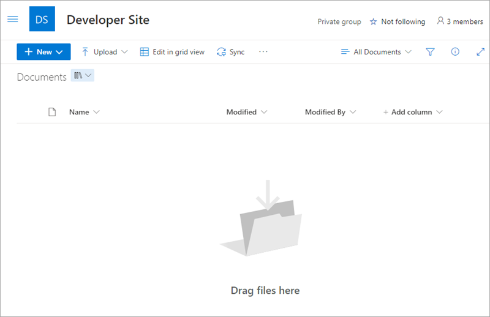
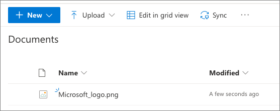

In this exercise, you'll create a new web part that someone can use to select a file to upload to the current site's **Documents** (also known as: *Shared Documents*) library.

> [!NOTE]
> A previous version of this exercise demonstrated how to use mock data within your web part when testing the component in the SharePoint local workbench. However, the local workbench was removed in the SharePoint Framework release v1.13. The mock data exercise was retired in favor of the common scenario to upload files to document libraries with the SharePoint Framework.

## Create a new SharePoint Framework web part project

Open a command prompt and change to the folder where you want to create the project.

> [!IMPORTANT]
> The instructions below assume you are using v1.13.0 of the SharePoint Framework Yeoman generator.

Run the SharePoint Yeoman generator by executing the following command:

```console
yo @microsoft/sharepoint
```

Use the following to complete the prompt that is displayed (*if additional options are presented, accept the default answer)*:

- **Which type of client-side component to create?**: Web Part
- **What is your Web Part name?**: UploadFile
- **What is your Web Part description?**: UploadFile description
- **Which framework would you like to use?** No JavaScript Framework

After provisioning the folders required for the project, the generator will install all the dependency packages by running `npm install` automatically. When NPM completes downloading all dependencies, test the default project provisioned by the generator.

Open the project in **Visual Studio Code**.

## Update the web part's user interface

With the web part created, update the user interface to include a control to select a file from the user's computer and a button to trigger the process.

Locate and open the **./src/webparts/fileUpload/FileUploadWebPart.ts** file.

Locate the existing `render()` method in the **FileUploadWebPart** class. Replace the contents of the `render()` method with the following HTML. This includes a file input control and a button:

```typescript
public render(): void {
  this.domElement.innerHTML = `
    <div class="${styles.fileUpload}">
      <div class="${styles.container}">
        <div class="${styles.row}">
          <div class="${styles.column}">
            <input class="${styles.fileUpload}-fileUpload" type="file" /><br />
            <input class="${styles.fileUpload}-uploadButton" type="button" value="Upload" />
          </div>
        </div>
      </div>
    </div>`;

  // TODO 1

  // TODO 2
}
```

## Obtain element references and attach event handlers

Next, replace the `// TODO` comment with the following code. These are used to get a reference to the two form elements you added to the web part:

```typescript
// get reference to file control
const inputFileElement = document.getElementsByClassName(`${styles.fileUpload}-fileUpload`)[0] as HTMLInputElement;

// wire up button control
const uploadButton = document.getElementsByClassName(`${styles.fileUpload}-uploadButton`)[0] as HTMLButtonElement;
```

Now that you have a reference to the input control and button added to the web part, replace the `// TODO 2` comment with the following:

```typescript
uploadButton.addEventListener('click', async () => {
  // get filename
  const filePathParts = inputFileElement.value.split('\\');
  const fileName = filePathParts[filePathParts.length -1];

  // TODO 3
});
```

This code attaches to the `click` event on the button. The last two steps are to read the selected file in and then to write it to the document library.

## Read the contents of the selected file

In the **FileUploadWebPart.ts** file, add the following method to the `FileUploadWebPart` class. This will take a file reference, read its contents into memory and return it to the caller:

```typescript
private _getFileBuffer(file: File): Promise<ArrayBuffer> {
  return new Promise((resolve, reject) => {
    let fileReader = new FileReader();

    // write up error handler
    fileReader.onerror = (event: ProgressEvent<FileReader>) => {
      reject(event.target.error);
    };

    // wire up when finished reading file
    fileReader.onloadend = (event: ProgressEvent<FileReader>) => {
      resolve(event.target.result as ArrayBuffer);
    };

    // read file
    fileReader.readAsArrayBuffer(file);

  });
}
```

Next, call this method by adding the following line to our `click` event handler, immediately before the `// TODO 3` comment:

```typescript
// get file data
const fileData = await this._getFileBuffer(inputFileElement.files[0]);
```

This call will take the first file selected by the user and pass it as a reference to the method we just added. The contents of the file are stored in the `fileData` member.

## Upload the file to the document library

The last step is to upload the file. To do this, we'll use the SharePoint Framework's API to use the SharePoint REST API.

Before we add the code to upload the file, we need to add a few references to object we'll use. Add the following code to the **FileUploadWebPart.ts** file, after the existing `import` statements at the top of the file:

```typescript
import {
  ISPHttpClientOptions,
  SPHttpClient
} from '@microsoft/sp-http';
```

Now, add the following method to the `FileUploadWebPart` class. This class will first create the full URL of the endpoint where you'll upload the file. Notice it's using the `GetByTitle()` method to reference the **Documents** library. It's also set to upload the file and overwrite an existing file with the same name.

Next, after creating the request to send to the REST API endpoint, we're using the **SpHttpClient** object's `post()` method to upload the file to the SharePoint REST API. Once the file has been uploaded, an alert message notifies the user it worked. Otherwise it throws an exception.

```typescript
private async _uploadFile(fileData: ArrayBuffer, fileName: string): Promise<void> {

  // create target endpoint for REST API HTTP POST
  const endpoint = `${this.context.pageContext.web.absoluteUrl}/_api/web/lists/GetByTitle('Documents')/RootFolder/Files/add(overwrite=true,url='${fileName}')`;

  const options: ISPHttpClientOptions = {
    headers: { 'CONTENT-LENGTH': fileData.byteLength.toString() },
    body: fileData
  };

  // upload file
  const response = await this.context.spHttpClient.post(endpoint, SPHttpClient.configurations.v1, options);

  if (response.status === 200) {
    alert('File uploaded successfully');
  } else {
    throw new Error(`Error uploading file: ${response.statusText}`);
  }
}
```

Finally, call this method from our `click` handler on the button. Replace the `// TODO 3` commend with the following code. It calls the new `_uploadFile()` method and passes in the file's contents and the name of the file:

```typescript
// upload file
await this._uploadFile(fileData, fileName);
```

## Test the web part

Start the local web server using the provided gulp **serve** task, but include the `--nobrowser` argument to just start the local server.

```console
gulp serve --nobrowser
```

The SharePoint Framework's gulp **serve** task will build the project, start a local web server.

Open a browser and navigate to a SharePoint site's hosted workbench to test the project, such as `https://{{REPLACE-THIS}}.sharepoint.com/sites/{{REPLACE-THIS}}/_layouts/workbench.aspx`.

Select the plus icon on the page to open the toolbox and select the **File Upload** web part.


The web part will be rendered on the page, as shown in the following figure:



In another browser window/tab, navigate to the same site's **Documents** library. In this case, we can see nothing is in the library:



Go back to the browser window/tab that contains the web part.

Select the **Choose File** button and select a file from your computer, then select the **Upload** button. You should see an alert appear saying the file was uploaded.

Finally, verify the file was uploaded by switching back ot the browser window/tab with the **Documents** library. The file should appear in a moment, or you can force the page to update by refreshing it:



Close the browser and stop the local web server by pressing <kbd>CTRL</kbd>+<kbd>C</kbd> in the command prompt.

## Summary

In this exercise, you created a new web part that someone can use to select a file to upload to the current site's **Documents** library.
