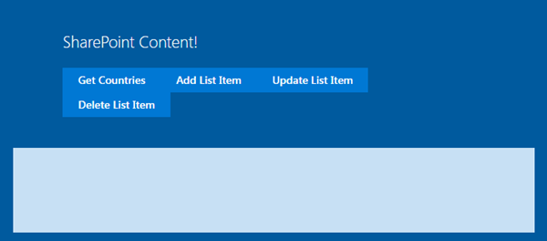
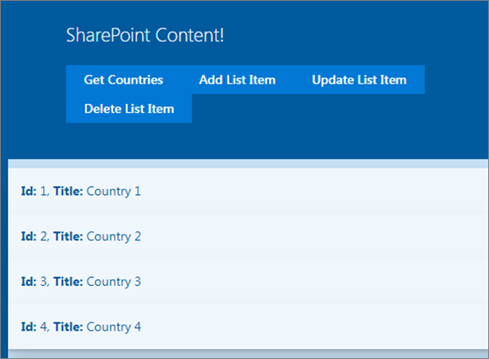

In this exercise, you'll extend the SharePoint Framework project from the previous exercises to add logic so mock data is used when the web part is run from the local workbench.

## Test the web part in the local workbench

Run the following command to start the local web server and test the web part in the hosted workbench:

```shell
gulp serve
```

Add the web part to the workbench using the same process as the previous exercises. When the web part loads, try selecting any of the buttons. Notice nothing happens.



If you open the JavaScript console in your browser's developer tools, you'll notice a few errors related to the workbench. If you inspect the network traffic in the developer tools you'll see requests to the ***/_api/** endpoint will first show as **pending** and then ultimately timeout.

This is because the local workbench has no SharePoint context nor does it have a working SharePoint REST API. That is only available in a real SharePoint environment.

## Determine the current environment

Update the web part to determine if it's running in the local workbench or a real SharePoint environment.

Locate and open the **./src/webparts/spFxHttpClientDemo/spFxHttpClientDemoWebPart.ts** file.

Add the following `import` statement to the existing `import` statements:

```typescript
import {
  Environment,
  EnvironmentType
} from '@microsoft/sp-core-library';
```

Add the following property to the `SpFxHttpClientDemoWebPart` class. This will return a boolean value if the current SharePoint environment is real (`true`) or the local workbench (`false`) used in testing:

```typescript
private get _isSharePoint(): boolean {
  return (Environment.type === EnvironmentType.SharePoint || Environment.type === EnvironmentType.ClassicSharePoint);
}
```

## Use mock data

Update the web part to use mock data when the **Get Countries** button is pressed while running in the local workbench. Locate the `_onGetListItems` handler and update its contents to the following code. This will first check if the web part is in the local workbench (`!this._isSharePoint`). If it is, it will return mock data; otherwise it will run the previous code that will call the SharePoint REST API.

```typescript
if (!this._isSharePoint) {
  this._countries = [
    { Id: '1', Title: 'Country 1' },
    { Id: '2', Title: 'Country 2' },
    { Id: '3', Title: 'Country 3' },
    { Id: '4', Title: 'Country 4' }
  ];
  this.render();
} else {
  this._getListItems()
    .then(response => {
      this._countries = response;
      this.render();
    });
}
```

Apply similar logic to the methods that implement write operations. However, in these cases we simply want the web part to do nothing as there is nothing to simulate in a write operation. Locate the methods `_onAddListItem`, `_onUpdateListItem` and `onDeleteListItem` and add the following line to the top of each method. This will exit the function if the web part is running in the local workbench:

```typescript
if (!this._isSharePoint) { return; }
```

## Test the web part

Go back to the browser with the local workbench loaded. Notice that when you select the **Get Countries** button, you see the mock data returned:



Also notice that if you go back to the hosted workbench in a SharePoint Online site, the web part works as it did prior to adding mock data as it uses the live SharePoint REST API in a real SharePoint environment.

Stop the local web server by pressing <kbd>CTRL</kbd>+<kbd>C</kbd> in the console/terminal window.

## Summary

In this exercise, you extended the SharePoint Framework project from the previous exercises to add logic so mock data is used when the web part is run from the local workbench.
