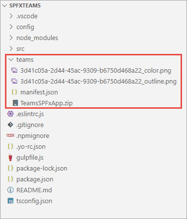
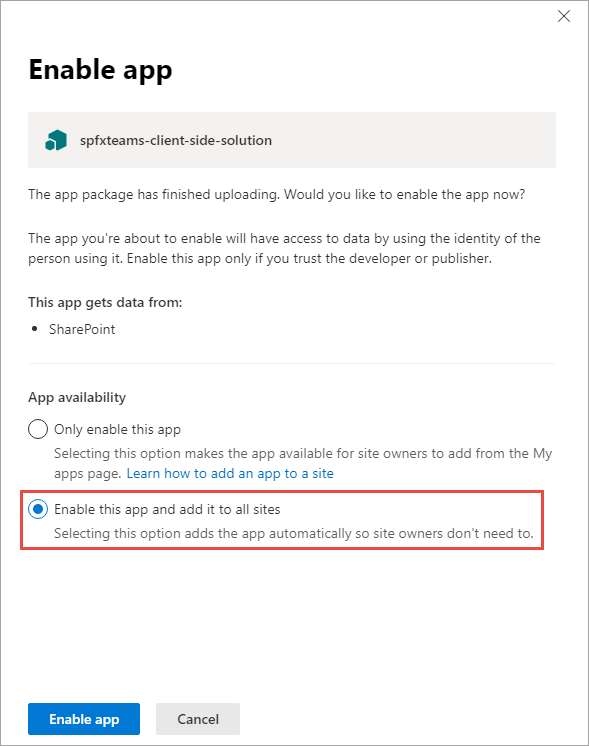
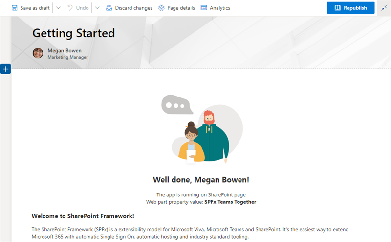
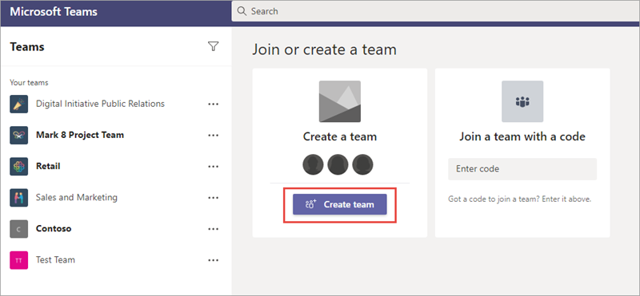
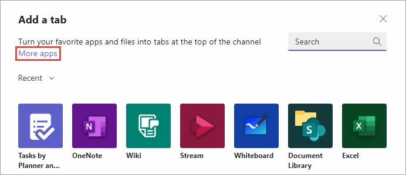
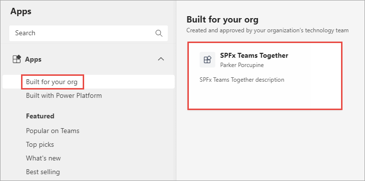
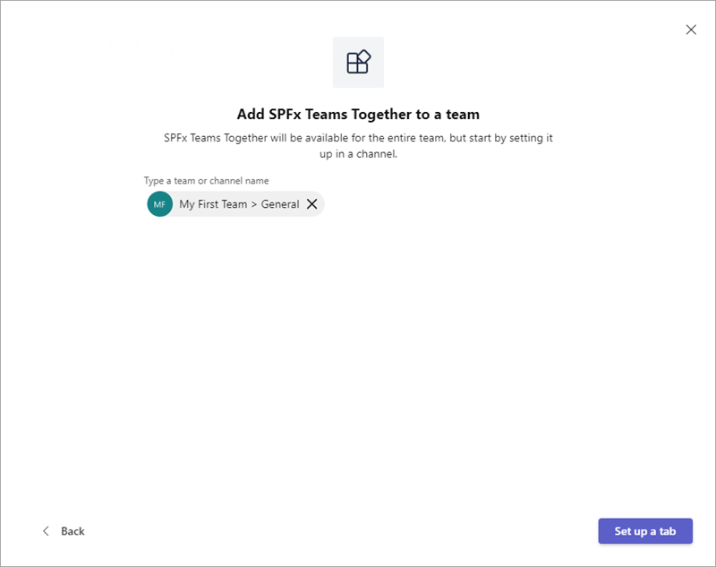
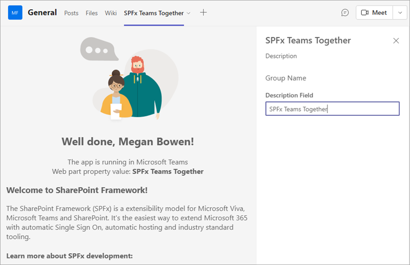

In this exercise, you'll create a SharePoint Framework web part solution that will work in both SharePoint Online and as a tab in Microsoft Teams.

> [!IMPORTANT]
> The instructions below assume you are using v1.13.1 of the SharePoint Framework Yeoman generator.

Open a command prompt and change to the folder where you want to create the SharePoint Framework project. Then, run the SharePoint Yeoman generator by executing the following command:

```console
yo @microsoft/sharepoint
```

Use the following to complete the prompt that is displayed (*if additional options are presented, accept the default answer*):

- **What is your solution name?**: spfxteams
- **Only SharePoint Online (latest) is supported. For earlier versions of SharePoint (2016 and 2019) please use the 1.4.1 version of the generator.**: SharePoint Online only (latest)
- **Do you want to allow the tenant admin the choice of being able to deploy the solution to all sites immediately without running any feature deployment or adding apps in sites?**: Yes
- **Will the components in the solution require permissions to access web APIs that are unique and not shared with other components in the tenant?**: No
- **Which type of client-side component to create?**: Web Part
- **What is your Web Part name?**: SPFx Teams Together
- **What is your Web Part description?**: SPFx Teams Together description
- **Which framework would you like to use?** No JavaScript framework

After provisioning the folders required for the project, the generator will install all the dependency packages by running `npm install` automatically. When NPM completes downloading all dependencies, open the project in **Visual Studio Code**.


## Enable the web part to be used in Microsoft Teams

Locate and open the file **./src/webparts/spFxTeamsTogether/SpFxTeamsTogetherWebPart.manifest.json**:

Within the web part manifest file, locate the property `supportedHosts`. Ensure the value of the property includes `TeamsTab`:

```typescript
"supportedHosts": ["SharePointWebPart", "TeamsTab"],
```

## Create and deploy the Microsoft Teams app package

Notice the project contains a folder **teams** that contains two images. These are used in Microsoft Teams to display the custom tab.

> [!NOTE]
> You may notice there is no **manifest.json** file present. The manifest file can be generated automatically by SharePoint from the **App Catalog** site or you can create it manually. For more information on manual creation of the manifest file, see the documentation: [Deployment options for SharePoint Framework solutions for Microsoft Teams](/sharepoint/dev/spfx/deployment-spfx-teams-solutions).
>
> In this exercise you will manually create the Microsoft Teams manifest file so that you may get familliar with its contents.

### Manually create the Microsoft Teams manifest

Locate the **./teams** folder in the project.

Create a new file **manifest.json** in the **teams** folder and add the following code to it:

```json
{
  "$schema": "https://developer.microsoft.com/en-us/json-schemas/teams/v1.10/MicrosoftTeams.schema.json",
  "manifestVersion": "1.10",
  "packageName": "{{SPFX_COMPONENT_ALIAS}}",
  "id": "{{SPFX_COMPONENT_ID}}",
  "version": "0.1",
  "developer": {
    "name": "Parker Porcupine",
    "websiteUrl": "https://products.office.com/en-us/sharepoint/collaboration",
    "privacyUrl": "https://privacy.microsoft.com/en-us/privacystatement",
    "termsOfUseUrl": "https://www.microsoft.com/en-us/servicesagreement"
  },
  "name": {
    "short": "{{SPFX_COMPONENT_NAME}}"
  },
  "description": {
    "short": "{{SPFX_COMPONENT_SHORT_DESCRIPTION}}",
    "full": "{{SPFX_COMPONENT_LONG_DESCRIPTION}}"
  },
  "icons": {
    "outline": "{{SPFX_COMPONENT_ID}}_outline.png",
    "color": "{{SPFX_COMPONENT_ID}}_color.png"
  },
  "accentColor": "#004578",
  "configurableTabs": [
    {
      "configurationUrl": "https://{teamSiteDomain}{teamSitePath}/_layouts/15/TeamsLogon.aspx?SPFX=true&dest={teamSitePath}/_layouts/15/teamshostedapp.aspx%3FopenPropertyPane=true%26teams%26componentId={{SPFX_COMPONENT_ID}}%26forceLocale={locale}",
      "canUpdateConfiguration": true,
      "scopes": [
        "team"
      ]
    }
  ],
  "validDomains": [
    "*.login.microsoftonline.com",
    "*.sharepoint.com",
    "*.sharepoint-df.com",
    "spoppe-a.akamaihd.net",
    "spoprod-a.akamaihd.net",
    "resourceseng.blob.core.windows.net",
    "msft.spoppe.com"
  ],
  "webApplicationInfo": {
    "resource": "https://{teamSiteDomain}",
    "id": "00000003-0000-0ff1-ce00-000000000000"
  }
}
```

This file contains multiple strings that need to be updated to match the SharePoint Framework component. Use the following table to determine the values that should be replaced. The SharePoint Framework component properties are found in the web part manifest file: **./src/webparts/spFxTeamsTogether/SpFxTeamsTogetherWebPart.manifest.json**

|          manifest.json string          |  Property in SharePoint Framework component manifest  |
| -------------------------------------- | ----------------------------------------------|
| `{{SPFX_COMPONENT_ALIAS}}`             | `alias`                                       |
| `{{SPFX_COMPONENT_NAME}}`              | `preconfiguredEntries[0].title.default`       |
| `{{SPFX_COMPONENT_SHORT_DESCRIPTION}}` | `preconfiguredEntries[0].description.default` |
| `{{SPFX_COMPONENT_LONG_DESCRIPTION}}`  | `preconfiguredEntries[0].description.default` |
| `{{SPFX_COMPONENT_ID}}`                | `id`                                          |

> [!IMPORTANT]
> Don't miss replacing `{{SPFX_COMPONENT_ID}}` in `configurableTabs[0].configurationUrl`. You'll likely have to scroll your editor to the right to see it.

> [!IMPORTANT]
> The tokens surrounded by single curly braces (e.g. `{teamSiteDomain}`) do not need to be replaced.

### Manually create the Microsoft Teams app package

Locate the **./teams** folder in the project.

Create a ZIP archive containing the three files in the folder: the two images and **manifest.json**. 

> [!IMPORTANT]
> ZIP the contents of the folder, not the folder itself.

Name the ZIP archive **TeamsSPFxApp.zip** and save it in the **teams** folder. The **teams** folder should now contain four files.



## Create and deploy the SharePoint package

To test the web part in SharePoint and Microsoft Teams, it must first be deployed to an App Catalog.

Open a browser and navigate to your SharePoint Online tenant App Catalog site.

Select the menu item **Apps for SharePoint** from the left-hand navigation menu.

Build the project by opening a command prompt and changing to the root folder of the project. Then execute the following command:

```console
gulp build
```

Next, create a production bundle of the project by running the following command on the command line from the root of the project:

```console
gulp bundle --ship
```

Finally, create a deployment package of the project by running the following command on the command line from the root of the project:

```console
gulp package-solution --ship
```

Drag the package created in the previous steps, located in the project's **./sharepoint/solution/spfxteams.sppkg**, into the **Apps for SharePoint** library.

In the **Do you trust spfxteams-client-side-solution?** dialog, select the checkbox **Make this solution available to all sites in the organization** and then select **Deploy**.



This will make the web part available to all site collections in the tenant, including those that are behind a Microsoft Teams team.

The last step is to publish the Microsoft Teams app to your tenant's Microsoft Teams store. Select the SharePoint package you uploaded. Then, using the ribbon, select the **Files** tab and then the **Sync to Teams** button.


## Test the SharePoint Framework web part in SharePoint

In the browser, navigate to a modern SharePoint page.

Select the **Edit** button in the top-right of the page.

In the browser, select the Web part icon button to open the list of available web parts:


Search for the **SPFx Teams Together** web part and select it


The SharePoint Framework web part will be displayed on the page as shown in the following figure:



## Test the SharePoint Framework web part in Microsoft Teams

First, create a new Microsoft Teams team.

Using the same browser where you're logged into SharePoint Online, navigate to https://teams.microsoft.com. When prompted, load the web client.

If you don't have any teams in your tenant, you'll be presented with the following dialog. Otherwise, select the **Join or create a team** at the bottom of the list of teams:



On the **Create your team** dialog, select **From scratch**:


On the **What kind of team will this be?** dialog, select **Public**:


In the **Some quick details about your public team** dialog, set the Team name **My First Team** and select **Create**.

In the **Add members to My First Team** dialog, select **Skip**.

## Install the Microsoft Teams application as a new tab

Select the **My First Team** team previously created.

Select the **General** channel.


Add a custom tab to the team using the SharePoint Framework web part.

At the top of the page, select the + icon in the horizontal navigation:


In the **Add a tab** dialog, select **More Apps**



Select **Built for your org**.

Select the **SPFx Teams Together** app.



In the **SPFx Teams Together** dialog, select the **Add to a team** button.


In the next dialog, select the **General** channel in the **My First Team** team and select **Set up a tab**.



The next dialog will confirm the installation of the app. Select **Save**.


The application should now load in Microsoft Teams within the **General** channel under the tab **SPFx Teams Together**.



Select the **X** in the upper-right corner of the property pane to close the initial configuration.

## Summary

In this exercise, you created a SharePoint Framework web part solution that works in both SharePoint Online and as a tab in Microsoft Teams.
