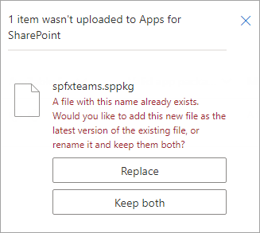

In this exercise, you'll update the SharePoint Framework web part from the previous exercise to display different information depending on whether it's running within a SharePoint or Microsoft Teams context.

Locate and open the file **./src/webparts/spFxTeamsTogether/SpFxTeamsTogetherWebPart.ts**.

Locate the `_getEnvironmentMessage()` method in the `SpFxTeamsTogetherWebPart` class. This code constructs a message indicating whether the web part is running in SharePoint or Teams by checking the value of `this.context.sdks.microsoftTeams`. If the `microsoftTeams` object has a value, then the web part is running in Teams. If the `microsoftTeams` object is `undefined`, then the web part isn't running in Teams:

```typescript
private _getEnvironmentMessage(): string {
  if (!!this.context.sdks.microsoftTeams) { // running in Teams
    return this.context.isServedFromLocalhost ?
      strings.AppLocalEnvironmentTeams :
      strings.AppTeamsTabEnvironment;
  }

  return this.context.isServedFromLocalhost ?
    strings.AppLocalEnvironmentSharePoint :
    strings.AppSharePointEnvironment;
}
```

Replace the implementation of `_getEnvironmentMessage()` method with the following code. It not only constructs a message indicating whether the web part is running in SharePoint or Teams, it also uses the appropriate context object to include the name of the team or SharePoint site where the web part is currently running:

```typescript
private _getEnvironmentMessage(): string {
  let message: string = "";

  if (!!this.context.sdks.microsoftTeams) { // running in Teams
    message = this.context.isServedFromLocalhost ?
      strings.AppLocalEnvironmentTeams :
      strings.AppTeamsTabEnvironment;

    message += ". Team name: " + this.context.sdks.microsoftTeams.context.teamName;
  } else {
    message = this.context.isServedFromLocalhost ?
      strings.AppLocalEnvironmentSharePoint :
      strings.AppSharePointEnvironment;

    message += ". Site name: " + this.context.pageContext.web.title;
  }

  return message;
}
```

## Package and deploy the web part

Build the project by opening a command prompt and changing to the root folder of the project. Then execute the following command:

```console
gulp build
```

Next, create a production bundle of the project by running the following command on the command line from the root of the project:

```console
gulp bundle --ship
```

Finally, create a deployment package of the project by running the following command on the command line from the root of the project:

```console
gulp package-solution --ship
```

Navigate to the modern tenant app catalog (that is, the **Manage Apps** page).

Locate the file created by the gulp task, found in the **./sharepoint/solution** folder with the name **\*.sppkg**.

Drag this file into the **Apps for SharePoint** library in the browser. When prompted, select **Replace**.



In the **Enable app** panel, ensure the **Enable this app and add it to all sites** radio button is selected and then select **Enable app**.

In the **This app has been enabled** panel, select **Close**.

## Test the changes

Navigate back to the SharePoint page where you added the web part in the previous exercise.

Notice how the page shows that it's currently in the SharePoint context and displays the current SharePoint site name:


Now go back into the Microsoft Teams team and select the tab that you previously added. Notice how the message says you're currently in Teams and the name of the team:


## Summary

In this exercise, you updated the SharePoint Framework web part from the previous exercise to display different information depending on whether it's running within a SharePoint or Microsoft Teams context.
