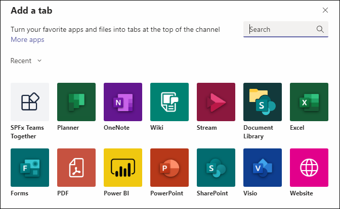
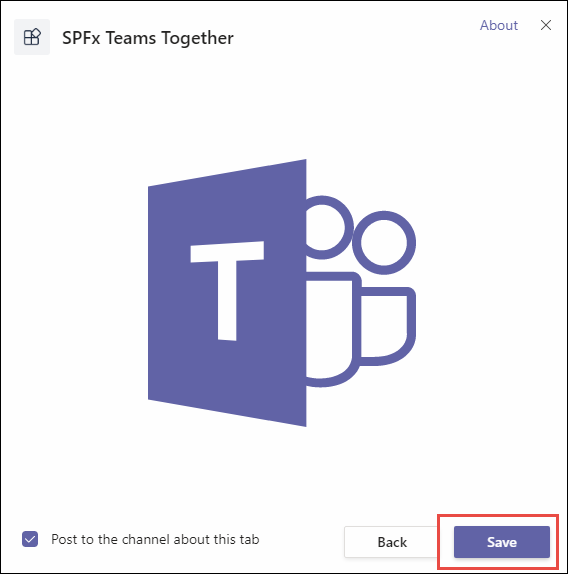
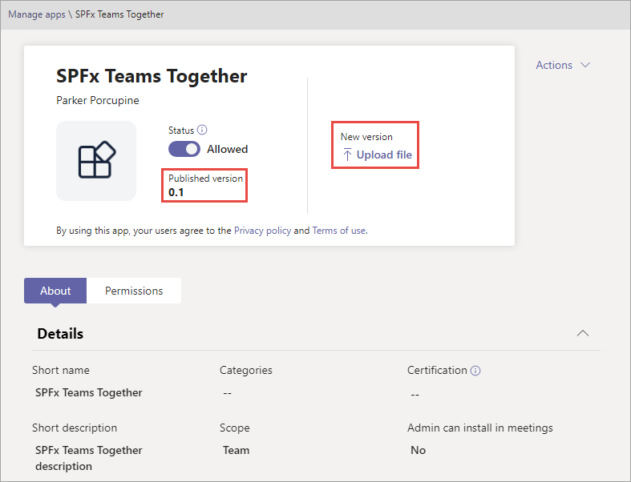

In this exercise, you'll update the configuration settings for the SharePoint Framework application and the configuration details of the Microsoft Teams application.

## Add a new custom property

Locate and open the file **./src/webparts/spFxTeamsTogether/SpFxTeamsTogetherWebPart.ts**.

Locate the interface `ISpFxTeamsTogetherWebPartProps`.

Add a new property to the interface:

```typescript
customSetting: string;
```

Locate the `render()` method within the `SpFxTeamsTogetherWebPart` class.

Locate the following line in the `render()` method:

```tsx
<p class="${ styles.description }">${escape(this.properties.description)}</p>
```

Add the following markup immediately following the previous line:

```tsx
<p class="${ styles.description }">${escape(this.properties.customSetting)}</p>
```

Scroll down to the `getPropertyPaneConfiguration()` method in the `SpFxTeamsTogetherWebPart` class.

Locate the property pane field control for the existing **description** property:

```typescript
PropertyPaneTextField('description', {
  label: strings.DescriptionFieldLabel
}),
```

Add a comma after the existing `PropertyPaneTextField()` and the following code to give users a way to edit the setting:

```typescript
PropertyPaneTextField('customSetting', {
  label: 'Custom Setting'
})
```

## Add a default value for the new property

Locate and open the file **./src/webparts/spFxTeamsTogether/SpFxTeamsTogetherWebPart.manifest.json**

Locate the `preconfiguredEntries[0].properties` object.

Add the following property and value to the `properties` object:

```json
"customSetting": "Default custom setting"
```

## Package and deploy the web part

Build the project by opening a command prompt and changing to the root folder of the project. Then execute the following command:

```shell
gulp build
```

Next, create a production bundle of the project by running the following command on the command line from the root of the project:

```shell
gulp bundle --ship
```

Finally, create a deployment package of the project by running the following command on the command line from the root of the project:

```shell
gulp package-solution --ship
```

Locate the file created by the gulp task, found in the **./sharepoint/solution** folder with the name ***.sppkg**.

Drag this file into the **Apps for SharePoint** library in the browser. When prompted, select **Replace It**.


## Test the changes

Navigate back to the SharePoint page where you added the web part in the previous exercise and refresh the page.

Edit the page and add a value to the **Custom Setting** property in the property pane. Notice how the page shows the property value:


> [!NOTE]
> The value of the custom property will start out blank even though you set a default value for it in the manifest file. The default value only gets set for new web parts.

Now go back into the Microsoft Teams team. Refresh the page if you have Teams open in a web browser. Select the down arrow to the right of the **SPFx Teams Together** tab and select **Settings**.


Add a value to the **Custom Setting** property in the property pane. Notice how the tab shows the property value:


## Disable updates to teams tab configuration

Locate and open the following file in the project: **teams/manifest.json**.

Set the value of the property `version` to `0.2`.

Locate the property `configurableTabs[0].canUpdateConfiguration`.

Set the value of this property to `false` and save the file.

Create a Microsoft Teams app package by zipping the contents of the **./teams** folder. Make sure to zip just the contents and not the folder itself. This ZIP archive should contain three files at the root: two images and the **manifest.json**.

## Delete the previous Microsoft Teams tab

Within the Microsoft Teams client, go to the **General** tab within the **My First Team**.

Select the down-arrow to the right of the **SPFx Teams Together** tab and select **Remove**.

When prompted, select **Remove**.

## Update the previously installed Microsoft Teams app

Within the Microsoft Teams client, select **Apps** in the lower right corner, and then select your tenant from the sidebar menu.

Select the app menu, then select **Update**.


Select the new Microsoft Teams app manifest you created a moment ago.

## Test the new Microsoft Teams app

Select the **My First Team** team previously created.

Select the **General** channel.


### Add the SPFx web part as a tab

At the top of the page, select the + icon in the horizontal navigation:


In the **Add a tab** dialog, locate, and select the **SPFx Teams Together** app:



The next dialog will confirm the installation of the app. Select **Save**.



The application should now load in Microsoft Teams within the **General** channel under the tab **SPFx Teams Together**.

Notice how the web part's property pane opens by default. Edit the values of the public properties on the web part and then select the **X** in the upper-right corner of the property pane to close the initial configuration:



Now go back into the Microsoft Teams team. Select the down arrow to the right of the **SPFx Teams Together** tab. Notice the **Settings** option is no longer present. This is because the setting in the Microsoft Teams app manifest specified the configuration can't be updated once it is installed into Microsoft Teams.


## Summary

In this exercise, you updated the configuration settings for the SharePoint Framework application and the configuration details of the Microsoft Teams application.
