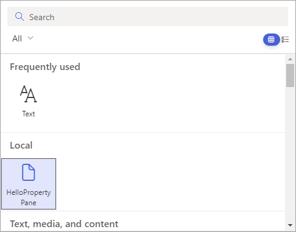
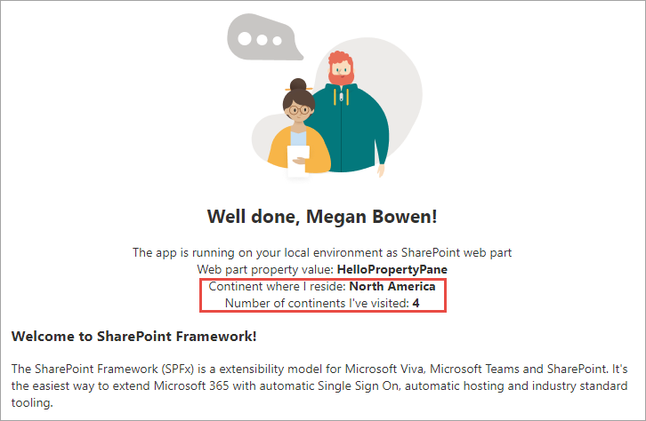

In this exercise, you'll manipulate the property pane for a SharePoint Framework client-side web part with controls, groups, and pages.

## Create a new SharePoint Framework solution and web part

> [!IMPORTANT]
> The instructions below assume you're using v1.14.0 of the SharePoint Framework Yeoman generator. For more information on the use of the SharePoint Framework Yeoman generator, see [Yeoman generator for the SharePoint Framework](https://aka.ms/spfx-yeoman-info).

Open a command prompt and change to the folder where you want to create the project.

Run the SharePoint Framework Yeoman generator by executing the following command:

```console
yo @microsoft/sharepoint
```

Use the following to complete the prompt that is displayed (*if more options are presented, accept the default answer*):

- **What is your solution name?:** HelloPropertyPane
- **Which type of client-side component to create?:** WebPart
- **What is your Web part name?:** HelloPropertyPane
- **Which framework would you like to use?:** No framework

After provisioning the folders required for the project, the generator will install all the dependency packages using npm.

When npm completes downloading all dependencies, ensure the developer certificate is installed by executing the following command:

```consolenpm
gulp trust-dev-cert
```

Next, verify everything is working.

Open the project folder in **Visual Studio Code**.

Locate and open the file **config/serve.json**

In the **serve.json** file, locate the `initialPage` setting. It's currently configured with a placeholder URL.

```json
"initialPage": "https://enter-your-SharePoint-site/_layouts/workbench.aspx",
```

Replace **https://enter-your-SharePoint-site** with the URL of a SharePoint Online site in your tenant. This will form a valid URL that will open the hosted workbench. The following is an example that would work in the **contoso** tenant:

```json
"initialPage": "https://contoso.sharepoint.com/sites/mySite/_layouts/workbench.aspx",
```

Execute the following command to build, start the local web server, and test the web part in the hosted workbench:

```console
gulp serve
```

If you see a warning dialog in the hosted workbench, switch back to the command prompt, wait for the **reload** subtask to finish executing, and then refresh the hosted workbench.


Select the **Add a new web part** icon:


Select the **HelloPropertyPane** web part to add the web part to the page:



You can access the web part property pane by selecting the pencil (edit) icon in the toolbar to the left of the web part:


## Add New Properties to the web part

With a working web part, the next step is to customize the property pane experience. Create two new properties that will be used in the web part and property pane.

Open the file **.\src\webparts\helloPropertyPane\HelloPropertyPaneWebPart.ts**. Locate the interface `IHelloPropertyPaneWebPartProps` after the `import` statements. Add the following two properties to the interface:

```typescript
myContinent: string;
numContinentsVisited: number;
```

Update the web part rendering to display the values of these two properties. Within the `HelloPropertyPaneWebPart` class, locate the `render()` method and find the following line in the HTML output:

```html
<div>Web part property value: <strong>${escape(this.properties.description)}</strong></div>
```

Add the following two lines after the line you located:

```html
<div>Continent where I reside: <strong>${escape(this.properties.myContinent)}</strong></div>
<div>Number of continents I've visited: <strong>${this.properties.numContinentsVisited}</strong></div>
```

Wait a few seconds for the project to rebuild, and then refresh the hosted workbench. The web part will render a blank string and **undefined** for these two properties as neither has been assigned a value:


This can be addressed by setting the default values of properties when a web part is added to the page. Open the file **.\src\webparts\helloPropertyPane\HelloPropertyPaneWebPart.manifest.json**.

Locate the following section in the file: `preconfiguredEntries[0].properties.description`. Add a comma after the `description` property's value and add the following two lines after the `description` property:

```json
"myContinent": "North America",
"numContinentsVisited": 4
```

> [!TIP]
> Changes to the manifest and configuration files will not be reflected in the workbench until you restart the local web server.

Close the browser tab containing the hosted workbench and stop the local web server by pressing <kbd>CTRL</kbd>+<kbd>C</kbd> in the command prompt. Rebuild and restart the local web server by executing the command **gulp serve**. When the hosted workbench loads, add the web part back to the page to see the properties.



## Extend the property pane

Now that the web part has two new custom properties, the next step is to extend the property pane to allow users to edit the values.

Add a new text control to the property pane, connected to the **myContinent** property. Open the file **.\src\webparts\helloPropertyPane\HelloPropertyPaneWebPart.ts**. Locate the method `getPropertyPaneConfiguration()` and within it, locate the `groupFields` array. Add a comma after the existing `PropertyPaneTextField()` and add the following code to add a second text field control:

```typescript
PropertyPaneTextField('myContinent', {
  label: 'Continent where I currently reside'
})
```

If the local web server isn't running, start it by executing **gulp serve**. Once the SharePoint workbench is running again, add the web part to the page and open the property pane. Notice you can see the property and text box in the property pane. Any edits to the field will automatically update the web part:


Next, add a slider control to the property pane, connected to the **numContinentsVisited** property. In the **HelloPropertyPaneWebPart.ts**, at the top of the file, add a `PropertyPaneSlider` reference to the existing `import` statement for the `@microsoft/sp-property-pane` package.

Scroll down to the method `getPropertyPaneConfiguration()` and within it, locate the `groupFields` array.

Add a comma after the last `PropertyPaneTextField()` call, and add the following code:

```typescript
PropertyPaneSlider('numContinentsVisited', {
  label: 'Number of continents I\'ve visited',
  min: 1, max: 7, showValue: true,
})
```

Notice the property pane now has a slider control to control the number of continents you've visited:


## Add control validation

In a previous step, the user was given a property where they could enter the name of the continent in which they live. Now add validation logic to ensure they enter a valid continent name.

In the **HelloPropertyPaneWebPart.ts**, add the following method to the `HelloPropertyPaneWebPart` class. This method takes a string as an input and returns a string. This allows you to do custom validation logic. If this method returns an empty string, the value is considered valid; otherwise, the returned string is used as the error message.

```typescript
private validateContinents(textboxValue: string): string {
  const validContinentOptions: string[] = ['africa', 'antarctica', 'asia', 'australia', 'europe', 'north america', 'south america'];
  const inputToValidate: string = textboxValue.toLowerCase();

  return (validContinentOptions.indexOf(inputToValidate) === -1)
    ? 'Invalid continent entry; valid options are "Africa", "Antarctica", "Asia", "Australia", "Europe", "North America", and "South America"'
    : '';
}
```

Now you can connect the validation method to the text field control you previously added. Locate the text field that is associated with the **myContinent** property.

Add the following code to the options object passed into the `PropertyPaneTextField()` call as the second parameter: `onGetErrorMessage: this.validateContinents.bind(this)`. The text field control should now look like the following code:

```typescript
PropertyPaneTextField('myContinent', {
  label: 'Continent where I currently reside',
  onGetErrorMessage: this.validateContinents.bind(this)
}),
```

If the local web server isn't running, start it by executing **gulp serve**. Once the SharePoint Workbench is running again, add the web part to the page and open the property pane. Enter the name of a non-existent continent to test the validation logic:


Notice the property value isn't updated when the control's input is invalid.

## Summary

In this exercise, you manipulated the property pane for a SharePoint Framework client-side web part with controls, groups, and pages.
