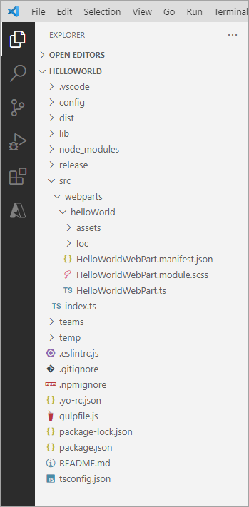
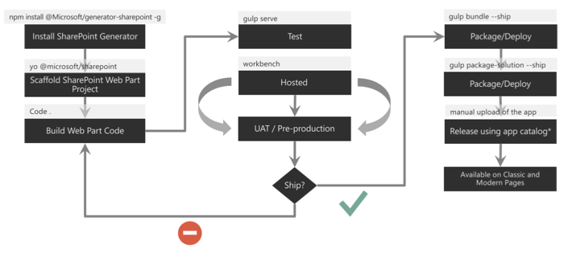
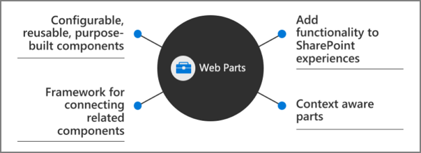

In this unit, you'll learn about the different components in a SharePoint Framework project, and get an overview of the build and deployment process.

## SharePoint Framework project structure

The Yeoman generator for the SharePoint Framework creates the scaffolding (*folders and files*) for a new SharePoint Framework project. After building the project the first time, you'll see even more folders and files present. Just like a .NET Framework project, some of the generated files are temporary and shouldn't be kept in source control.

Let's look at the folders in a newly created and built SharePoint Framework project:



- **.vscode**: This folder contains Visual Studio Code specific files.
- **config**: This folder contains configuration files used by the project's various build tasks. You'll edit these files as necessary depending on the types of components you're creating and for specific situations, such as the site to test extensions or adding references to external libraries.
- **dist**: This folder, created automatically when you bundle the project, contains the JavaScript bundle and manifest created by the build process that will be used in deployment.
- **lib**: This folder, created automatically when you build the project, contains the temporary files generated from the compilation and transpilation of TypeScript to JavaScript and SCSS to CSS files.
- **node_modules**: This folder is created automatically when installing package dependencies using the `npm install` command.
- **src**: This folder contains all the source code for your project.
- **temp**: This folder, created automatically when you test the project, contains files used by the local development web server.

> [!NOTE]
> The **dist**, **lib**, **node_modules**, and **temp** folders should not be committed to your source control solution because they are automatically generated by the build process and when installing or restoring dependencies.
>
> These folders are similar to the **bin**, **obj**, and **packages** folder generated in a .NET project.

## Key files in SharePoint Framework projects

Now let's look at a few of the key files within a SharePoint Framework project.

### Web Part class

When you're creating web parts, the Yeoman generator for the SharePoint Framework will create a web part class file and add it to your project. This file is located within in the **./src/webparts/\[webpartName\]** folder. The name of the web part is added to the folder and the class' file name.

```typescript
export interface IHelloWorldWebPartProps {
  description: string;
}
export default class HelloWorldWebPart extends BaseClientSideWebPart<IHelloWorldWebPartProps> {
  // ...
}
```

This file defines the main entry point for the web part and extend the `BaseClientSideWebPart` class. All client-side web parts must extend from this base class.

The web part file will contain both the web part class and in interface. The interface defines the non-standard public properties on the web part that are persisted when the web part is saved or published from edit mode.

### Web Part manifest

The web part manifest file, **\*.manifest.json**, is located in the same folder as the web part class. It contains metadata for the web part that include things such as the web part's ID, alias, the type of component, and its version.

```typescript
{
  "id": "a632c154-6871-4bcb-b689-b54363e15544",
  "alias": "HelloWorldWebPart",
  "componentType": "WebPart",
  "version": "*",
  "manifestVersion": 2,
  "requiresCustomScript": false,
  "supportedHosts": ["SharePointWebPart"],

  "preconfiguredEntries": [{
    "groupId": "5c03119e-3074-46fd-976b-c60198311f70",
    "group": { "default": "Other" },
    "title": { "default": "Hello SPFx" },
    "description": { "default": "My first SPFx web part" },
    "officeFabricIconFontName": "BirthdayCake",
    "properties": {
      "description": "HelloWorld"
    }
  }]
}
```

Web parts will also contain a section for `preconfiguredEntries` that are the default values for the public properties set on the web part when its added to a new page.

### CSS Modules

CSS modules address a challenge you may have when working with client-side solutions. CSS classes can be used to not only set the styles of an element on the page, but can also override other CSS classes. If a CSS class name is present on the page more than once, the last one will override any settings on previously defined classes. For example, having different web parts that use the same CSS class name on the same page can impact the rendering of each web part.

CSS modules address this challenge by creating a globally unique name for each CSS class. A class named `.helloWorld` is translated to `.helloWorld_da83fer` for example. The hash at the end of the class name is unique to that web part project.

The SharePoint Framework build toolchain handles the complexities of generating these class names and referencing them in your web part.

You define your classes in a SASS file. The class names can use **camelCasing** but not **kebab-casing** for the CSS module process to work. The SharePoint Framework build pipeline generates JavaScript and TypeScript type definitions for all the classes that map to the generated class names. In your web part, you'll import the style object, `import styles from './HelloWorldWebPart.module.scss';`, and then reference the styles as a real TypeScript object:

```typescript
public render(): void {
  this.domElement.innerHTML = `
    <div class="${ styles.helloWorld }">
      <div class="${ styles.container }">
        <div class="${ styles.row }">
          <div class="${ styles.column }">
            <span class="${ styles.title }">Welcome to SharePoint!</span>
          </div>
        </div>
      </div>
    </div>`;
}
```

### Config.json file

The **./config/config.json** file contains information about your JavaScript bundles, external dependencies, and localized resources.

```json
{
  "version": "2.0",
  "bundles": {
    "hello-world-web-part": {
      "components": [
        {
          "entrypoint": "./lib/webparts/helloWorld/HelloWorldWebPart.js",
          "manifest": "./src/webparts/helloWorld/HelloWorldWebPart.manifest.json"
        }
      ]
    }
  },
  "externals": {},
  "localizedResources": {
    "HelloWorldWebPartStrings": "lib/webparts/helloWorld/loc/{locale}.js"
  }
}
```

The `bundles` node enables developers to control the name of the bundle file created by the bundling process and what components are included in the bundle. Each component is listed by the primary JavaScript file that contains the component and the component's manifest. These values are used by the SharePoint Framework's bundling process when it configures Webpack on each build.

> [!NOTE]
> Webpack, another open-source tool, is included in each project's dependencies and is entirely managed by the build process. There is nothing for the developer to install or configure.

The `externals` node is where you can define external libraries that you don't want to be included in the resulting bundle created by Webpack. For example, if our component used the popular library jQuery, you shouldn't include it as part of the bundle. Instead, the external library should be loaded from an external CDN before loading the component bundle on the page. In this case, you'd add the jQuery CDN reference to the `externals` node. During the bundling process, when Webpack sees a reference to jQuery, it will ignore it and not include it in the bundle. In addition, the component's manifest will be modified to instruct the module loader in at runtime to load jQuery before loading the component's bundle.

## Client-side web part build toolchain flow

Now that you understand the important folders and files in a project, let's look at the build toolchain and flow for a SharePoint Framework project. This scenario will focus on a project that contains a web part component. Other types of components, such as extensions and libraries, may involve a slightly different process or step.



In the figure above, the first column covers configuring your development environment for SharePoint Framework development by installing all the necessary dependencies. You then create the project using the Yeoman generator for the SharePoint Framework and develop your component.

Moving onto the second column, test your component in the local or hosted workbench by executing the command `gulp serve` from the command line from the root folder of the project. This task will build, bundle, start the local web server, launch the default browser, and navigate to the local workbench. Here you can add your web part to the local workbench's page to test it.

You can also test it in the hosted workbench by using the same browser and navigating to the hosted workbench. The hosted workbench will load the component from your local web server in the browser.

Follow standard development practices by iterating the component until you settle with the final version of your component that is ready to deploy.

The third column represents the deployment process. You'll first rebundle the component using the `gulp bundle --ship` command that recreates the bundle for production. Next, create the deployable SharePoint package using the `gulp package-solution --ship` command. This command generates the **\*.sppkg** file.

Finally, Upload the SharePoint package to your tenant's or site collection's App Catalog site. At this point, the app can be installed in a site collection that will add the web part to the web part toolbox where it can be added to a page in edit mode.

## Gulp tasks

The SharePoint Framework development and build toolchain includes many tasks developers will need to run to build, package, deploy, and configure their projects and environments. These tasks are executed using the popular open-source tool **Gulp**. Microsoft has created and included multiple tasks in every project to do the following tasks:

- **clean**: This task deletes the **dist**, **lib**, and **temp** folders created from building and bundling the project.
- **build**: This task will transpile all TypeScript to JavaScript and all SASS to CSS files. These temporary files are built to the **lib** folder.
- **bundle**: This ask will run the **build** task and then create JavaScript bundle(s) with Webpack using the files from the build task.
- **dev-deploy** and **deploy-azure-storage**: These tasks upload the production manifest and JavaScript bundles to the Azure Storage blob specified in the **./config/deploy-azure-storage.json** configuration file when you've elected to use the Azure CDN to host and serve your files.
- **package-solution**: This task will create a **\*.sppkg** SharePoint package file using the output from the **bundle** task.
- **serve**: The serve task will start the local web server that hosts the local workbench.
- **test**: This task will run the **build** task and then run all unit tests defined in the project.
- **trust-dev-cert** and **untrust-dev-cert**: These two tasks are used to trust and untrust the self-signed development SSL certificate on your local development environment. The local web server started up by the **serve** task uses this self-signed certificate. The SSL certificate must be added to your development environment's trust root authority for the browser to accept the request.

## Solution packaging

Once you've created your project and it's ready for deployment, use the `gulp package-solution` task to create the **\*.sppkg** SharePoint Package file.

For projects created and built using the SharePoint Framework v1.4.1 or higher, if the property `includeClientSideAssets` is set to `true` in the **./config/package-solution.json** file, the JavaScript bundle and manifest for the components will be included in the SharePoint package file. This option will enable the deployment of the files to a special **ClientSideAssets** library in the root of the site collection where the app is installed.

> [!TIP]
> In SharePoint Online,  the **ClientSideAssets** folder is automatically configured to be included as enabled by the Office 365 CDN if your tenant has been enabled of the Office 365 CDN.

However, if the property is set to `false`, or you're using the SharePoint Framework before v1.4.1, or you don't want to use the **ClientSideAssets** folder, you must deploy the JavaScript bundle and manifest files to a publicly accessible location. Microsoft recommends using Azure blob storage and an Azure CDN and provides the **dev-deploy** and **deploy-azure-storage** gulp tasks to help with the deployment.

## SharePoint client-side web parts

Client-side web parts, built using the SharePoint Framework, are the cornerstone of the vision for innovating, extending, and customizing the SharePoint modern experience.

They're configurable, reusable, and purpose-built components that page designers and site owners can use to create unique experiences for their users.



Client-side web parts are build using the SharePoint Framework that provides additional capabilities, including access to Microsoft Graph for incorporating personal and organizational information into page experiences.

Web parts are also context aware, in the sense that they have access to contextual information about the current page. For instance, at runtime, the web part can get information about the current user and the current page and site the web part is currently running in.

Client-side web parts are flexible as well! Developers can use them to create single page applications (SPAs) as single page app pages, the basis for Microsoft Teams tabs and personal apps, and even as the host for Office Add-ins.

## Client-side web parts

Experienced SharePoint developers who are familiar with server-side web parts developed and deployed using SharePoint features and solutions will find client-side web parts to be familiar. They're just web parts!

The only difference from a server-side web part is client-side web parts are rendered in the browser, not on the server.

Client-side web parts are build for the modern, JavaScript-driven web just as the modern SharePoint experience.

## Summary

In this unit, you learned about the different components in a SharePoint Framework project, and get an overview of the build and deployment process.
