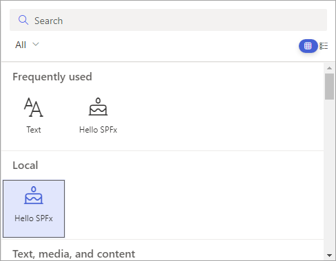

In this exercise, you'll work with the two different versions of the SharePoint Workbench: the local and hosted workbench, as well as the different modes of the built-in gulp serve task.

Open **Visual Studio Code** and then open the SharePoint Framework web part project you created in the previous exercise.

Start the local web server using the provided gulp **serve** task:

```shell
gulp serve
```

The SharePoint Framework's gulp **serve** task will build the project, start a local web server, and launch a browser open to the SharePoint Workbench.

Add the web part to the page.

Now, with both the browser and Visual Studio code on the same screen, edit the HTML in the web part's `render()` method, located in the **src/webparts/helloWorld/HelloWorldWebPart.ts** file.

If you save the file (*or let Visual Studio Code save it after a few seconds of inactivity*), you will see the command prompt window execute numerous commands and then the browser will refresh.

This is because the gulp **serve** task is monitoring all code files such as **\*.ts**, **\*.htm**, and **\*.scss** for changes. If they change, it reruns the tasks that **gulp serve** ran for you. It then refreshes the browser as it is using a utility that allows the server to have some control over the local workbench.

This makes development easy!

## Testing with the SharePoint Online Hosted Workbench

Next, in the browser navigate to one of your SharePoint Online sites and append the following to the end of the root site's URL: **/_layouts/workbench.aspx**. This is the SharePoint Online hosted workbench.

Notice that the toolbox contains many web parts, not just the **HelloWorld** web part currently being served by the local web server. This is because you're now testing the web part in a working SharePoint site.



> [!NOTE]
> The difference between the local and hosted workbench is significant. Consider that the local workbench is not a working version of SharePoint, rather just a single page that can let you test web parts. This means you won't have access to a real SharePoint context, lists, libraries or real users when you are testing in the local workbench.

Let's see another difference between the local and hosted workbenches. Go back to the web part and make a change to the HTML.

Notice that after saving the file, while the console displays numerous commands, the browser that is displaying the hosted workbench doesn't automatically reload. This is expected. You can still refresh the page to see the updated web part, but the local web server can't cause the hosted workbench to refresh.

Close both the local and hosted workbench and stop the local web server by pressing <kbd>CTRL</kbd>+<kbd>C</kbd> in the command prompt.

## The different modes of the gulp serve task

The gulp **serve** task that you've run so far has automatically opened the local workbench. But there may be cases where you don't want to launch the local workbench, rather you want to test with the hosted workbench. In these scenarios, you have two options.

Start the local web server using the provided gulp **serve** task with the **nobrowser** switch:

```shell
gulp serve --nobrowser
```

The gulp **serve** task will run just like normal and start the local webserver, but it will not launch the browser.

Open a browser and navigate to one of your SharePoint Online sites and append the following to the end of the root site's URL: **/_layouts/workbench.aspx**.

Notice the web part is appearing in the toolbox. Everything still works, you just don't get the default browser!

Close the hosted workbench and stop the local web server by pressing <kbd>CTRL</kbd>+<kbd>C</kbd> in the command prompt.

But what if you want the browser to open the hosted workbench automatically for you? In that case, you can use a configuration setting to tell the gulp **serve** task what to do.

Locate and open the file **config/serve.json**

In the **serve.json** file, locate the `initialPage` setting. It's currently configured to open the local workbench.

```json
"initialPage": "https://localhost:5432/workbench",
```

Update the `initialPage` setting to open the hosted workbench:

```json
"initialPage": "https://contoso.sharepoint.com/sites/mySite/_layouts/workbench.aspx",
```

> [!NOTE]
> Ensure you enter the proper URL of a SharePoint Online site collection you have access to.

Start the local web server using the provided gulp **serve** task:

```shell
gulp serve
```

Notice the browser will now load, but it will navigate to your hosted workbench in SharePoint Online.

Close the hosted workbench and stop the local web server by pressing <kbd>CTRL</kbd>+<kbd>C</kbd> in the command prompt.

## Summary

In this exercise, you worked with the two different versions of the SharePoint Workbench: the local and hosted workbench, and the different modes of the built-in gulp serve task.
