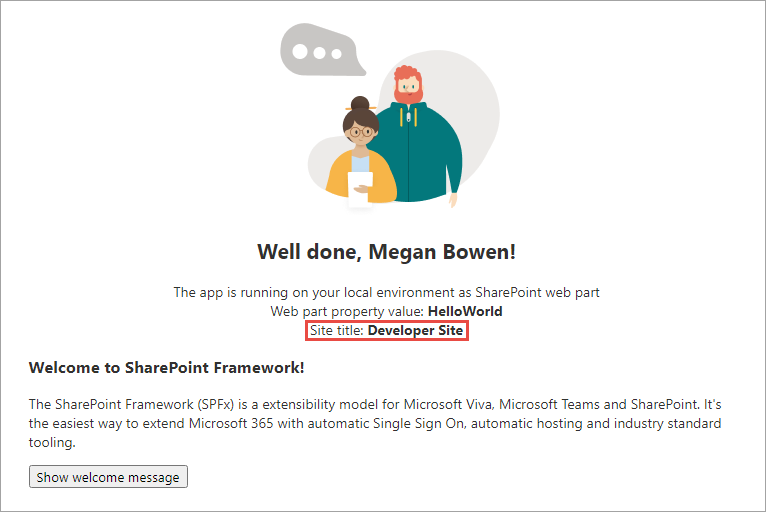
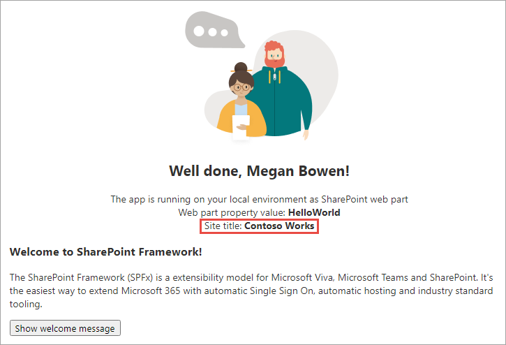

In this exercise, you'll test your web part in the hosted workbench, and you will explore the different modes of the built-in gulp serve task.

Open **Visual Studio Code** and then open the SharePoint Framework web part project you created in the previous exercise.

## The different modes of the gulp serve task

The SharePoint Framework's gulp **serve** task with the **nobrowser** switch will build the project and start a local web server. After running the gulp **serve** task, you need to manually navigate to the hosted workbench to test your web part. This is how you have used the gulp **serve** task so far.

But what if you want the browser to open the hosted workbench automatically for you? In that case, you can use a configuration setting to tell the gulp **serve** task what to do.

Locate and open the file **config/serve.json**

In the **serve.json** file, locate the `initialPage` setting. It's currently configured with a placeholder URL.

```json
"initialPage": "https://enter-your-SharePoint-site/_layouts/workbench.aspx",
```

Update the `initialPage` setting to open the hosted workbench:

```json
"initialPage": "https://contoso.sharepoint.com/sites/mySite/_layouts/workbench.aspx",
```

> [!NOTE]
> Ensure you enter the proper URL of a SharePoint Online site collection you have access to.

Start the local web server using the provided gulp **serve** task without the **nobrowser** switch. This will build the project, start a local web server, and load the hosted workbench at the URL configured in **serve.json**.

```console
gulp serve
```

## Testing with the SharePoint Online Hosted Workbench

Select the web part icon button to open the list of available web parts. Notice that the toolbox contains many web parts, not just the **HelloWorld** web part currently being served by the local web server. This is because you're testing the web part in a working SharePoint site.


Add the web part to the page.

Locate the web part file **src/webparts/helloWorld/HelloWorldWebPart.ts**.

Now locate the `render()` method and add the following line to the top of it, right after the method declaration:

```ts
const siteTitle : string = this.context.pageContext.web.title;
```

Add the following line just after the **Welcome to SharePoint** message:

```html
<p class="${ styles.subTitle }"><strong>Site title:</strong> ${ siteTitle }</p>
```

Wait a few seconds for the project to rebuild, and then refresh the hosted workbench. Notice that the title of the site is being displayed:



Now, open a new browser tab and navigate to a different site. Append the following to the end of the site's URL: **/_layouts/workbench.aspx**. 

Add the web part to the page.

Notice that the title of the second site is being displayed:



This is a simple demonstration of how the hosted workbench exposes the context of the current SharePoint site.

Close the browser tabs containing the hosted workbench and stop the local web server by pressing <kbd>CTRL</kbd>+<kbd>C</kbd> in the command prompt.

## Summary

In this exercise, you tested your web part in the hosted workbench, and you explored the different modes of the built-in gulp serve task.
