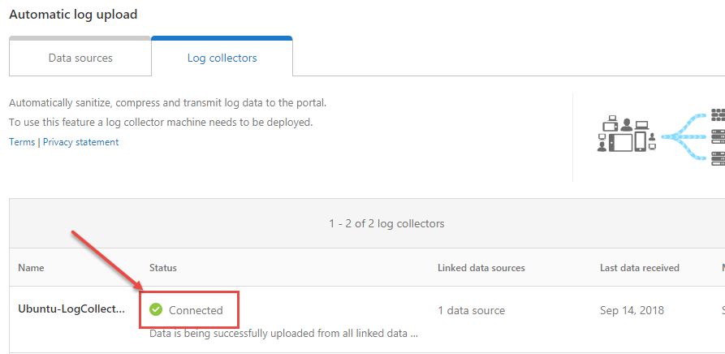

Log collectors are an important component of Microsoft Cloud App Security. They collect communications logs from firewalls and proxy servers and send them to Cloud App Security for analysis. Some proxy servers can prevent them from sending their collected logs smoothly.

In Contoso, your roll out of Microsoft Cloud App Security is complete but you have noticed a gap in log collection from three offices. Looking into the problem in more depth, you notice that all these offices are protected by proxy servers from the same manufacturer. You want to diagnose and fix the problem.

Here, you’ll learn about a common problem caused by misconfigured certificates that may affect your log collectors.

## Proxy server challenges

In Microsoft Cloud App Security, log collectors run on-premises to gather information about the Shadow IT websites and apps that are in use. The collectors obtain web logs from firewalls and proxy servers by using either File Transfer Protocol (FTP) or the Syslog protocol. They transfer these logs to the Cloud App Security portal, where they can be analyzed and the results can be displayed to administrators. This system is an important component in Cloud Discovery.

Log collectors can usually upload their logs to the portal without problems, even when they have to do so through a proxy server. However, a common problem can arise when the log collector doesn’t trust the proxy server’s root Certificate Authority (CA). If this trust problem exists, the log collector can’t obtain its correct configuration from Microsoft Cloud App Security or upload its collected logs.

The solution is to install the proxy server’s root CA certificate on the log collector. Because the log collector is a Docker container, you can complete this task by using Docker’s `exec` command to run some Bash commands on the collector.

## Configure the log connector CA certificate

To ensure that the log connector trusts the CA certificate, follow these procedures.

> [!NOTE]
> These steps assume that you have already set up Docker and started the log collector image. To complete these steps, you’ll need the API token that was created when you configured the log collector in the Microsoft Cloud App Security portal.

### Copy the CA certificate to the container

The first stage is to import the proxy server’s root CA certificate into the log collector container:

1. Sign into the Docker host and then, to check that the container is running, run this command:

    ```bash
    docker ps
    ```

    In the results, look for a container based on the image **mcr.microosft.com/mcas/logcollector**.

    

1. To copy the CA certificate to the container, run this command. Replace `Ubuntu-LogCollector` with the name of your container:

    ```bash
    docker cp proxy-ca.crt Ubuntu-LogCollector:/var/adallom/ftp/discovery
    ```

### Import the certificate into the Java KeyStore

Now that the certificate is copied into the log collector container, you must install it in the Java KeyStore so that the log collector can use it when it makes connections. Follow these steps:

1. To start a Bash prompt that runs within the log collector container, run this command. Replace `Ubuntu-LogCollector` with the name of your container:

    ```bash
    docker exec -it Ubuntu-LogCollector /bin/bash
    ```

1. At the `bash>` prompt, to navigate to the Java **jre** folder, run these commands:

    ```bash
    cd "$(find /opt/jdk/*/jre -name "bin" -printf '%h' -quit)"
    cd bin
    ```

1. To import the root certificate and define a password, run this command. Replace `<password>` with your choice of secure password:

    ```bash
    ./keytool --import --noprompt --trustcacerts 
       --alias SelfSignedCert 
       --file /var/adallom/ftp/discovery/Proxy-CA.crt 
       --keystore ../lib/security/cacerts 
       --storepass <password>
    ```

1. To check that the certificate is installed correctly, run this command:

    ```bash
    ./keytool --list --keystore ../lib/security/cacerts | grep self
    ```

    The list of certificates should include one named **SelfSignedCert**.

### Configure the log collector to use the new configuration

Before the new certificate can be used, you must update the log collector’s configuration:

1. Run the `collector_config` command, within the container, to ensure that the new configuration is in use. Replace `<apiToken>` with the token that was created when you created the log collector in the portal:

    ```bash
    collector_config <apiToken> ${CONSOLE} ${COLLECTOR}
    ```

    

1. In the Cloud App Security portal, the log collector’s status should change from **Healthy** to **Connected**.

    
