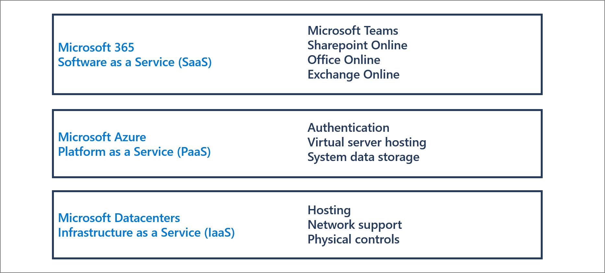

Microsoft 365   is a multi-tenant, cloud-based, Software-as-a-Service (SaaS) subscription offering from Microsoft. Subscriptions to Microsoft 365 provide customers with the option to select from a variety of online services, including Exchange Online, SharePoint Online, Microsoft Teams, and Office Online. Our services are designed to provide performance, scalability, security, management capabilities, and service levels required for mission-critical applications and systems used by business organizations. Microsoft manages the service infrastructure on behalf of customers and is responsible for securing the infrastructure that stores customer data. All components of the service are regularly updated by Microsoft as part of the cloud subscription model.

It is also important to point out that in cloud environments, customers and cloud service providers share the responsibility for achieving a compliant and secure computing environment. Microsoft uses [a shared responsibility model](/azure/security/fundamentals/shared-responsibility?azure-portal=true) to define security and operational accountability in Microsoft 365 services. While Microsoft 365 secures the underlying cloud infrastructure and services, customers need to be aware of their responsibilities for ensuring a secure tenant environment for their users and data.

In this module, we explore how Microsoft 365 is designed to provide secure and resilient services to our customers. Network, service, and tenant-level isolation ensures that customer data is secure on our shared platform. We build resiliency into our services at the network, service, and data levels to protect service availability against faults and single points-of-failure. Finally, we take care to document and validate our architecture, including dependencies, allowing our services to securely use new and existing Microsoft cloud offerings.

## Architecture overview

Currently, close to a million machines are used to power Microsoft 365 services. The infrastructure behind these services varies across service-specific hardware and virtualized environments in Azure, Windows, and Linux, and includes both multitenant and dedicated platforms. Microsoft 365 is a global business, and our infrastructure is distributed in datacenters around the world, enabling our customers to meet data residency and sovereignty requirements. Microsoft 365 services are designed to run at massive scale, which requires thousands of Microsoft engineers to build and maintain them.   Keeping our infrastructure secure is one of Microsoft's top priorities.

Microsoft 365 service infrastructure is housed in Microsoft datacenters and leverages many features of Microsoft Azure. Four core features amongst many others are:

- **SharePoint Online:** a solution for creating websites to share documents and information with colleagues and customers. This information and documentation repository includes OneDrive, Delve, Access Online, and Project Online. SharePoint Online is hosted on virtual machines with physical hardware managed by SharePoint Online.
- **Office Online:** a solution providing customers with the ability to view and edit documents via web browser. Examples include reading and editing documents hosted in SharePoint Online. Office Online is hosted on Azure virtual machines.
- **Exchange Online:** a hosted email solution for business. Exchange Online protects customer information with advanced security capabilities while maintaining high reliability for email access from any location, without the operational burden of setting up or maintaining on-premises servers. Exchange Online is hosted on physical servers managed by Exchange Online.
- **Microsoft Teams:** a teamwork hub offering persistent chat, meetings, calls, files, and applications. The Microsoft Teams experience builds on Microsoft 365's group infrastructure, global scale, enterprise grade security, and graph driven intelligence. Microsoft Teams is hosted on Azure virtual machines.

In addition to core features, Microsoft 365 uses supporting services that provide important business functionality and contribute to a fully featured customer experience. Each of our services is self-contained, and while they are designed to integrate with one another for increased functionality, they can be deployed and operated independently. Service independence prevents a fault in one service from impacting the availability of other services in Microsoft 365.

While Microsoft 365 designs, builds, and deploys its own services, our systems use Microsoft datacenters for network infrastructure support, datacenter hosting, network operations, and physical/environmental controls. The capabilities provided by Microsoft datacenters enhance service availability and maintain network resilience against faults and failures. In addition, many of our services are built on Microsoft Azure and take advantage of features available through Azure's Infrastructure-as-a-Service (IaaS), including virtual hosting and storage services. Connections to Azure services occur using FIPS 140-2 compatible TLS on approved ports and protocols.

## Learn more

- [Shared responsibility in the cloud](/azure/security/fundamentals/shared-responsibility?azure-portal=true)
