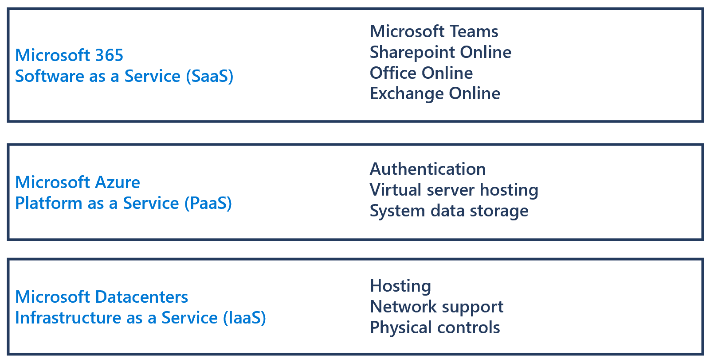

Microsoft is organized around engineering groups who build and support Microsoft cloud platforms, services, and software. Microsoft 365 is part of the Engineering + Devices Group, which integrates productivity, communications, education, search, and other information services, along with the software platform, apps, store, and devices that power the Windows ecosystem. Microsoft 365 leverages the technologies of other Microsoft engineering groups, including the Cloud + Artificial Intelligence Group who build and maintain Microsoft global datacenters and provide Microsoft Azure's computing fabric.

Microsoft 365 is a multi-tenant, cloud-based subscription service offering from Microsoft. Subscriptions to Microsoft 365 provide customers with an option to select from various cloud services, including Exchange Online, SharePoint Online, Microsoft Teams, and Office Online. Microsoft 365 service infrastructure is housed in Microsoft datacenters and uses many features of Microsoft Azure. Our services are designed to provide performance, scalability, security, management capabilities, and service levels required for mission-critical applications and systems used by business organizations.

## Microsoft 365 services

The Microsoft 365 business group is organized into service teams that develop and maintain each Microsoft 365 product, as well as support teams that provide supporting services for Microsoft 365 system operations. Each service is deployed onto service-specific servers hosted in Microsoft datacenters, and many of our core services use features of the Microsoft Azure platform, including authentication, virtual server hosting, and data storage.

Four core features amongst many others are:

- **SharePoint Online:** a solution for creating websites to share documents and information with colleagues and customers. This information and documentation repository includes OneDrive, Delve, Access Online, and Project Online.
- **Office Online:** a solution providing customers with the ability to view and edit documents via web browser. Examples include reading and editing documents hosted in SharePoint Online.
- **Exchange Online:** a hosted email solution for business. Exchange Online protects customer information with advanced security capabilities while maintaining high reliability for email access from any location, without the operational burden of setting up or maintaining on-premises servers.
- **Microsoft Teams:** a teamwork hub offering persistent chat, meetings, calls, files, and applications. The Microsoft Teams experience builds on Microsoft 365's group infrastructure, global scale, enterprise grade security, and graph driven intelligence.

In addition to the teams who develop and operate our core services, Microsoft 365 includes teams who support all Microsoft 365 products and enforce the organization's key principles. These teams include:

- **Microsoft 365 Security** provides service teams with centralized security expertise and security incident response as part of our federated security response model.
- **Microsoft 365 Identity** oversees identity and access management, providing an integrated and broad solution for managing Microsoft 365 user identities and associated credentials.
- **Microsoft 365 Business Continuity** supports business continuity and disaster recovery efforts across Microsoft 365 as part of Enterprise Business Continuity Management (EBCM).
- **Microsoft 365 Trust** supports Microsoft 365 security and compliance efforts as part of maintaining compliance certifications, promoting transparency, and retaining customer trust in Microsoft 365 services.
- **Other Microsoft 365 Workloads** include service teams who provide features and components that support Microsoft 365 services.

Together these teams develop, build, and support the Microsoft 365 service offering for customers.
