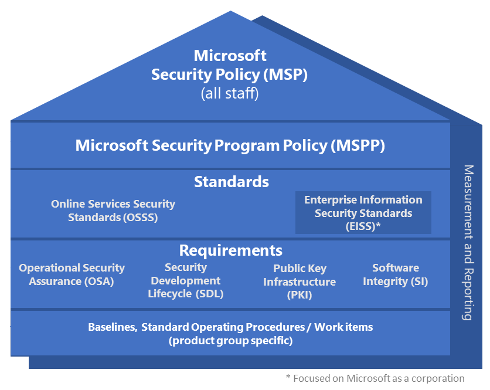

The Microsoft Security Policy and Standards Program is part of the Microsoft Policy Framework and provides a comprehensive security governance program for all Microsoft staff, engineering groups, and business units. Because security requirements are constantly changing to account for new technologies, regulatory and compliance requirements, and security threats, Microsoft regularly updates our security policies and supporting documents to protect Microsoft systems and customers, meet our commitments, and maintain customer trust.

## Microsoft Security Policy and Standards Program

The Microsoft Security Policy and Standards Program is organized into policies, standards, requirements, and baselines. Policies, standards, and requirements provide enterprise-wide guidance to support consistent security and privacy practices across Microsoft. Individual business units, such as Microsoft 365, use standard operating procedures (SOPs) to detail how their business units implement the requirements.

The MSP and its related security requirements include:

- **Microsoft Security Policy (MSP):** The MSP is a non-technical collection of security objectives that apply to all Microsoft staff. The objectives in the MSP guide all security policies, standards, and requirements throughout Microsoft.
- **Microsoft Security Program Policy (MSPP):** The Microsoft Security Policy Program (MSPP) defines a common set of security objectives to drive toward a governance framework for expected security outcomes. MSPP applies to Microsoft staff in, but not limited to development, operations, security, compliance and audit roles during the creation, maintenance, and/or operation of Microsoft software and/or services.
- **Standards:** The Online Services Security Standard (OSSS) and Enterprise Information Security Standards (EISS) outline enterprise-wide requirements for online services and corporate security. The OSSS guides security for all online services, while EISS is implemented by corporate security teams.
- **Requirements:** Requirements are more detailed than standards and provide specific, technical implementations that must be met by applicable systems and business units. For example, any business unit that develops Microsoft products or services must implement Microsoft’s Security Development Lifecycle (SDL) to enforce secure development practices. Other requirements at Microsoft include Operational Security Assurance (OSA) for securely operating production systems, Public Key Infrastructure (PKI) for secure public key cryptography, and Software Integrity (SI) requirements to protect and verify code integrity.
- **Standard Operating Procedures (SOPs):** Individual product groups and business units use SOPs to detail how their organization implements standards and requirements to meet the security objectives defined in the MSP.

## MSP and MSPP roles and responsibilities

Updates to the Microsoft Security Policy (MSP) and Microsoft Security Program Policy (MSPP) are led by Customer Security and Trust, a business unit under Microsoft Corporate, External, and Legal Affairs (CELA) with input from all relevant engineering groups and business units. The CVP of Customer Security & Trust and the CISO of Corporate Strategy act as final approvers for all changes to the MSP.

## MSP and MSPP review process

At a minimum, Microsoft security policies, standards, and requirements are reviewed and updated on an annual basis. Annual security policy revision considers a variety of factors, including:

- Changes to external regulatory or compliance requirements. Examples include legislation or updates to external standards, such as ISO or NIST. The security policy revision process includes review of all proposed changes to ensure alignment with applicable regulations.
- Changes to the security landscape. This includes emerging threats, security issues, and lessons learned from past incidents.
- Changing business and customer needs. As the business changes, policies and standards might need to be updated to account for new technologies. For example, new products and services may require new approaches to security.

Relevant stakeholders, their delegates, and reviewers assess how changing conditions might require updates to Microsoft security policies and standards. Proposed changes are submitted to relevant reviewers for approval. After the review is complete, updated versions of Microsoft security policies and standards are disseminated and implemented by Microsoft business units, who update their standard operating procedures (SOPs) to account for any changes to their organization-specific security implementations.

## Exception handling

Exceptions to Microsoft’s security policies and standards represent deviations from requirements with a legitimate business justification for the deviation. All exceptions are reviewed and approved by an appropriate governance entity. Depending on the scope of the exception and the potential risk it represents, exception approval from an appropriate executive may be required. All exceptions must be tracked in the appropriate tool.
