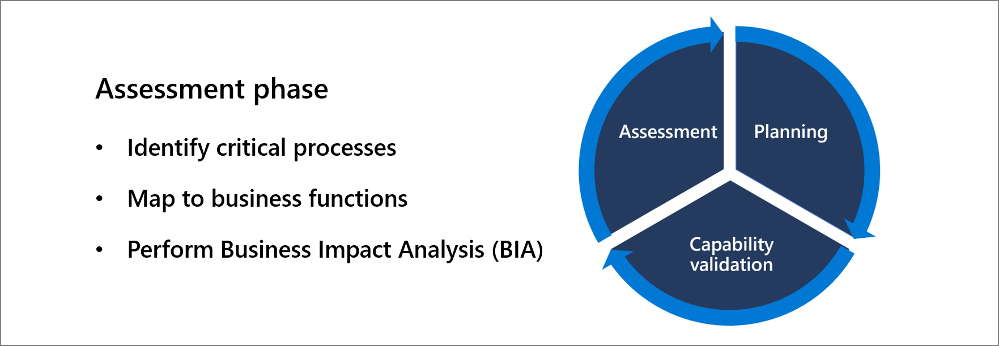

> [!VIDEO https://www.microsoft.com/videoplayer/embed/RE4ylBC]

The BCM lifecycle begins with the Assessment phase. The primary goals of Assessment are to identify critical processes and services, map them to business functions, and perform a Business Impact Analysis (BIA) to identify recovery objectives. After initial Assessment and BCM program implementation, the Assessment phase is used to confirm that underlying assumptions about critical processes and services, dependencies, and recovery objectives are still valid.

Business units begin the Assessment phase by identifying processes and services that are required to support corporate goals. This process includes Dependency Analysis (DA) to help identify additional components required to maintain critical business functionality. These activities clarify and make explicit the assumptions behind the business continuity plan.

After identifying critical processes and services, business units complete a BIA to determine recovery objectives for an effective business continuity plan. The BIA helps business units identify Recovery Time Objectives (RTOs), or the maximum duration within which a service must be restored after a disruption, as well as Recovery Point Objectives (RPOs), or the maximum acceptable age of data used for recovery. RTOs and RPOs vary based on the nature of critical processes and services. Defining these objectives using a BIA guides the selection of appropriate resilience and recovery strategies during the Planning phase.
