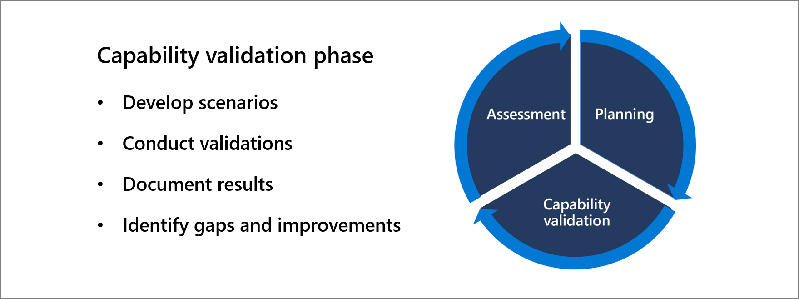

> [!VIDEO https://www.microsoft.com/videoplayer/embed/RE4yqwL]

Capability validation is an integral part of the EBCM lifecycle. It involves testing Business Continuity Plan (BCP) effectiveness in both theory and practice. Each service team tests their BCP regularly to measure the plan’s effectiveness and the service team’s readiness to execute the plan. Per EBCM Program guidelines, an annual review of BCP and capability validation must take place within 12 months of the last review and include review of supporting documentation, such as the BIA and DA.

## Validation levels

To validate resilience and recovery strategies against a wide range of potential incidents, the EBCM Program defines multiple categories of test scenarios affecting people, locations, and technology. Individual service teams are free to define their own specific tests within EBCM test scenario guidelines.

Examples of test scenarios include:

- Loss of a primary building or campus cluster
- Technology disruptions
- Regional network outages
- Critical third-party disruptions
- Workforce disruptions
- Broad regional events
- Loss of a single datacenter
- Cyber attacks
- Pandemic

Within the context of each test scenario, Microsoft defines eight levels of validation, from 0, which means the capability has not been tested, to 7, which means the capability was fully activated during the test. Levels 1 through 4 test features of the business continuity plan outside of production environments. Levels 5 through 7 require increasingly rigorous validation of recovery strategies within production environments, with level 7 requiring validation of the recovery plan for an entire application ecosystem, including all dependencies. The level of validation required for each service is based on the service’s criticality, with more critical services receiving more rigorous validation. We make capability validation results for select Microsoft 365 Services available to our customers through quarterly reports.

## Responding to service-impacting incidents

The value of capability validation and continuous BCM improvement becomes evident when Microsoft has to execute business continuity plans to respond to service-impacting incidents. When Hurricane Harvey hit Texas with an anticipated impact to our San Antonio datacenter, the Exchange Online team activated the business continuity plan to proactively evacuate traffic from the datacenter, preventing any impact to our customers. Once the threat had passed, the datacenter was returned to normal operation without incident by following clearly defined recovery processes. These processes were in place because Exchange Online had updated and tested its continuity plan based on lessons learned from previous natural disasters to ensure the plan would be effective during a real emergency.

Lessons learned from internal incidents also support business continuity improvements. When the Microsoft corporate network experienced a DNS outage due to a bad Group Policy deployment, customers were protected from any impact because the corporate network was isolated from our Commercial Services in separate fault-zones. However, internal communications at Microsoft were affected and made coordination to resolve the incident more difficult. This incident led to the creation of State of Emergency protocols to enable collaboration between teams at Microsoft during incidents that impact internal communications.

## Learn more

[Business Continuity and Disaster Recovery Plan Validation Report](https://aka.ms/EBCM_BCP_Test_Report?azure-portal=true)
