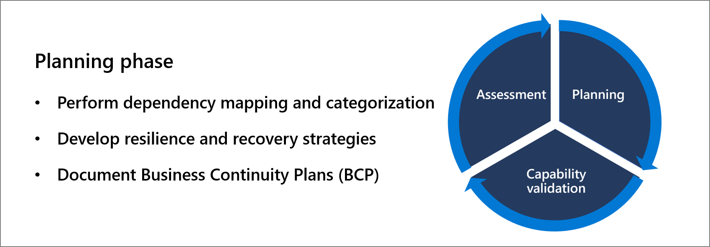

> [!VIDEO https://www.microsoft.com/videoplayer/embed/RE4yqwK]

Based on the results of the Assessment phase, business units develop business continuity plans to enable recovery of critical processes and services if there is a major disruption. Business continuity plans include resilience and recovery strategies, recovery verification procedures, and the activities required to restore services after a disruption has ended. Plans must meet the objectives identified in the BIA and account for service dependencies when selecting resilience and recovery strategies.

Once the business continuity plan has been documented, it is disseminated to service teams to ensure relevant personnel receive appropriate training to fulfill their business continuity responsibilities. In addition, service teams are responsible for implementing the resilience and recovery strategies identified in the business continuity plan. For example, if a business continuity plan identifies geographically redundant data replication as a resilience strategy, service teams implement that strategy for applicable critical service components.

Because Microsoft 365 Services is constantly evolving, business continuity planning involves regular review and revision. Business continuity plans must be reviewed within 12 months of the last review or when any major architectural changes have occurred that would impact the efficacy of the plan. New business continuity plans must be validated for effective design and implementation, and updated plans must be reviewed and validated within 12 months of the previous validation.
