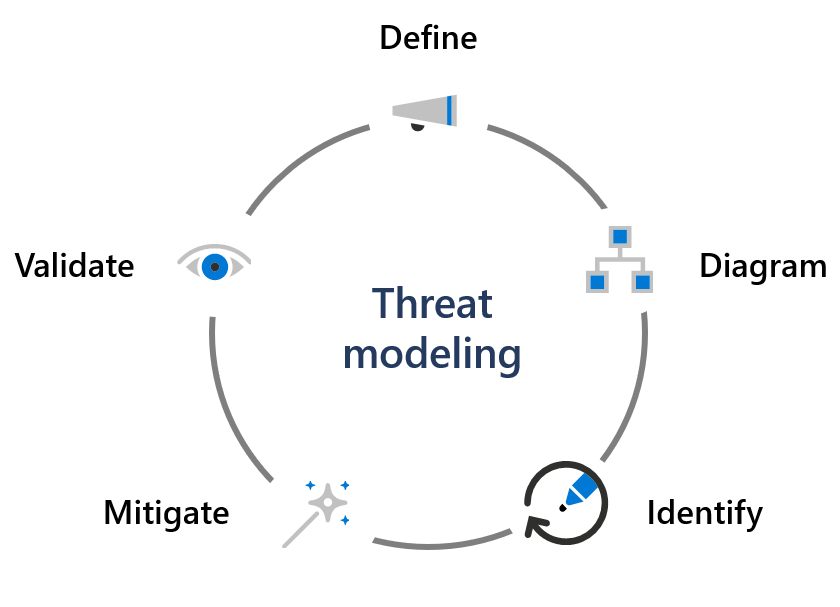

The Microsoft SDL emphasizes the importance of security and privacy by design. Security and privacy features should not be add-ons, but instead be central components of our products and services. We build security into our products by defining security requirements early in the feature lifecycle, maintaining up-to-date threat models for all major service components and features, and requiring manual code review for all source code.

## Security and privacy requirements

Security and privacy requirements should inform the design of all highly secure applications and systems. At Microsoft, every product, service, and feature we develop begins with clearly defined security and privacy requirements. Because software development is an ongoing process, we continuously update these requirements throughout a product’s lifecycle to reflect changes in both required functionality and the threat landscape. Factors that influence security and privacy requirements include the nature of the software being developed, known security threats, lessons learned from security incidents, legal and industry requirements, and internal standards and coding practices.

The optimal time to define security and privacy requirements is during the initial design and planning stages of a product or feature. This allows development teams to integrate security features into a product’s core functionality. For example, one question we ask about every product during the design phase is whether the product will handle sensitive information, such as customer data. Microsoft’s SDL includes security and privacy requirements to help developers implement best practices for sensitive data handling and ensure that our software collects, processes, and stores sensitive data securely in compliance with relevant requirements. SDL requirements for sensitive data handling include encryption, logging, and incident response preparedness to protect sensitive data and provide the Microsoft 365 Security Response team with the audit capabilities required to investigate and respond to potential security incidents.

## Threat models and data flow diagrams (DFDs)

>[!VIDEO https://www.microsoft.com/videoplayer/embed/RE4xilB]

Once a product’s design includes clearly defined security and privacy requirements, development teams build threat models to visualize the security and privacy threats most likely to affect the product. Threat modeling helps to identify, categorize, and rate potential threats according to risk so developers can propose and implement appropriate mitigations. The SDL requires development teams at Microsoft to maintain up-to-date threat models and DFDs for all major service components and features.

Threat modeling begins by **defining** a product or feature’s components and **diagraming** their relationships to one another for key functional scenarios, such as authentication or sensitive data handling. Threat modeling diagrams include relevant dataflows, functions, and processes to help visualize threats to the service. As part of the threat modeling process, service teams create and maintain DFDs that document all dataflows, ports, and protocols used by a service component or feature.

Completed diagrams are used to **identify** threats to the system and prioritize threats for mitigation. Development teams propose and implement **mitigations** for risks exposed by their threat models. New mitigations are added to the product’s security requirements, **validated** in the code during manual code review and automated testing, and reviewed as part of the approval process prior to release.

Because modern software development using Agile emphasizes rapid feature delivery to customers, threat modeling is an ongoing process. To ensure consistency across development teams and to help keep threat models up to date, Microsoft requires its developers to use Microsoft’s Threat Modeling Tool for all threat models. The Threat Modeling Tool enables any developer or software architect at Microsoft to:

- Communicate about the security design of their systems.
- Analyze security designs for potential security issues using a proven methodology.
- Suggest and manage mitigations for security issues.

During security review prior to release, all threat models are reviewed for accuracy and completeness, including mitigations for unacceptable risks. These reviews maintain accountability and encourage security-oriented design.

## Manual code review

Our development teams use Azure DevOps Git for version control on all new code repositories. To verify that all code developed at Microsoft conforms to SDL and design requirements, the SDL requires manual code review by a separate reviewer before code changes can be checked into a release branch. Code reviewers check for coding errors and verify that code changes meet SDL and design requirements, pass functional and security tests, and perform reliably. They also review associated documentation, configs, and dependencies to ensure code changes are documented appropriately and will not cause unintended side-effects.

If a reviewer finds problems during code review, they can ask the submitter to resubmit the code with suggested changes and additional testing. Code reviewers may also decide to block check-in entirely for code that does not meet requirements. All changes to code submitted for release must be clearly attributable to a single developer and reviewed by a separate reviewer to maintain accountability. In addition, all changes to release code must be recorded and retained for at least 18 months to provide an auditable record of all code changes, along with their author, business justification, test results, and the reviewer who approved the change.

## Learn more

- [Threat Modeling](https://www.microsoft.com/securityengineering/sdl/threatmodeling?azure-portal=true)
- [How We Use Git at Microsoft](https:/docs.microsoft.com/azure/devops/learn/devops-at-microsoft/use-git-microsoft?azure-portal=true)
