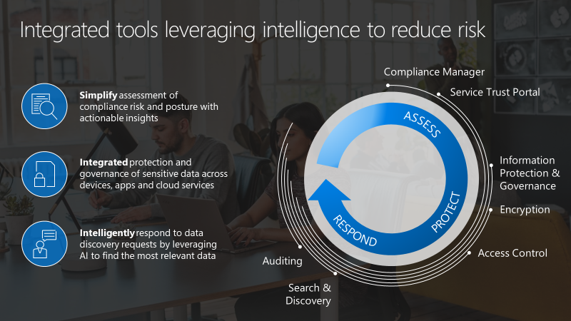

As the proliferation of data increases, and our reliance on storing and accessing that data online grows, so has the need for data management. Over the years, governmental and other agencies have become interested in how we use and share data, particularly personal data, like financial and health data. 

To help protect individuals, governments have introduced regulations about data storage, handling, and use:

- Granting people the right to access, and possibly correct, data stored about them
- Defining a data retention period
- Granting governments and regulatory bodies the rights to access records for investigative purposes 
- Defining exactly how data can and cannot be used. In other words, defining the purpose for the collated data 
- Defining privacy controls so that private data remains private

Some of these regulations include:

- **Health Insurance Portability and Accountability Act (HIPAA)** imposes strict privacy regulations on protected health information.
- **Federal Information Security Modernization Act (FISMA)** dictates how United States federal agencies protect information.
- **General Data Protection Regulation (GDPR)** and **Safe Harbor Framework** address the protection of data and how and when it can be transferred. 
- **The Family Educational Rights and Privacy Act (FERPA)** covers the use or disclosure of student education records, including student information sent in email or email attachments.
- **The Personal Information Protection and Electronic Documents Act (PIPEDA)** addresses how private sector organizations collect, use, and disclose personal information in regard to commercial business. 
- **The Gramm–Leach–Bliley Act (GLBA)** protects nonpublic personal information.

Microsoft 365 supports your organization’s compliance needs with built-in tools and capabilities to help you protect information, manage data governance, and respond to regulatory requests. 

It can be helpful to think about managing compliance in terms of three phases: 
- **Assess**. Assess compliance risk and posture with actionable insights
- **Protect**. Protect and govern sensitive data across devices, apps, and cloud services
- **Respond**. Intelligently respond to data discovery requests by leveraging AI to find the most relevant data

*The three phases of compliance management and the solutions in Microsoft 365 that can help you* 