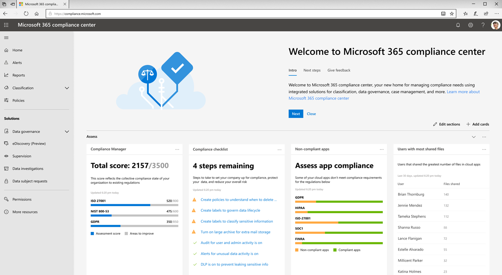

The new Microsoft 365 compliance center is a specialized workspace for your compliance, privacy, and risk management professionals. You can use the compliance center to assess your compliance risks through Compliance Manager, protect and govern your data with sensitivity and retention labels, respond to regulatory requests like Data Subject Requests, and access other compliance and privacy solutions. 

*The Microsoft 365 Compliance Center Welcome page*

The new experience helps you reduce compliance risks and protect your digital estate more easily and effectively with three new insights:
- With the Compliance Manager integration, Microsoft 365 compliance center provides you with visibility into your compliance posture against key regulations and standards like the GDPR, ISO 27001, NIST 800-53, and more on the homepage. You can then perform risk assessments and follow step-by-step guidance to enhance your compliance and privacy controls.
- Additionally, to help you label data more accurately, Microsoft 365 Label Analytics preview can enable you to analyze and validate how sensitivity and retention labels are being used beyond your Office 365 workloads. 
- Microsoft Cloud App Security (MCAS) insights are also available in the Microsoft 365 compliance center to help you identify compliance risks across applications, discover shadow IT, and monitor employees’ non-compliant behaviors.

Once the Microsoft 365 compliance center is enabled for your tenant, you will be to access it at: https://compliance.microsoft.com.

### Try it ###
>Learn how to assess risk using the Microsoft 365 compliance center in this interactive guide:
>
>   
>
>Be sure to click the full-screen option in the video player, to make it easier to see all of the great Microsoft Teams features. When you're done, use the **Back** arrow in your browser to come back to this page. 
