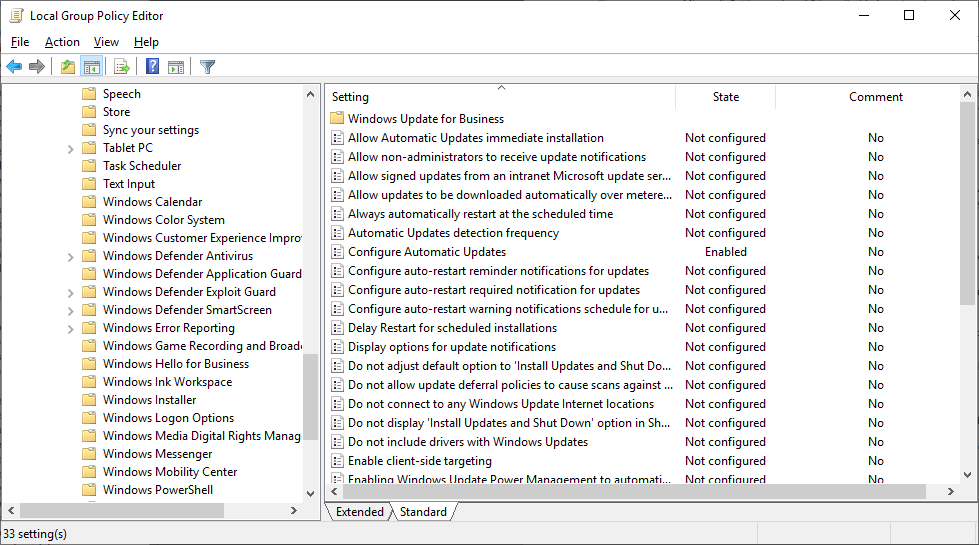
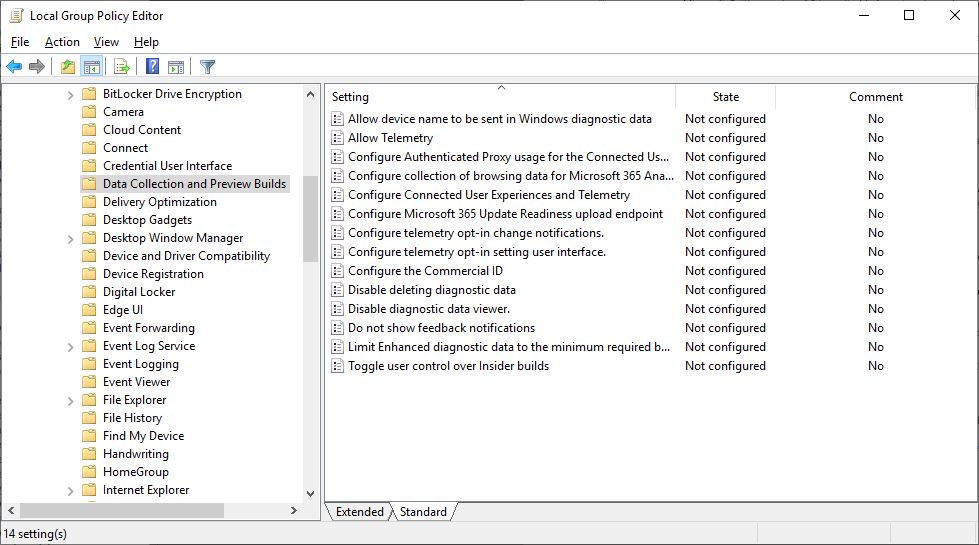
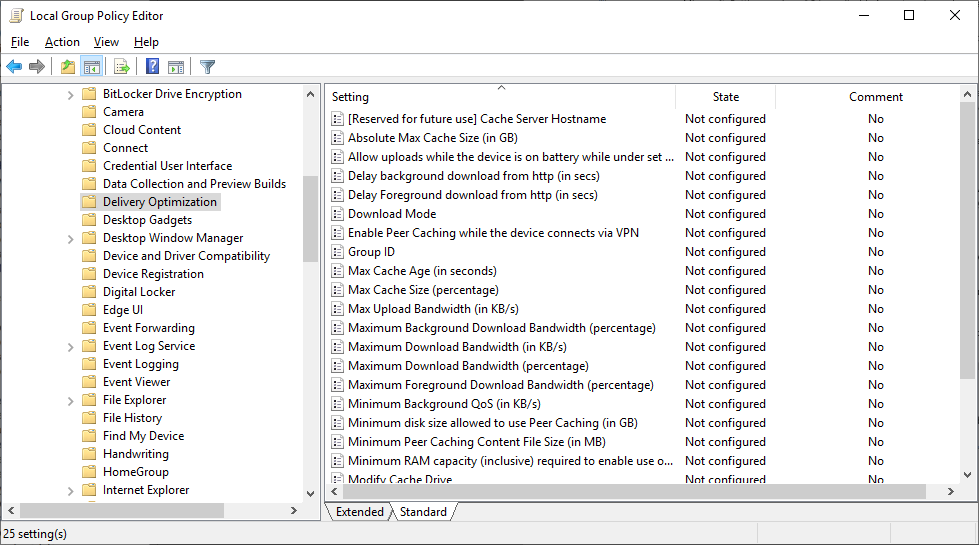

To configure each individual computer with specific Windows Update settings would be very time-consuming. Fortunately, you can create a Group Policy Object (GPO) to configure the necessary settings, and then use Active Directory Domain Services (AD DS) to apply those settings to the appropriate collection of computers.

Three nodes in Group Policy contain Windows Update settings that are relevant for Windows 10 devices. The first of these nodes is the Windows Update node. Open the Group Policy Management Editor on a domain controller, and then navigate to **Computer Configuration/Administrative Templates/Windows Components/Windows Update**.

In addition to the Windows Update node, you also can configure update settings in **Computer Configuration/Administrative Templates/Windows Components/Data Collection and Preview Builds** as shown in the image below.

The final node in Group Policy that contains Windows Updates settings is the Delivery Optimization node. The **Computer Configuration/Administrative Templates/Windows Components/Delivery Optimization** node contains the following settings.

These are the three nodes for adjusting Windows Update with Group Policy.

