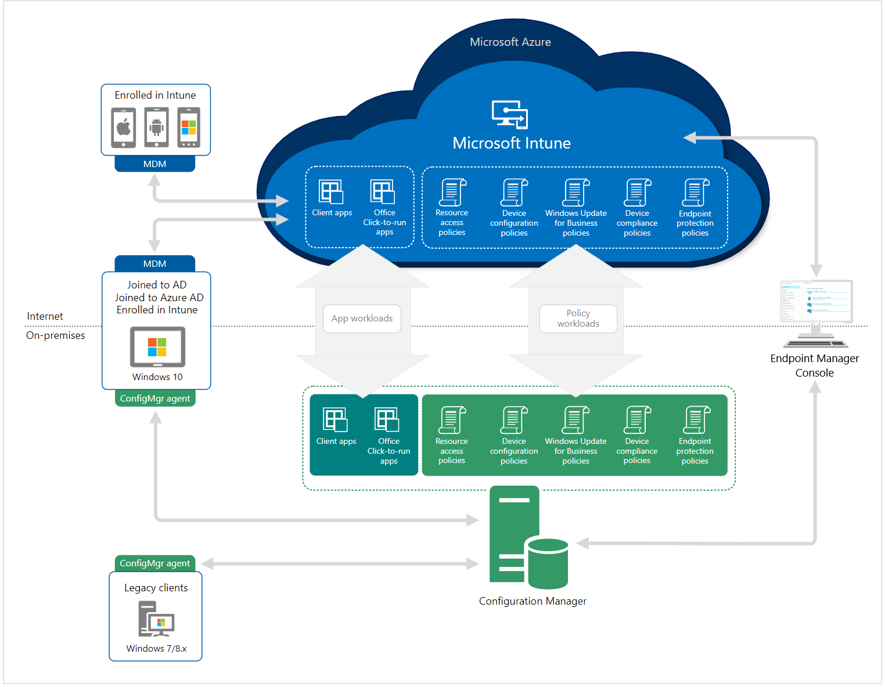

Co-management is where you concurrently manage Windows 10 devices with both Configuration Manager and Microsoft Intune. It combines your existing on-premises Configuration Manager and Active Directory investment with the cloud by using Intune, Azure AD, and other Microsoft 365 cloud services. You choose whether Configuration Manager or Intune is the management authority. You keep some tasks on-premises, while running other tasks in the cloud with Intune.

> [!NOTE]
> The mobile device management (MDM) authority setting determines how you manage your devices. As an IT admin, you must set an MDM authority before users can enroll devices for management. For more information, see [Set the mobile device management authority](/mem/intune/fundamentals/mdm-authority-set.md).

Co-management is one of the primary ways to attach your existing Configuration Manager deployment to the Microsoft 365 cloud. It helps you unlock additional cloud-powered capabilities like conditional access. By using co-management, you have the flexibility to use the technology solution that works best for your organization.

When a Windows 10 device has the Configuration Manager client and is enrolled to Intune, you get the benefits of both services. You control which workloads, if any, you switch the authority from Configuration Manager to Intune. Configuration Manager continues to manage all other workloads, including those workloads that you don't switch to Intune, and all other features of Configuration Manager that co-management doesn't support.

## Benefits of co-management

When you enroll existing Configuration Manager clients in co-management, you gain the following immediate value:  
- Conditional access with device compliance  
- Centralized visibility of device health  
- Link users, devices, and apps with Azure Active Directory (Azure AD)  
- Modern provisioning with Windows Autopilot  
- Intune-based remote actions, such as restart, remote control, or factory reset

In the following diagram, you can see how Windows 10 devices can be manged with both Configuration Manager and Microsoft Intune:

