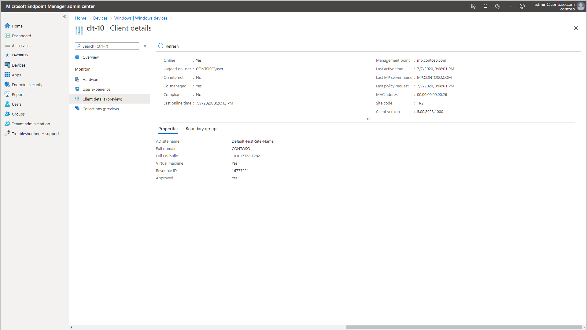
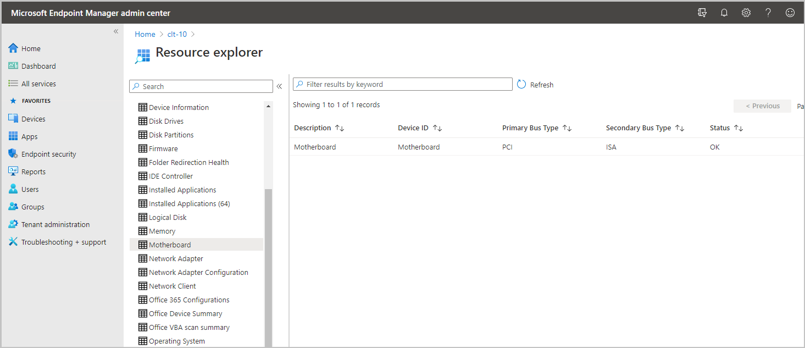
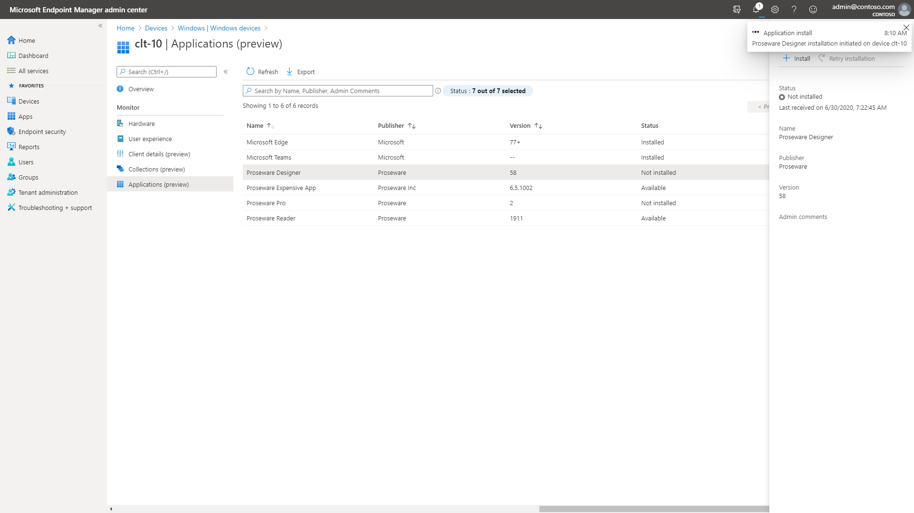
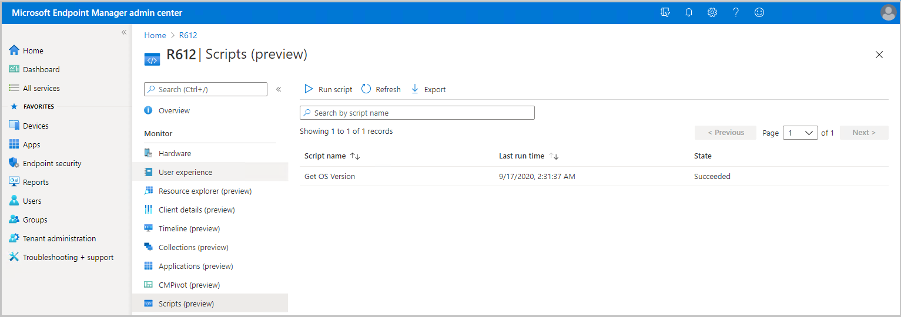
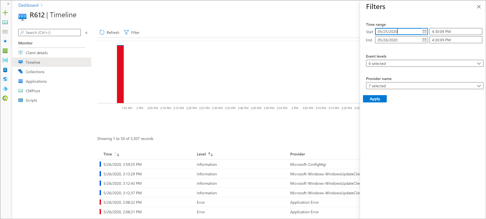

Tenant attach allows you to recognize your Configuration Manager devices and take actions from Microsoft Endpoint Manager. For instance, you can view client and device details, install apps, and run PowerShell scripts from Microsoft Endpoint Manager admin center. Additionally, you can view a timeline of device events that are synced each day, as well as perform other actions.

## Client details

You can see Configuration Manager client details including collections, boundary group membership, and client information for a specific device in the Microsoft Endpoint Manager admin center.

### View client details based on device

Use the following steps to view client details for a specific device:

1. In a browser, navigate to [Microsoft Endpoint Manager admin center](https://endpoint.microsoft.com).
2. Click **Devices** > **All Devices**. 
   As previously mentioned, you'll see **ConfigMgr** in the **Managed by** column for devices that have been uploaded using tenant attach.

   

3. Select a device that is synced from Configuration Manager via tenant attach. The device will have **ConfigMgr** in the **Managed by** column.
4. Click **Client details** to see additional details.

   Once an hour, the following fields are updated:
      - Last policy request
      - Last active time
      - Management point

   

5. Click **Collections** to list the client's [collections](/mem/configmgr/core/clients/manage/collections/introduction-to-collections). 
   Collections help you organize resources into manageable units.

   

### View a list of devices based on user

Use the following steps to view a list of devices that belong to a user:

1. In a browser, navigate to [Microsoft Endpoint Manager admin center](https://endpoint.microsoft.com).
2. Click **Troubleshooting + support** > **Troubleshoot** > **Select user**. 
   If you already have a displayed user, you choose **Change user** to select a different user.
3. Search for or click on a listed user. Then, click **Select**.

   The **Devices** table lists the Configuration Manager devices associated with the user. 

For more information about viewing client details and tenant attach, see [Tenant attach: ConfigMgr client details in the admin center](/mem/configmgr/tenant-attach/client-details).

## Device data

From the Microsoft Endpoint Management admin center, you can view hardware inventory for uploaded Configuration Manager devices by using resource explorer.

To view device data from the resource explorer:

1. In a browser, navigate to [Microsoft Endpoint Manager admin center](https://endpoint.microsoft.com).
2. Click **Devices** > **All Devices**.
3. Select a device that is synced from Configuration Manager via tenant attach. 
   You can recognize devices that have been synced via tenant attach because **ConfigMgr** will be listed in the **Managed by** column for the device.
4. Click **Resource explorer** to view hardware inventory.
5. Search for or select a class (a device value) to retrieve information from the client.

   

Resource explorer can display a historical view of the device inventory in the Microsoft Endpoint Manager admin center. When troubleshooting, having historical inventory data can provide valuable information about changes to the device.

1. From the Microsoft Endpoint Manager admin center, select **Resource explorer** if you don't have it selected already.
2. Select a class (a device value).
3. Enter a custom date in the date time picker to get historical inventory data.

   

4. Close resource explorer and return to the device information by clicking the `X` icon in the top right of resource explorer.

   

For more information about viewing device data for tenant attach devices, see [Tenant attach: Resource explorer in the admin center](/mem/configmgr/tenant-attach/resource-explorer).

## App management

From the Microsoft Endpoint Management admin center, you can initiate an application install in real time for a tenant attached device. You can deploy an application to a device or user. Also, you can repair, re-evaluate, reinstall, or uninstall an application.

Use the following steps to install an application to an on-premises device:

1. In a browser, navigate to [Microsoft Endpoint Manager admin center](https://endpoint.microsoft.com).
2. Click **Devices** > **All Devices**.
3. Select a device that is synced from Configuration Manager via tenant attach. 
   You can recognize devices that have been synced via tenant attach because **ConfigMgr** will be listed in the **Managed by** column for the device.
4. Click **Applications** to view a list of available apps.
5. Select an application that hasn't been installed and click **Install**.

   

For more information about applications and tenant attach, see [Tenant attach: Install an application from the admin center](/mem/configmgr/tenant-attach/applications).

## Scripts

Bring the power of the Configuration Manager on-premises Run Scripts feature to the Microsoft Endpoint Manager admin center. Allow additional personas, like Helpdesk, to run PowerShell scripts from the cloud against an individual Configuration Manager managed device in real time. This gives all the traditional benefits of PowerShell scripts that have already been defined and approved by the Configuration Manager admin to this new environment.

1. In a browser, navigate to [Microsoft Endpoint Manager admin center](https://endpoint.microsoft.com).
2. Click **Devices** > **All Devices**.
3. Select a device that is synced from Configuration Manager via tenant attach. 
   You can recognize devices that have been synced via tenant attach because **ConfigMgr** will be listed in the **Managed by** column for the device.
4. Click **Scripts** to view a list of available scripts.

   Scripts that were recently run that directly targeted the device will already be listed. The list includes scripts run from the admin center, SDK, or the Configuration Manager console. Scripts initiated from the on-premises console, against collections containing the device won't be shown, unless the scripts were also initiated specifically for the single device.

   

For more information about running scripts on tenant attached devices, see [Tenant attach: Run Scripts from the admin center](/mem/configmgr/tenant-attach/scripts).

## Device event timeline

When Configuration Manager synchronizes a device to Microsoft Endpoint Manager through tenant attach, you can see a timeline of events. This timeline shows past activity on the device that can help you troubleshoot problems.

Once a day Configuration Manager sends the on-premises device events to the Microsoft Endpoint Manager admin center. Only events collected after the client receives the **Enable Endpoint analytics data collection** policy are visible in the admin center. You can generate test events easily by installing an application or an update from Configuration Manager, or restart the device. Events are kept for 30 days.

> [!NOTE]
> As a [prerequisite](/mem/configmgr/tenant-attach/timeline#prerequisites) to view the timeline from the Microsoft Endpoint Manager admin center, you must set **Enable Endpoint analytics data collection** to **Yes** in Configuration Manager. For more information about implementing the device timeline, see [Tenant attach: Device timeline in the admin center](/mem/configmgr/tenant-attach/timeline).

To view the device event timeline:

1. In a browser, navigate to [Microsoft Endpoint Manager admin center](https://endpoint.microsoft.com).
2. Click  **Devices** > **All Devices**.
3. Select a device that is synced from Configuration Manager via tenant attach. 
   You can recognize devices that have been synced via tenant attach because **ConfigMgr** will be listed in the **Managed by** column for the device.
4. Click **Timeline**. By default, you're shown events from the last 24 hours.
   - Select **Sync** to fetch the recent data generated on client. The device sends events once a day to the admin center by default.
   - Use the **Filter** button to change the **Time range**, **Event levels**, and **Provider name**.
   - If you select an event, you'll see the detailed message for it.
   - Select **Refresh** to reload the page and to see newly collected events.

   

For more information about viewing device events for tenant attached devices, see [Tenant attach: Device timeline in the admin center](/mem/configmgr/tenant-attach/timeline).
