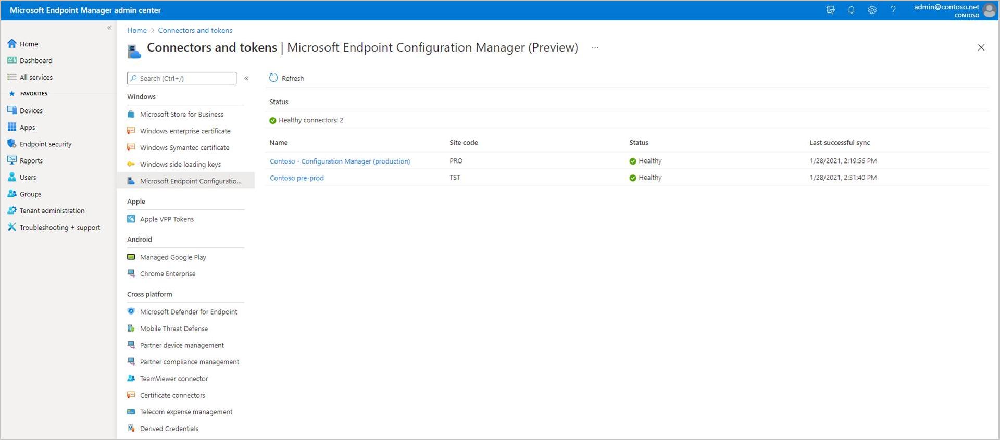

The Configuration Manager connector provides details about your Configuration Manager implementation. When you've successfully attached your tenant to Configuration Manager, you'll see your connection is **Healthy**. Attaching your tenant to Configuration Manager is called tenant attach. This involves registering your Intune tenant with your Configuration Manager deployment. 

Implementing tenant attach isn't required to enable co-management, however attaching your tenant before enabling co-management is recommended. For more information, see [Set up tenant attach using Microsoft Endpoint Configuration Manager](/learn/modules/endpoint-manager/setup-tenant-attach-using-configuration-manager?azure-portal=true).

To display the Configuration Manager connector status:

1. Sign in to [Microsoft Endpoint Manager admin center](https://go.microsoft.com/fwlink/?linkid=2109431).
2. Select **Tenant administration** > **Connectors and tokens** > **Microsoft Endpoint Configuration Manager**. Select a Configuration Manager hierarchy to display additional information about it.
   
   

3. If you have attached your tenant to Configuration Manager, your connection will be listed as **Healthy**. However, if you haven't attached your tenant to Configuration Manager, you will see **No results** for both the **Status** and **Name** of the Configuration Manager hierarchy.

Once you confirm your tenant has been successfully attached, you can review details about the Configuration Manager connector, such as the last successful synchronization time and the connection status.