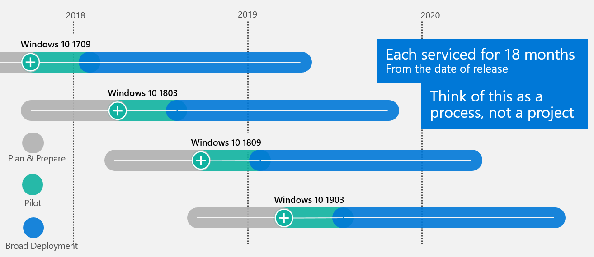

In Windows 10, you can use deployment rings to further control how and when updates are applied to your devices. It’s probable that you will only define these deployment rings once; however, you should consider revisiting the deployment ring configuration periodically to ensure that they still meet the needs of your organization and its users. 

A typical deployment ring strategy is described in the following table.

|Name of ring|	Channel	|Feature update deferral| 	Quality update deferral	|Description|
|-|-|-|-|-|
|Preview|	Windows Insider Program|	None|	None|	For testing updates on a small group of devices before they become more widely available on the semi-annual channel.|
|Targeted|	Semi-annual channel (Targeted)|	None|
	None|	Used to evaluate a significant update before it is deployed to most other devices.|
|Broad|	Semi-annual channel|	120 days|	7 to 14 days|	Use this ring to deploy the update to most of your users’ devices.   Use the deferment period to thoroughly test the updates before further deployment.   
Note: You can pause updates if you encounter significant problems or issues.|
|Critical|	Semi-annual channel|	180 days|	30 days|	Reserved for devices that are critical and are only updated when the updates have been thoroughly tested throughout the rest of your organization.| 

By defining and using deployment rings, you can effectively control how feature and quality updates are deployed through your organization. You should start to think about using Windows as a service as an ongoing process, rather than a specific project to update Windows builds. The following diagram shows how you can use the servicing channels to create an update timeline that includes a planning and preparation phase, pilot deployments, and general deployment. 

You do not need to deploy all feature updates; you can opt to bypass those updates that do not add value for your users. Bear in mind, however, that support for a feature update continues for 18 months after its release. 