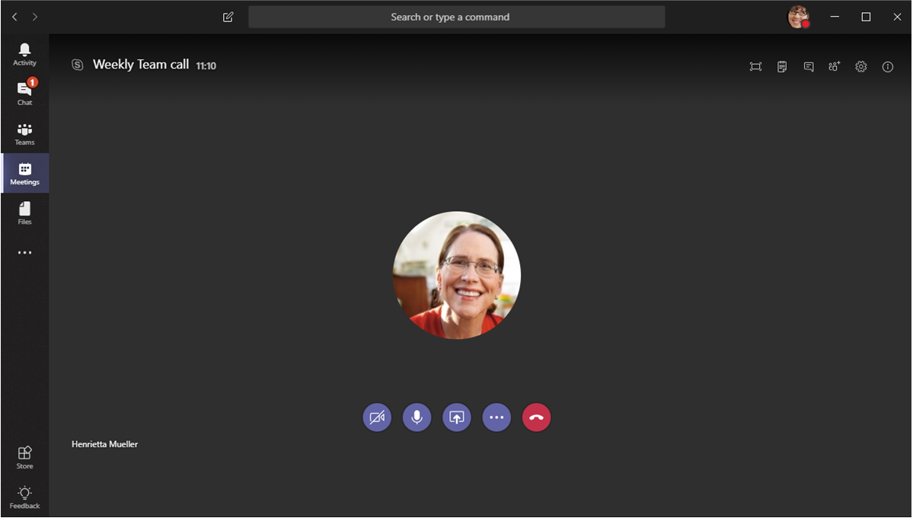

It’s estimated that the average knowledge worker spends nearly one third of the week in meetings. The most productive meetings bring together subject matter experts and project teams to have focused, interactive discussions that help them make informed decisions. The key to achieving this productivity is better preparation, supported by tools that encourage positive work and meeting habits. 

With Microsoft 365 you can:

- Easily schedule calls and online meetings.
- Quickly start a meeting through an ad hoc call or instant message. 
- Create a shared workspace for all your team conversations, files, meetings, and apps. 
- Automate processes and workflows across your organization.
- Save time with self-service tools for schedule and task management.

**Outlook** provides calendar and file integration to ensure meeting tools can be accessed seamlessly. Team members can access shared Outlook calendars and link to shared files in SharePoint and OneNote. 

**Microsoft Teams** lets employees form teams around important projects by organizing conversations, files, meetings, and tools into a single hub for teamwork complete with rich audio and video capabilities. Collaboration begins the moment the meeting is scheduled. Attendees can immediately connect on group chat to prepare for the meeting and share relevant documents ahead of time. Learn about meeting participants by hovering over Teams profiles to see organizational and LinkedIn background.

*A Microsoft Teams meeting*

During meetings, video and screen sharing create a focus among the group, while new AI services provide auto-translation, transcription, and recording so participants get more out of the experience. Following the meeting, notes and action items can be automatically transcribed and distributed to the group, and anyone who was unable to attend can easily go back and watch the meeting. 

### Explore Microsoft Teams

View a [video version](https://www.microsoft.com/videoplayer/embed/RE44vAa) of the interactive guide (captions available in more languages).

  

Be sure to click the full-screen option in the video player. When you're done, use the **Back** arrow in your browser to come back to this page. 
