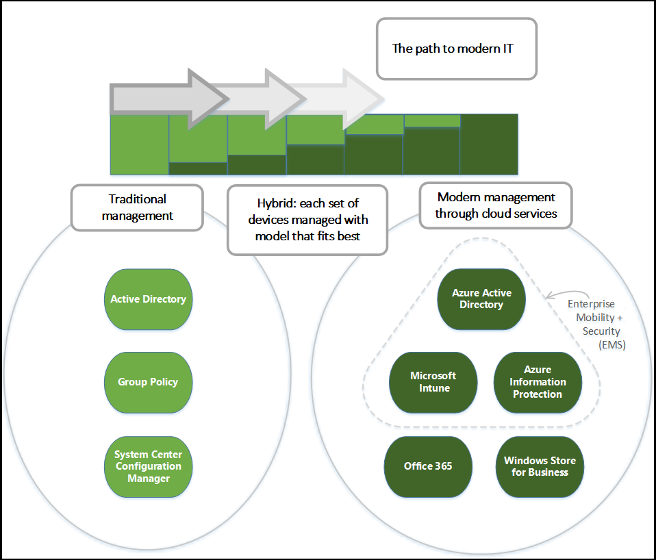

Throughout this module, you will learn about the key concepts and benefits of modern management with **Microsoft 365**.  We will explore the four key pillars to modern management, and how they can help your organization manage all their devices in a modern way that is easy to deploy, up-to-date, secure and intelligent.

In this module, you will:

- Articulate the benefits of modern management with Microsoft 365.

- Describe the modern device management options available to organizations with Microsoft 365.

## Modern Management

Use of personal devices for work, as well as employees working outside the office, may be changing how your organization manages devices. Certain parts of your organization might require deep, granular control over devices, while other parts might seek lighter, scenario-based management that empowers the modern workforce. **Windows 10** offers the flexibility to respond to these changing requirements and can easily be deployed in a mixed environment. You can increase the percentage of Windows 10 devices gradually, following the normal upgrade schedules used in your organization.

Your organization may also consider bringing in Windows 10 devices and downgrading them to Windows 7 until everything is in place for a formal upgrade process. While this may appear to save costs due to standardization, greater savings can come from avoiding the downgrade and immediately taking advantage of the cost reductions Windows 10 can provide. Because Windows 10 devices can be managed using the same processes and technology as other previous Windows versions, it’s easy for different versions of Windows to coexist while you gradually transition to more modern management tools.

With modern management tools, such as **Microsoft Intune** and **System Center Configuration Manager**, your organization can manage and support a wide range of device types or other third-party products. This *managed diversity* enables you to empower your users to benefit from the productivity enhancements available on their new Windows 10 devices (including rich touch and ink support), while still maintaining your standards for security and manageability. It can help you and your organization benefit from Windows 10 much faster.

## Management Options with Windows 10

Windows 10 offers a range of management options, as shown in the following diagram:

As indicated in the diagram, Microsoft continues to provide support for deep manageability and security through technologies like Group Policy, Active Directory, and System Center Configuration Manager. It also delivers a “mobile-first, cloud-first” approach of simplified, modern management using cloud-based device management solutions such as **Microsoft Enterprise Mobility + Security (EMS)**. Future Windows innovations, delivered through **Windows as a Service**, are complemented by cloud services like Microsoft Intune, Azure Active Directory, Azure Information Protection, Office 365, and the Microsoft Store for Business.

