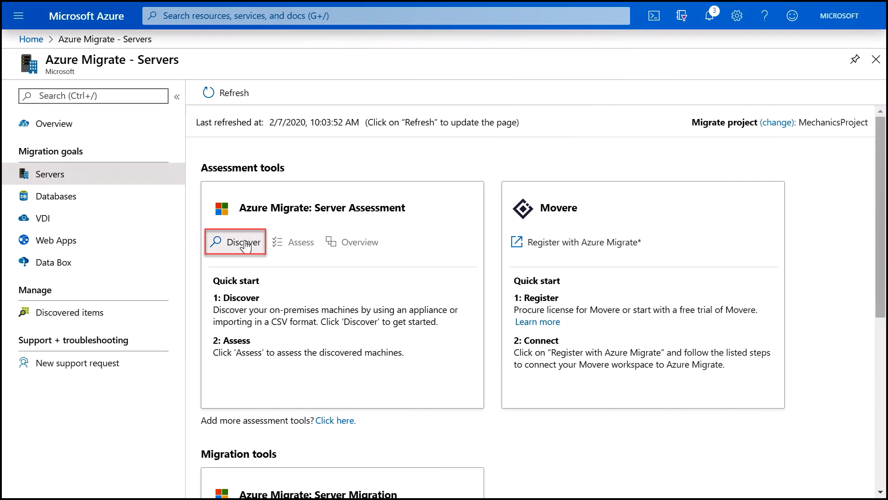
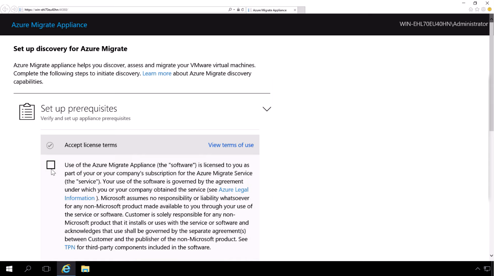
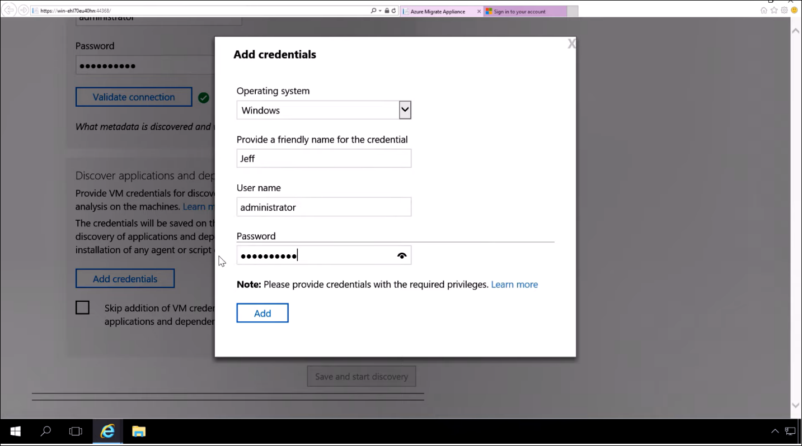

After selecting your migration tools in the previous module, you'll click **Discover** in the Server Assessment.

>

At the top of the screen are two radio buttons: **Discover using appliance** and **Import using CSV**. **Import using CSV** allows you to import virtual machine specifications and information in CSV format for your assessment. For this example, we will use the **Discover using appliance** option.

1. Select the **Discover using appliance** option.
2. Choose the Azure Migrate appliance virtual machine image to download; **VMware vSphere** or **Hyper-V**. For this example, we'll choose **VMware vSphere Hypervisor**.

   

The Azure Migrate appliance is a complete, pre-configured Open Virtual Appliance (or OVA) that you'll import into your vSphere environment. These platform-specific appliances run on your infrastructure and discover the virtual machines you specify along with their attributes and performance metrics. Once you have downloaded the appliance image, you can move to the next step of configuring it in your environment.

## Configure the Azure Migrate appliance

1. In your VMware vSphere environment, deploy the image as a virtual machine.

   Click **File> Deploy OVF> Template> Browse** to the OVA file that was downloaded, and go through the normal virtual machine provisioning process, ensuring that it is on a network that can connect to your targeted virtual machines.

   

2. Log into the Azure Migrate appliance running in the ESX environment. This is a Windows image, where you set up and conduct discovery of your on-premises environment.

   Keep in mind that this is a **read-only inspection** of your VMs and corresponding metadata including performance history. There are no agents installed on your VM. When you first launch the Azure Migrate Appliance tool, you'll be asked to go through three steps.

   

- Step 1: Set up prerequisites
    Once you accept the terms and conditions, the Azure Migrate Appliance automatically checks to ensure that:
  - You are connected to the Internet.
  - Your time is synched with the internet time server.
  - A current version of VMware vSphere Virtual Disk Development Kit is installed. If not, you can download and install automatically.
- Step 2: Register with Azure Migrate
    We covered this topic in the previous module with prerequisites. Registering with Azure Migrate we can view information that is logged up from the appliance into Azure.
- Step 3: Specify vCenter Server
    Enter administrator credentials for the vCenter, including IP address, username, and password, and then validate the connection.

   
- Step 4: Discover apps and dependencies
    This step is optional but recommended. Here you provide virtual machine administrator credentials for discovery of applications and for dependency analysis to ensure your migrations are successful. The credentials are saved on the appliance and encrypted.

    The discovery process is conducted remotely and without any agents or scripts.
    1. Enter a friendly name for user and account credentials (that is, "VMadmin"), username, and password. Then click **Add**. There is also an option to opt out via the checkbox displayed in this step.
    2. Click **Continue** and then **Save and start discovery**.
