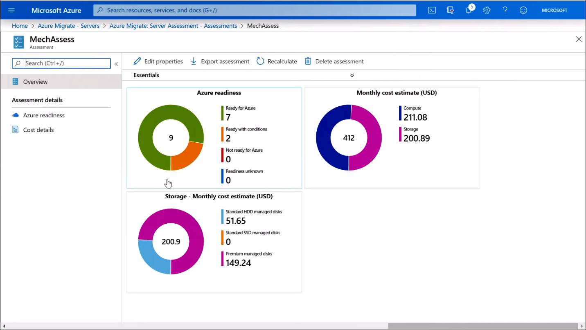
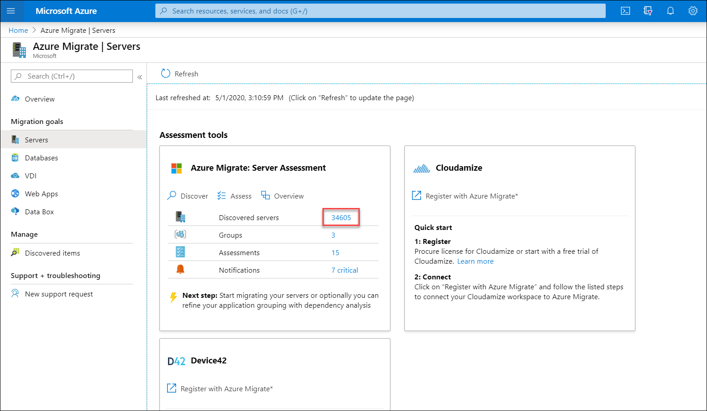
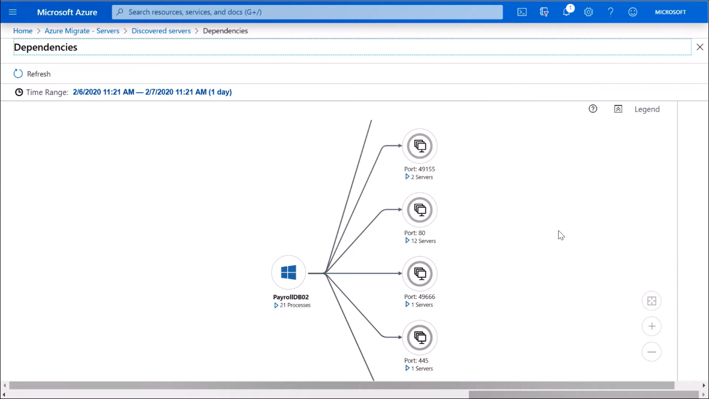

To view the assessment, click on **Assessment** from the home screen. You will see the assessment based on the group that was just created.

Within the assessment (pictured below), you can find an overview of Azure readiness with a monthly cost estimate for compute and storage.

>

From there you can explore Azure Readiness for a more detailed breakdown of:
- Specs and sizing recommendations.
- Location of CPU and memory utilization.
- Disk metrics for size, performance, and throughput.
- A monthly cost-estimate.

Azure Migrate also discovers dependencies across virtual machines in your group. To access this view, go back to the **Azure Migrate Servers** screen and click on **Discovered servers**. 

>

Click on **View Dependencies** from the list of servers to see dependencies for a virtual machine. There, you will find a view of dependent resources with ports and IP addresses that communicate with your virtual machine. This view displays all TCP/IP traffic between resources You can migrate those dependent resources to ensure your applications will work after the migration.

>

You can export the assessment in a detailed Microsoft Excel spreadsheet. Using the assessment, you can find virtual machine recommendations, cost estimates, and any dependencies to ensure your migration goes smoothly.

After you are satisfied with your recommendations and the path forward, you can move on to the next step: replicating your virtual machines into Azure Storage, testing, and then production migration.

## Learn more
 - [How to run VMware in Azure - Demo Tutorial](https://www.microsoft.com/videoplayer/embed/RE4sOiW?azure-portal=true)
 - [Prerequisites setup guidance](https://docs.microsoft.com/azure/migrate/tutorial-prepare-vmware#prepare-azure?azure-portal=true)