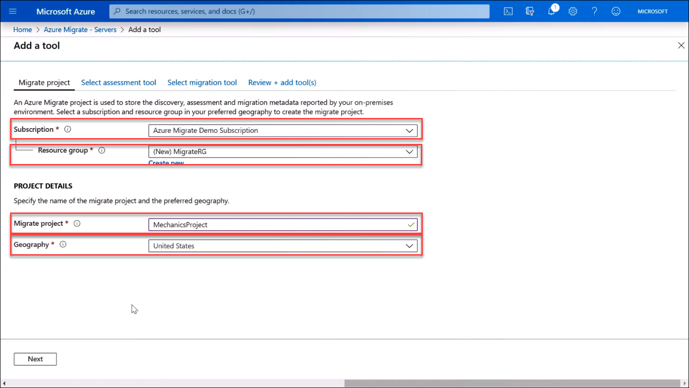
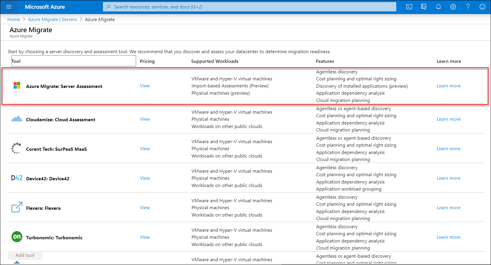
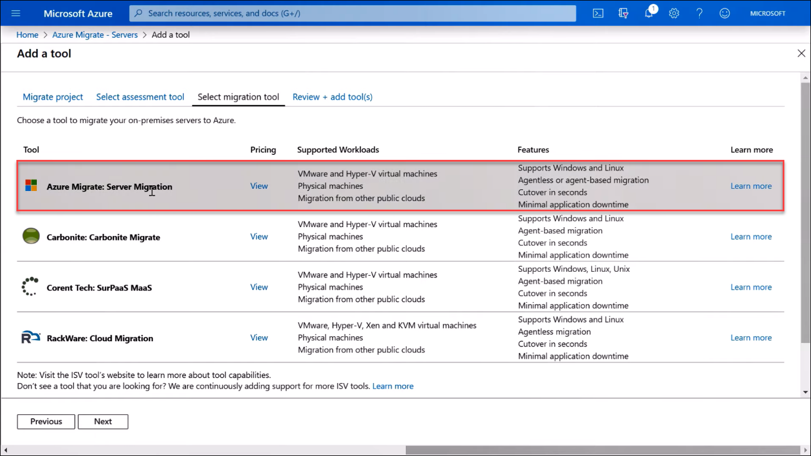

## Select your assessment and migration tools
Next, you’ll need to find on-premises VMs and application environments and assess them for migration to Azure before you replicate them into Azure storage and then migrate them into production.  

Here, you can see options for assessing and migrating servers, databases, web apps, and virtual desktop infrastructure. 
1. Select **Assess and migrate servers** (which works for both Windows and Linux servers). 
1. If this is your first time going through the migration process, click **Add Tools** to start a wizard-based process to select the assessment and migration tools you want to use. 
1. Choose your **Subscription**. 
1. Select or **create** a new **Resource group**. 
1. Give your **Migrate Project** a name.
1. Choose your **Geography**. 
1. Click **Next**.

   
1. Under the **Select assessment tool** tab, you’ll see a list of Microsoft and Microsoft partner tools. The Microsoft first-party tools are included in your Azure subscription. There are several partner options that are especially useful if you have partners helping with your migration or have used one of these tools in the past. Select a migration tool. In this case, select **Azure Migrate: Server Assessment**.

   
1. Under the **Select Migration Tool** tab, you’ll see a list of Microsoft and Microsoft partner tools just like in the assessment tool step. There are several partner options that are especially useful if you have partners helping with your migration or have used one of these tools in the past.

   
1. Select a migration tool. In this case, select **Azure Migrate: Server Migration**.
1. Click **Next** where you will see a summary of your selections to review.
1. Click on **Add Tools** which adds the selected tools to your Azure Migrate project.

You can select multiple tools in the assessment and migration phases within Azure Migrate. Each tool is set up one at a time. After the first tool is set up, you can add more tools later.
Now your Azure Migrate project is set up and ready to receive assessment and discovery information from your virtual machine environment in VMware or Windows Server Hyper-V. In the next module, we will configure and run the discovery and assessment processes against a VMware vSphere environment. 

## Learn more
 - [How to run VMware in Azure - Demo Tutorial](https://www.microsoft.com/videoplayer/embed/RE4sOiW?azure-portal=true)
 - [Prerequisites setup guidance](https://docs.microsoft.com/azure/migrate/tutorial-prepare-vmware#prepare-azure?azure-portal=true)

