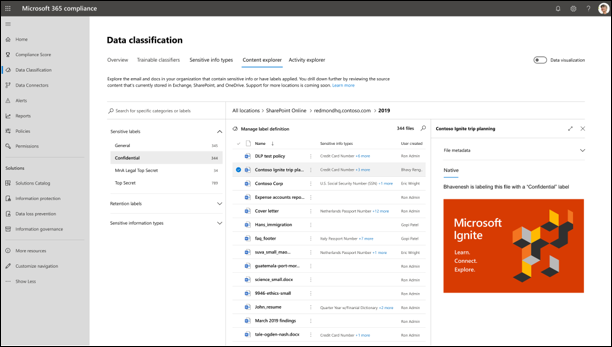
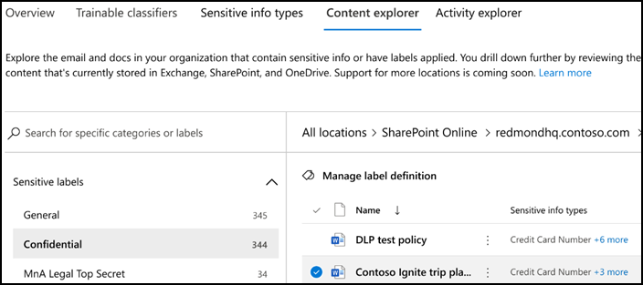

**Content explorer** shows a current snapshot of items with a sensitivity label or retention label applied, or that have been classified as containing a sensitive information type.  Here is a summary of what the content explorer provides:
- Visibility into the amount of sensitive data in a document that triggered the classification to be applied.
- Ability to filter by label or sensitive information type to get a detailed view of the locations where the data is stored.
- Integrated viewer to display documents, providing context for the circumstances in which sensitive information is being detected.

    
 
> [!NOTE]
> This feature is a capability included with:
> - Microsoft 365 E5 
> - Microsoft 365 E5 Compliance 
> - Microsoft 365 E5 Information Protection and Governance 
> 
> Please review Microsoft 365 licensing guidance for security & compliance to identify required licenses for your organization.

You can search for specific sensitive information types, sensitivity labels or retention labels, or browse to the one you are interested in. The right side of the page will summarize the number of items meeting the classification you selected grouped by location. Additional information is available by listing the specific items matching the label or sensitive information type and viewing the source content stored in Exchange, SharePoint, and OneDrive.  Each of these activities (listing and viewing) requires additional permissions due to the potentially sensitive nature of the content.
 
    

## Learn more
- [Get started with content explorer](/microsoft-365/compliance/data-classification-content-explorer?azure-portal=true)
