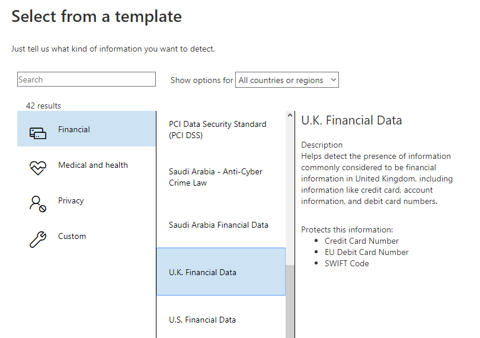

Using sensitive information types will most likely be a key component of your information protection and governance strategy. A sensitive information type is defined by a pattern that can be identified by a regular expression or function. They can help identify, classify, and protect content that contains credit card numbers, bank account numbers, passport numbers, and more.

### Built-in and custom 
Sensitive information types can be built in, customized from built-in, or created from scratch. Approximately 100 sensitive information types are built into Microsoft 365 and ready for you to use. Some built-in sensitive information types, like credit card number, are applicable to a global audience while others, like Finland National ID and Australia Driver’s License Number, are specific to  region or regulation. Built-in sensitive information types can be customized or created based on your organization’s needs. 

### Key components
Sensitive information types are based on patterns, supporting evidence, character proximity, and confidence levels. A sensitive information type is defined by a pattern that can be identified by a regular expression or a function. Supporting evidence such as keywords and checksums can also be used to identify a sensitive information type. Confidence level and character proximity are also used in the detection process. 

The built-in sensitive information types are described using these characteristics:

### Format
General description of sensitive information type. Here are three examples:
- 14 to 16 digits that can be formatted or unformatted and which must pass the Luhn test
- Nine digits with optional forward slash (old format) 10 digits with optional forward slash (new format)
- One letter (in English) followed by nine digits

### Pattern
Adds more detail to **Format**. An example of a pattern is one letter (in English) followed by nine digits:
- One letter (in English, not case sensitive)
- The digit "1" or "2"
- Eight digits

### Checksum
Some sensitive information types use checksums for error detection, while others don't.

### Keywords
**Text-based** words or phrases that typically act as supporting evidence to confirm a pattern match. Here are some examples:
- ID Number
- License number
- Patient number

### Definition
The confidence level, stated in percentage terms, in which Microsoft 365 has detected a sensitive information type based on a set of conditions being met within a specific character proximity. A sensitive information type can have more than one definition, each with a different confidence level. Conditions are based on: 
- Content matches the pattern
- A keyword is found
- The checksum (if it exists) passes

> [!NOTE]
> A Luhn test is used to validate credit card numbers.

## Policy integration
Sensitive information types can be used on their own to classify data. They can also be specified in conditions (individually or grouped into a policy template) to configure policies in Microsoft’s solutions for information protection and governance. The table below shows each of the information protection and governance solutions and where in those solutions you can use sensitive information types.

| Solution | Where used   |
|---|---|
|Information protection   |Sensitivity label auto-labeling policies   |
|Data loss prevention (DLP) |  DLP policies |
|Information governance  | Retention policies & Retention label auto-apply policies  |
|Records management | Retention label auto-apply policies  |

A policy template contains a group of related sensitive information types. You can use policy templates to simplify policy creation. Policy template selection is an optional part of all the policy processes listed above. Microsoft 365 includes 42 policy templates divided into three categories: financial, medical and health, and privacy. You can also filter the templates by a specific country or region.

The image below shows the policy template selection screen from the retention label auto-apply policy wizard. You can see the U.K. Financial Data policy template detects these sensitive information types:
- Credit Card Number
- EU Debit Card Number
- SWIFT Code

   

## Sensitive information types
Watch this video on sensitive information types to learn more.
>
> [!VIDEO https://www.microsoft.com/videoplayer/embed/RE4yqxc]

> 
## Learn more
- [What sensitive information types look for](https://docs.microsoft.com/microsoft-365/compliance/what-the-sensitive-information-types-look-for?azure-portal=true)
- [Custom sensitive information types](https://docs.microsoft.com/microsoft-365/compliance/custom-sensitive-info-types?azure-portal=true)
