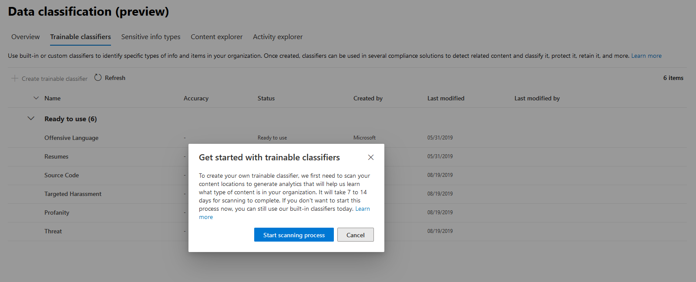
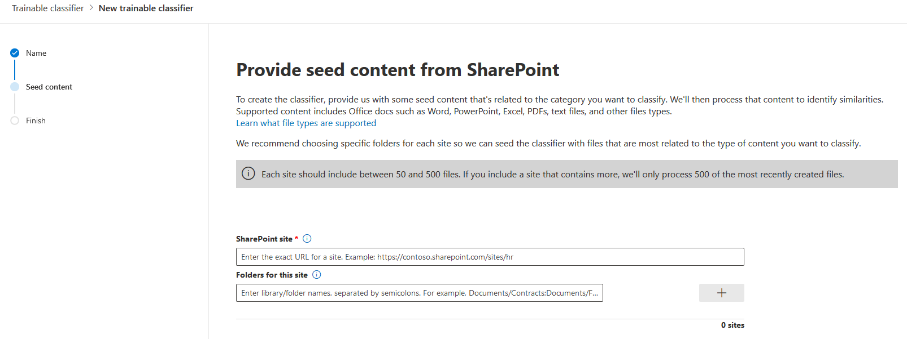
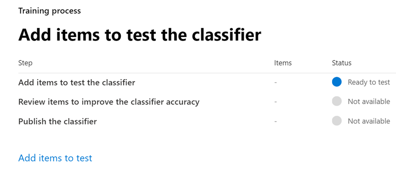
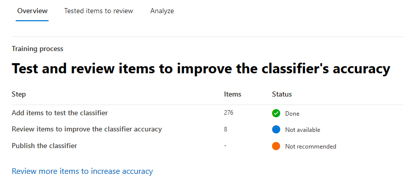
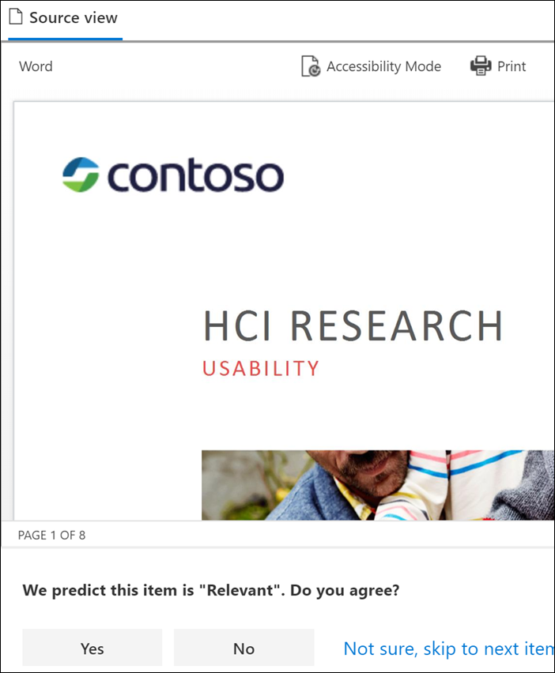

Most organizations have content to protect that cannot be detected using the methods used by sensitive information types. Data classification using trainable classifiers (currently in preview) is useful when content is not easily identified using pattern matching. Trainable classifiers apply the power of artificial intelligence (AI) and machine learning (ML) to find data to track, protect, and govern. You train a classifier to identify sensitive content based on what it is, rather than the elements in the item. 

> [!NOTE]
> This feature is a capability included with:
> - Microsoft 365 E5 
> - Microsoft 365 E5 Compliance 
> - Microsoft 365 E5 Information Protection and Governance 
> 
> Please review Microsoft 365 licensing guidance for security & compliance to identify required licenses for your organization.

### Built-in classifiers
Microsoft 365 comes with five classifiers already trained and ready to use.
- Résumés
- Source Code
- Harassment
- Profanity
- Threat

You should test the built-in classifiers to determine if they are working as you expect prior to applying them to a large audience or significant amount of content.

> [!IMPORTANT]
> Your organization, and not Microsoft or its subsidiaries, remains responsible for all decisions related to monitoring, enforcement, blocking, removal, and retention of any content identified by one of these built-in classifiers.

### Custom trainable classifiers
You can create and train your own classifiers to look for data unique to your organization such as customer records, human resources data, and contracts. Creating a trainable classifier can take a significant amount of time and requires careful preparation.

Once the one-time setup process is complete, you can begin configuring trainable classifiers. The trainable classifier configuration process can be broken down as follows:
1. Seed. Prepare your sample data and create the trainable classifier.
1. Test. Prepare test data, test the predictive model, and evaluate the results.
1. Publish. Make the trainable classifier available for use in your compliance solutions.

Each step is explained in more detail below.
### One-time setup
A one-time scan must be completed before creating any custom trainable classifiers. This is needed so Microsoft 365 can learn more about the content in your organization. This process takes 7 to 14 days. The image below shows the message you will receive when attempting to create a custom trainable classifier for the first time.
 
   

### Seed
**Step 1: Prepare sample data**. Prepare content to seed your predictive model consisting of known positive samples of the content you want to classify and store it in a SharePoint Online document library or folder. You will need at least 50 and as many as 500 samples that strongly represent the type of content you want the trainable classifier to detect. 

**Step 2: Create trainable classifier.** Create the classifier by navigating to **Microsoft 365 compliance center > Data classification > Trainable classifiers > Create trainable classifier**. You will give the classifier a name, a description, and provide the location of the seed content. The image below shows the **Provide seed content from SharePoint** page in the **Create new classifier** wizard.

    

It can take as long as 24 hours for the prediction model to be built once you complete the **Finish** step in the **Create trainable classifier** wizard. The image below shows the **EU Training** trainable classifier with a status of **Need test items**. That means the seed content has been processed and the predictive model is ready for testing.
 
    

### Test
**Step 1: Prepare test data**. Start testing the predictive model once seeding is complete. You need at least 200 and as many as 10,000 positive and negative examples of the content you are training the classifier to detect. The content used to build the model should not be used to test the model. Create a second SharePoint document library or folder for the test content, move your content there, and wait for the folder to be indexed. 

**Step 2: Test predictive model**. You start the test wizard by clicking on **Add items to test** on the trainable classifier information page. Point to the SharePoint site holding the test items and choose **Done** to start the test. The image below shows the **Training process** card on the trainable classifier information page before you start the testing process. Notice the status is **Ready to test**. Once you begin the test, Microsoft 365 attempts to predict whether each item you provided for testing is **Relevant** or **Not Relevant**. 

    
 
**Step 3: Evaluate predictions**. You need to tell the model if it is accurately predicting the relevance of the test content when the trainable classifier is done processing your test data.  The **Review items to improve the classifier accuracy** step will be set to **Ready to review** when it is ready for you to conduct the evaluation.

The image below shows the review process is currently underway with 8 test items reviewed so far. The status is **Not available** because not enough test content has been evaluated yet. 
 
    

Choose the **Tested items to review** tab to review and evaluate items. You will be presented with 30 items to review at a time. You review each item and determine if the predictive model correctly classified the item. The image below shows one of the test documents undergoing an evaluation to determine if it is relevant. You choose **Yes**, **No**, or **Not sure**, **skip to the next item**. Model accuracy improves with every item you evaluate. You should review at least 200 items.
 
  

Once you have reviewed enough items and accuracy reaches at least 70%, you can publish the trainable classifier or continue to improve the accuracy of the model by conducting additional testing and evaluation.

    

### Publish
Publish the trainable classifier when you are satisfied with the results from the predictive model. Once published, your custom trainable classifier will be available in selected compliance solutions. 

The image below shows a published trainable classifier. Notice the status is **Ready to use**.
 
## Trainable Classifiers
Watch this video on trainable classifiers.
>
> [!VIDEO https://www.microsoft.com/videoplayer/embed/RE4yg7t]

> 
## Learn more
- [Get started with trainable classifiers](https://docs.microsoft.com/microsoft-365/compliance/classifier-getting-started-with?azure-portal=true)
- [Using a built-in classifier](https://docs.microsoft.com/microsoft-365/compliance/classifier-using-a-ready-to-use-classifier?azure-portal=true)
- [Creating a trainable classifier](https://docs.microsoft.com/microsoft-365/compliance/classifier-creating-a-trainable-classifier?azure-portal=true)

