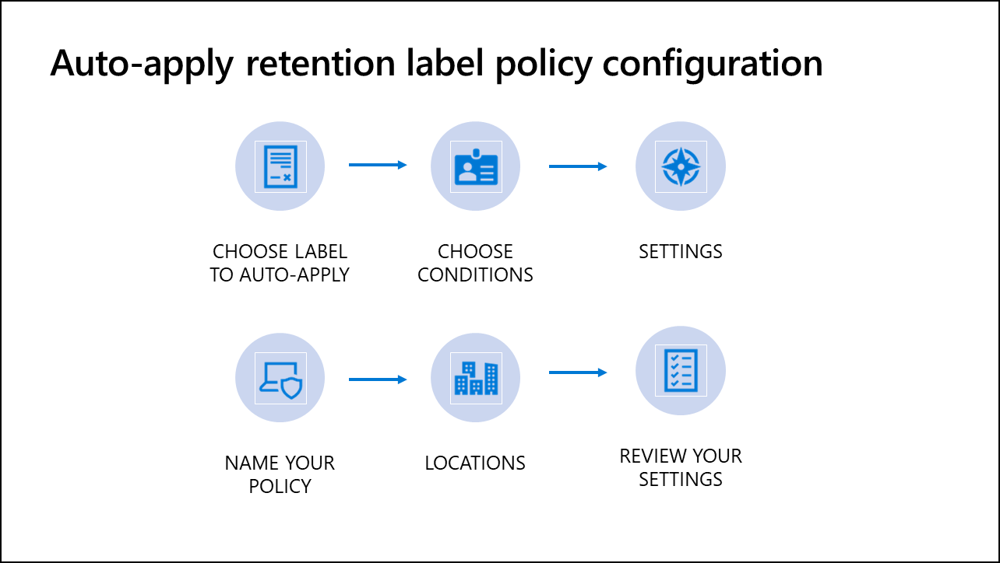

When you auto-apply labels, users will see the labels automatically applied to content matching the conditions you configure (such as content containing specific sensitive information).

> [!NOTE]
> This feature is a capability included with:
> - Microsoft 365 E5 
> - Microsoft 365 E5 Compliance 
> - Microsoft 365 E5 Information Protection and Governance 
> 
> Please review Microsoft 365 licensing guidance for security & compliance to identify required licenses for your organization.

Here are some important things to remember about published retention labels.
-	Auto-apply retention labels can take seven days to be enforced on existing content matching the conditions.
-	Users do not need to be trained on your classifications or governance policies and can focus on their work.
-	You do not need to rely on users to classify their content correctly.

Navigate to **Microsoft 365 compliance center > Information Governance > Label policies > Auto-apply a label to auto-apply retention labels**.

Creating an auto-apply retention label policy consists of these steps:
1.	Choose label to publish
1.	Choose conditions
1.	Settings (only valid for sensitive info condition)
1.	Name your policy
1.	Locations
1.	Review your settings

## Step 1: Choose label to auto-apply
The label you select will be automatically applied to content in the locations you choose. Users will see the label applied to their content that matches the conditions specified. Unlike manually applied retention labels, you can only auto-apply a single label per policy.

## Step 2: Choose conditions
There are three options to choose the type of content you want to apply this label to:
- **Apply label to content that contains sensitive info**. Two options are available, both of which are based on sensitive information types. 
   - Select from pre-defined templates consisting of a group of region, industry, or topic-specific sensitive information type templates (like financial, privacy and health).
   - Create a custom policy consisting of the sensitive information types you choose (like credit card and IP address).   
- **Apply label to content that contains specific words or phrases**. You can auto-apply labels to content that satisfies certain conditions using Keyword Query Language (KQL) syntax to specify words, phrases, or searchable properties (such as "subject" for email and "author" for documents). Here are some examples:
   - Exchange
      - subject: "Quarterly Financials"
      -	recipients:garthf@contoso.com
   - SharePoint and OneDrive
      - contenttype:contract
      -	site: https://contoso.sharepoint.com/sites/teams/procurement AND contenttype:contract

- **Apply label to content that matches a trainable classifier**. Custom trainable classifiers are used to identify categories of content specific to your organization, like contracts, employee agreements, or financial documents. Microsoft has also provided built-in trainable classifiers to classify content like resumes or source code.  

## Step 3: Settings 
This step is only valid when the option selected in the choose conditions step is **Apply label that contains sensitive info**. You can use it to modify the conditions for the sensitive info types already selected, add new sensitive info types, and specify more advanced conditions like instance count and match accuracy thresholds. For example, content with a single instance of publicly identifiable information (PII) may justify a different retention period than content with 1000 instances of PII. Conditions can also be grouped and you can use and/or logic to link them. 

## Step 4: Name your policy

### Name
Enter a short name for the retention label policy to be displayed on the label policy page.

### Description
Enter a description of the retention label policy's purpose.

## Step 5: Locations
Retention labels can be automatically applied to Exchange email, SharePoint sites, and OneDrive accounts. The label can be auto-applied to all locations or specific ones.

Choosing **Let me choose specific locations** allows you to not only select the location (Exchange, SharePoint, or OneDrive), it also allows you another inclusion/exclusion selection level for SharePoint and OneDrive based on the characteristics of the location as shown in the table below.

| Location  | Include/Exclude  |
|---|---|
| Exchange email  |N/A   |
| SharePoint sites  |  Sites |
| OneDrive accounts  | Accounts  |

> [!NOTE]
> Auto-apply retention labels cannot be included/excluded in Exchange. They are applicable to all Exchange email or no Exchange email.

## Step 6: Review your settings
The final step in the process is to review your settings, make any needed updates, and auto-apply the policy. 

## Learn more
- [Overview of retention labels](https://docs.microsoft.com/microsoft-365/compliance/labels?azure-portal=true)
- [Keyword Query Language (KQL) syntax reference](https://docs.microsoft.com/sharepoint/dev/general-development/keyword-query-language-kql-syntax-reference?azure-portal=true)
- [Getting started with trainable classifiers](https://docs.microsoft.com/microsoft-365/compliance/classifier-getting-started-with?azure-portal=true)
