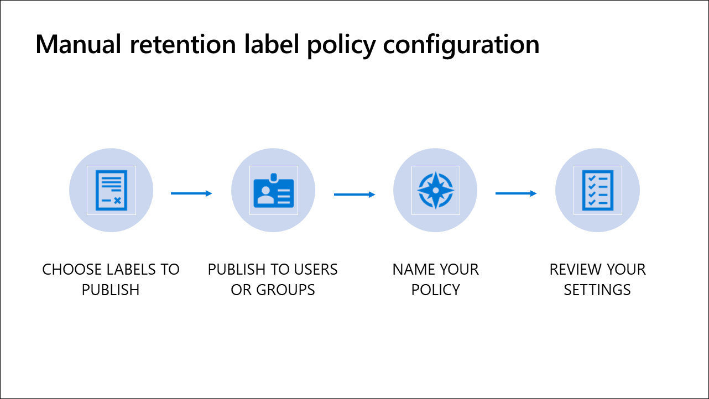

Publish labels so users can apply them to their content. When you publish labels to locations such as Exchange Online, SharePoint Online and OneDrive, users can manually apply the labels to retain their content. A published label can also be used to apply a default retention policy to a location like a SharePoint Online document library.

Here are some important things to remember about published retention labels.

- Published retention labels can take one day to appear in SharePoint Online and OneDrive.
- Published retention labels can take seven days to appear in Exchange Online and the mailbox must contain 10 MB of data.

Navigate to **Microsoft 365 compliance center > Information Governance > Label policies > Publish labels to publish labels for manual application.**

Creating a retention label policy to publish labels for manual application consists of these steps:

1. Choose labels to publish
1. Publish to users and groups
1. Name your policy
1. Review your settings

## Step 1: Choose labels to publish

You can select one or more labels you want to publish to your organization's apps so users can apply them to their content.

## Step 2: Publish to users and groups

Retention labels can be published to Exchange Online, Office 365 groups, and OneDrive and SharePoint Online sites. You can publish to all locations at once or choose specific locations.

Choosing "Let me choose specific locations" allows you to select the location (Exchange, SharePoint, etc.) add an inclusion/exclusion selection based on the characteristics of the location, as shown in the table below.

| Location  | Include/Exclude  |
|---|---|
| Exchange email  |  Recipients |
| SharePoint sites | Sites  |
| OneDrive accounts  | Accounts  |
|  Microsoft 365 groups  | Groups  |

> [!NOTE]
> Microsoft 365 groups includes group-connected team sites.

## Step 3: Name your policy

### Name

Enter a short name for the policy to be displayed on the label policy page.

### Description

Enter a description of the policy's purpose.

## Step 4: Review your settings

The final step in the process is to review your settings, make any needed updates, and publish the label.

> [!NOTE]
> Labels will appear in Outlook and Outlook web app only for mailboxes with at least 10 MB of data.

## Learn more

- [Overview of retention labels](/microsoft-365/compliance/labels?azure-portal=true)
