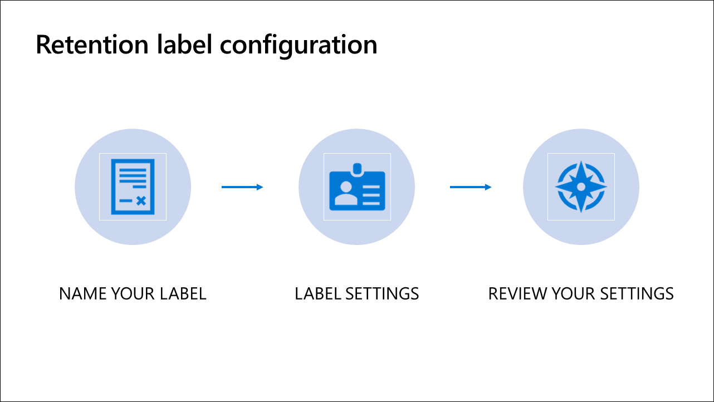

When published, retention labels appear in users' apps, such as Outlook, SharePoint, and OneDrive. When a label is applied to email or documents (automatically or by the user), the content is retained based on the settings you configure. For example, you can create labels that retain content for a certain time or delete content automatically when it reaches a certain age. They are used in the following information protection and governance solutions:

- Information governance
- Records management

In some instances, you may ask your users to add retention labels to their own content, especially emails. In other cases, you might want the system to automatically add retention labels to specific types of data, like contracts.

Here are some important things to remember about retention labels.

- Retention label creation is the first step in a two-step process to making them available. You must also publish or auto-apply the label.
- Retention label names cannot be changed after they are created.
- Only one retention label can be assigned to content (like and email or document) at a time.
- Auto-applied retention labels can be replaced by a manually assigned retention label.
- Retention labels do not take effect immediately after publishing or being auto-applied.
- Exchange public folders do not support labels.
- Retention label policies can trigger a disposition review at the end of a retention period. Retention policies cannot.

Navigate to **Microsoft 365 compliance center > Information Governance > Labels to configure retention labels**.

The process of creating a retention label consists of these steps:

1. Name your label
1. Label settings
1. Review your settings

## Step 1: Name your label

This step consists of providing the following information:

- Name
- Description for admins
- Description for users

### Name

This is the name of the label users will see in the apps where the label if published, like Outlook, SharePoint, and OneDrive. It should help the user understand what it is used for, but not be any longer than it needs to be.

### Description for admins

This information is only be visible to admins who will manage this label so enter something helpful.

### Description for users

This description will appear to users when they hover over the label in their apps. A default label showing the label’s retention settings will be displayed if left blank.

## Step 2: Label settings

### Retention

Turn retention on if you want to apply retention settings to this label. Leaving retention off results in the label behaving like a text label. Turning on the label results in additional settings pertaining to whether the content should be deleted or retained. When the label is applied to the content, the content is retained and/or deleted based on the settings you configure. If retained for a period of time, additional options are presented to configure what is to be done after the retention period has expired. You can also configure what trigger starts the retention period clock ticking.

### Retain the content

Selecting this option means the content will stay where it is for the time specified. For example, email will stay in mailboxes and documents will stay in SharePoint Online or OneDrive. If a user deletes t   he content, a copy will be placed in a secure location. Copies will also be made of content modified in Exchange Online. Next, you need to decide what happens after the retention period ends. Here are the options:

- **Delete the content automatically**. Content will be deleted without requiring additional action by users or admins.
- **Trigger a disposition review**. A disposition review is where an individual, like a compliance officer, reviews items that have reached the end of their retention period and decides if they can be safely deleted (disposed). When items reach the end of the retention period, reviewers will receive an email notification and can go to the dispositions page to determine what happens to the item.
- **Leave the content as is**. If you do not want to keep the content after the retention period expires, you must delete it yourself.

### Don’t retain the content, just delete if it’s older than

Users will be free to permanently delete their email, documents, or other items. But when content reaches the age specified, it will be deleted. For example, email messages and calendar items will be deleted from users' mailboxes and documents will be deleted from their SharePoint or OneDrive libraries.

### Retain or delete the content based on

You need to determine when you want the clock to start on the deletion or retention process. Here are your options:

- When it was created
- When it was last modified
- When it was labeled
- An event

If you choose **when it was created, last modified,** or **labeled**, content in email messages will be retained or deleted based on when the message was sent or received, documents when created or last modified, or when the label was applied. You will not be able to change the retention period if you elect to retain or delete content based on when it was labeled.

Basing the label on an event means the content will be retained forever until the event trigger is started. When there is a specific occurrence of the event type, you create the event to trigger the process using the event page or via an API. An example of an event would be an employee leaving the organization. Event-driven retention configuration is covered in the records management module in this learning path.

## Step 3: Review your settings

The final step in the process is to review your settings, make any needed updates, and create the label. Next, you will need to decide if you want to publish the label for manual labeling or auto-apply it. These processes are covered in the units that follow.

## Learn more

- [Overview of retention labels](/microsoft-365/compliance/labels?azure-portal=true)
