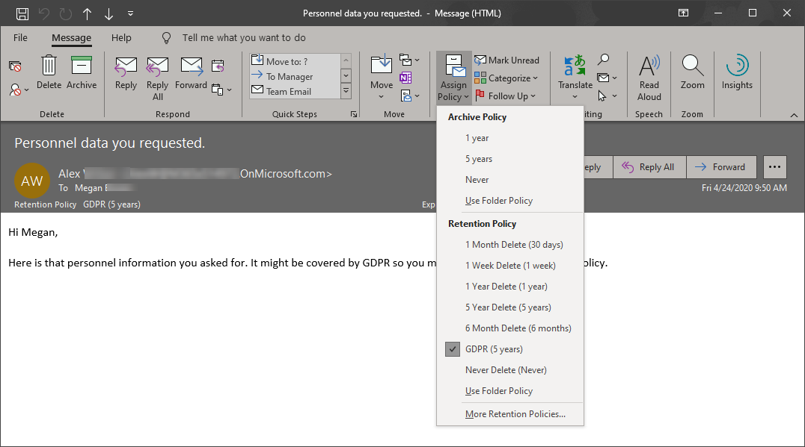
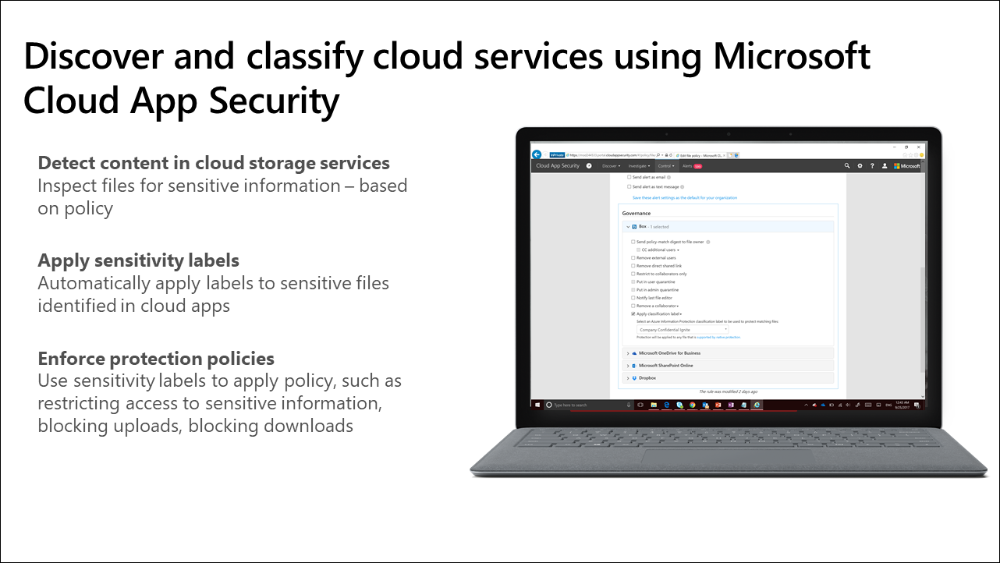

The first challenge many organizations face is identifying what kind of, and how much, data exists in their environment. You need a deep understanding of how much sensitive data exists and where it is stored before it can be protected and governed. This information is critical to assess your overall risk, which helps you define your strategy for protecting and governing the data. Start your journey by discovering and classifying important data across your environment. Here are some of the types of questions you will answer during this process:
- Who owns my data?
- What types of data do I have?
- Where is my data?
- Why is it a risk?
- What methods can I use to classify my data?
- Where can I classify my data?
- How can I see what happens to my data over its lifecycle?

## Data classification concepts
Classification is the process of identifying and labeling content in your organization to get a better understanding of your data landscape. This is accomplished by applying one or more of the following to your data:
- Sensitive information types
- Trainable classifiers
- Labels
- Policies
### Sensitive information types
Most information protection and governance workflows leverage sensitive information types. A sensitive information type is defined by a pattern that can be identified by a regular expression or function. One commonly recognized sensitive information type is a credit card number. Microsoft includes about 100 of the most common sensitive information types, or you can create your own.
### Trainable classifiers (currently in preview)
Trainable classifiers (in preview)
Data can also be classified via trainable classifiers. Trainable classifiers use artificial intelligence and machine learning to intelligently classify your data. They are most useful classifying data unique to an organization like specific kinds of contracts, invoices, or customer records. This method of classification is more about training a classifier to identify an item based on what the item is, not by elements that are in the item (pattern matching).

### Labels
A label can be thought of as a stamp on a document. For example, your organization might create a label named "Confidential" to indicate data that should not be widely shared or that it should be retained for a specific time period. Labels can, but do not have to, use sensitive information types to classify email messages, documents, sites, and more. Microsoft information protection and governance solutions use two forms of labels, sensitivity labels and retention labels. You can prevent users from changing labels by applying encryption to the content.

With sensitivity labels, you can classify and help protect your sensitive content. Protection options include adding watermarks or encryption to the content. Sensitivity labels persist wherever your document is stored or sent. 

Retention labels help you retain or delete content based on policies you define. These help organizations comply with industry regulations and internal policies. Retention labels do not persist outside Microsoft 365. 

Unlike retention labels, which are published to locations such as all Exchange mailboxes, sensitivity labels are published to users or groups. Sensitivity labels then appear in Office apps for those users and groups.

This image shows how you select a sensitivity label in a Word document.

  

This image shows a retention label named GDPR applied to an email in Outlook.

  

Content can have both a sensitivity label and a retention label associated with it, but not more than one of each. An example might be an Excel file with a sensitivity label of “Internal use only” and a retention label named “Employee Record”.

### Policies
Once classified, you can create policies. Sensitive information types, trainable classifiers, sensitivity labels, and retention labels act as inputs into policies. Policies define behaviors, like if there will be a default label, if labeling is mandatory, what locations the label will be applied to, and under what conditions. A policy is created when you configure Microsoft 365 to publish or automatically apply sensitive information types, trainable classifiers, or labels. 

Sensitivity label policies show one or more labels to Office apps (like Outlook and Word), SharePoint sites, and Office 365 groups. Once published, users can apply the labels to protect their content.

Data loss prevention (DLP) policies help identify and protect your organization's sensitive info. For example, you can set up policies to help make sure information in email and documents is not shared with the wrong people. DLP policies can use sensitive information types and retention labels to identify content containing information that might need protection. 

Retention policies and retention label policies help you keep what you want and get rid of what you do not. They also play a significant role in records management. 

## Classify data directly in Office apps
Microsoft makes the process of classifying, labeling, and protecting content a consistent and easy experience for users. Users apply and update labels while working in Word, PowerPoint, Excel, and Outlook. With built-in labeling, sensitivity labeling capability is integrated natively into Office apps. No plug-ins or add-ons are required for most users running the latest Office releases. The same labels and policies apply across Office on Mac, iOS, Android, Windows, and web. 

### Manual labeling on all platforms
Built-in manual labeling is available on all Office app platforms. Windows users must be running Microsoft 365 Apps for enterprise (formerly known as Office 365 ProPlus) version 1910 or later, or an add-on will still be required. A Microsoft 365 Apps for enterprise subscription is also required for macOS users.

### Automated labeling in Office for the web and Windows
The capability for users to do manual labeling is certainly a step in the right direction, but users cannot always be relied upon to do this on their own. Automated labeling is available in Office apps starting with Office on the web and Office on Windows. Users can override the automatically applied labels provided the administrator has configured the system to allow it.  

### Automated labeling on content stored in OneDrive, SharePoint Online, and Exchange Online (currently in preview)
You can now create auto-labeling policies to automatically apply sensitivity labels to email messages or documents stored in Microsoft 365 services like OneDrive, SharePoint Online, and Exchange Online. Because this labeling is applied by services rather than by applications, you do not need to worry about what apps users have and what version they are using. 

## Discover and classify Microsoft 365 content
The ability to discover and classify data in Microsoft 365 apps and services is part of the core functionality of Microsoft's information protection and governance solutions. These locations include the following:
- Exchange email
- SharePoint sites
- OneDrive accounts
- Teams messages and chats

## Discover and classify on-premises files
Azure Information Protection scanner helps discover, classify, label, and protect sensitive information in on-premises file servers. You can run the scanner and get immediate insight into risks with on-premises data. Discover mode helps you identify and report on files containing sensitive data. Enforce mode automatically classifies, labels, and protects files with sensitive data. 
  
  

## Discover and classify cloud services and SaaS apps
Most organizations store some of their sensitive data outside the Microsoft ecosystem. Microsoft Cloud App Security extends protection to third party clouds and SaaS applications.  This solution includes the following capabilities:
- Inspect files for sensitive information
- Automatically apply labels to sensitive files identified in cloud apps
- Use sensitivity labels to apply policy, such as restricting access to sensitive information, blocking uploads, and blocking downloads
 
  

## Learn more
 - [Information protection](https://docs.microsoft.com/microsoft-365/compliance/sensitivity-labels-office-apps?azure-portal=true)
 - [Data loss prevention](https://docs.microsoft.com/microsoft-365/compliance/sensitivity-labels-office-apps?azure-portal=true)

