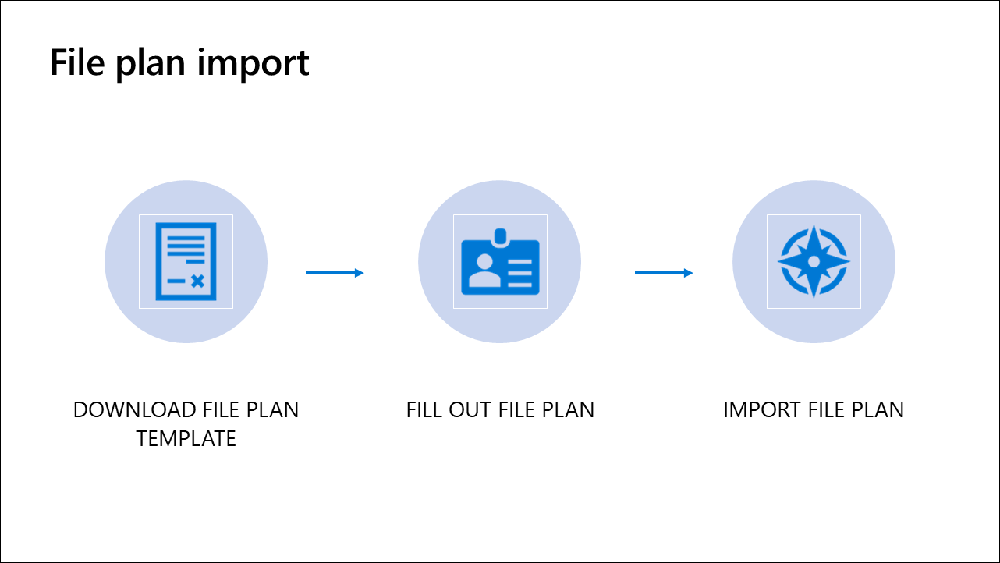

Microsoft has developed a tool to import your file plan into Microsoft 365. 

Navigate to **Microsoft 365 compliance center > Records management > File plan > Import** to import your file plan.

The process consists of the following steps:
1. Download the file plan template
1. Fill out the file plan
1. Import the file plan

Keep in mind imported file plan labels still need to be published or auto applied to see any results.

 
## Step 1: Download the file plan template
The file plan template is a comma separated value (CSV) file. You download it from the file plan page of the records management solution. Many of your stakeholders will be familiar with using Excel for file plan management, and you may be able to use this template as you collaborate with stakeholders during file plan and retention schedule development. The template fields will not match your organization’s existing file plan and retention schedule, so you will need to determine how to reconcile the differences. Here is a list of the fields in the file plan template:

- LabelName
- Comment
- Notes
- IsRecordLabel
- RetentionAction
- RetentionDuration
- RetentionType
- ReviewerEmail
- ReferenceId
- DepartmentName
- Category
- SubCategory
- AuthorityType
- CitationName
- CitationUrl
- CitatuionJurisdiction
- Regulatory
- EventType

## Step 2: Fill out the file plan  
The next step in the process is to complete the file plan template. Since your goal should be to import the file plan into Microsoft 365, do not make any changes to the column headings. You can save the file as whatever name you prefer. Be sure to export the file to CSV format if you convert it to an Excel workbook (XLSX) file and use rich formatting to facilitate collaboration with stakeholders.

> [!NOTE]
> There is a per-field limit of 64 characters when importing your file plan. You can add more characters to each field after the import, if required.

## Step 3: Import the file plan
When ready, upload the completed plan to Microsoft 365. Once you have verified everything looks as expected, publish, or auto-apply the labels to activate them. Refer to the information governance module in this learning path for instructions on publishing or auto-applying a label policy.

## Learn more
- [Import retention labels into your file plan](/microsoft-365/compliance/file-plan-manager?view=o365-worldwide#import-retention-labels-into-your-file-plan?azure-portal=true)
- [Retention label file plan descriptors columns](/microsoft-365/compliance/file-plan-manager?view=o365-worldwide#retention-label-file-plan-descriptors-columns?azure-portal=true)
