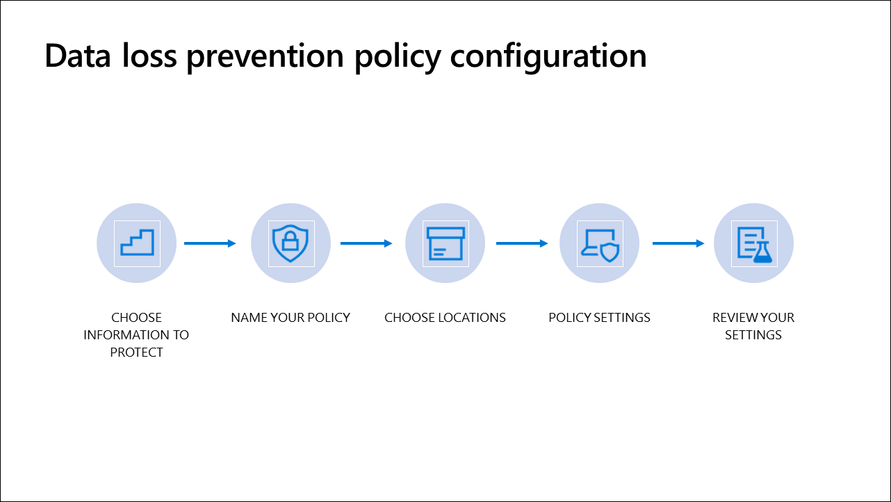
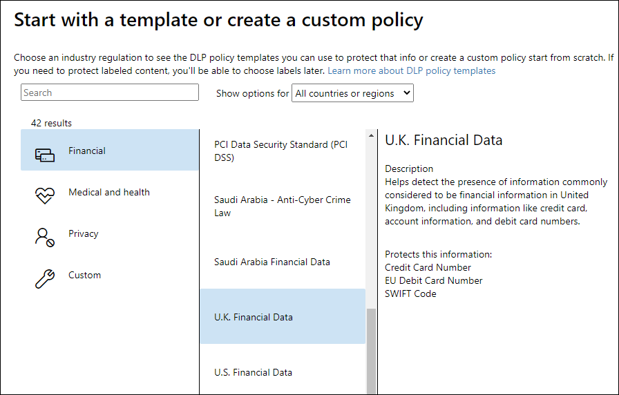
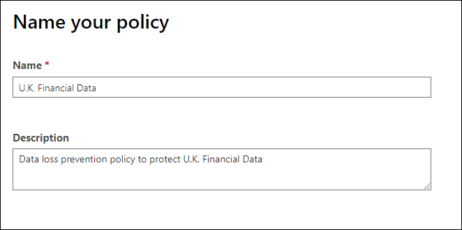
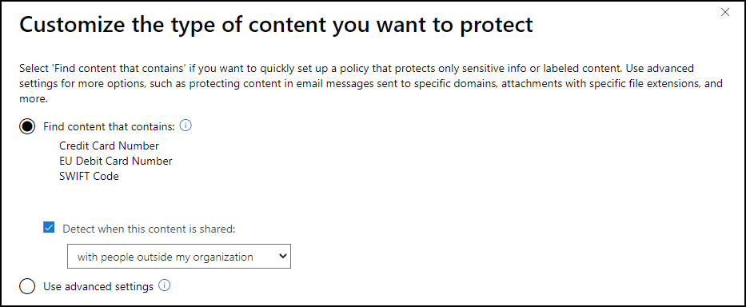
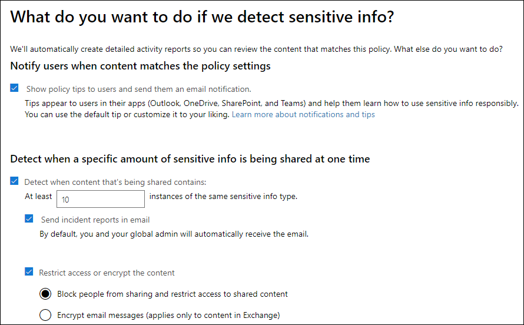
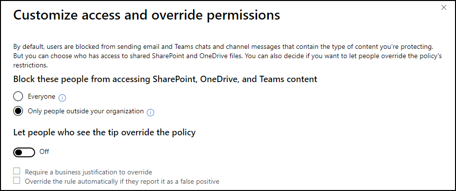
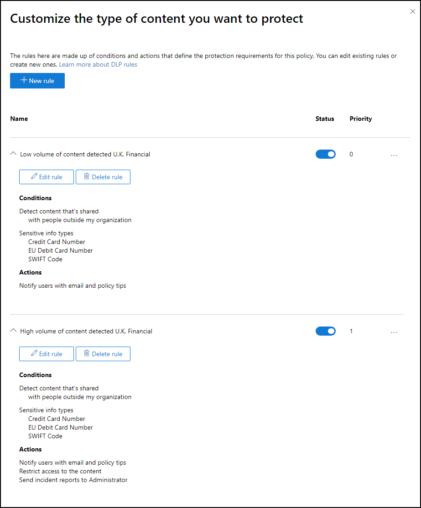

Data loss prevention policies help identify and protect your organization's sensitive information. For example, you can set up policies to help make sure information in email and documents are not shared with the wrong people.

Here are the steps involved in configuring a DLP policy:
- Choose information to protect
- Name your policy
- Choose locations
- Policy settings
- Review your settings

Navigate to **Microsoft 365 compliance center > Catalog > Data loss prevention > Open solution > Create Policy** to begin the process.

 
### Step 1: Choose the information to protect
The most common way to get started with DLP is to use one of the DLP policy templates included in Microsoft 365. You can use one of these templates as-is, use the template and modify the rules to meet your organization's specific compliance requirements, or create a custom policy from scratch. DLP policy templates consist of one or more sensitive info types grouped by Financial, Medical and health, and Privacy. You select one of those categories to see the relevant DLP policy templates. If you need to protect labeled content, you'll be able to choose labels later.  The image below shows UK Financial Data DLP policy template. It helps detect the presence of information commonly considered to be financial information in United Kingdom. The UK Financial Data template protects these sensitive information types:
- Credit card number
- EU debit card number
- SWIFT code

### Step 2: Name your policy
The next step is to give your policy a name and description. 

### Name
The name will be copied from the policy template, if selected in Step 1. It will be blank if the **Custom** option was selected.

### Description
Description of DLP policy for admin use.

### Step 3: Choose locations
You can select all locations and content or just what you need. Locations that can be protected include:
- Exchange email
- OneDrive accounts 
- SharePoint documents
- Teams chats and channel messages

If you select specific locations, you have more flexibility to specify additional options to include or exclude locations. The image below shows locations and what you can include and exclude from each. 

> [!NOTE]
> DLP for Teams chat and channel messages is a capability included with:
> - Microsoft 365 E5 
> - Microsoft 365 E5 Compliance 
> - Microsoft 365 E5 Information Protection and Governance 
> 
> Please review Microsoft 365 licensing guidance for security & compliance to identify required licenses for your organization.

### Step 4: Policy settings
The Policy settings step has two different branches, both of which use your selection from Step 1 as a starting point. The simpler of the two flows starts when the **Find content that contains** option is selected. The second branch starts when the **Use advanced settings** option is selected.

### Find content that contains
This simple flow lets you quickly:
- Specify the sensitive info types or labels you want to protect.
- Decide whether you want the policy to detect when the content is shared inside or outside your organization.
- Set up actions like access restrictions and user and admin notifications.
Select this option if you want to quickly set up a policy that protects content based on the sensitive information types from the policy template selected in Step 1, or if you want to add only additional sensitive information types or retention labels. The image below shows the three sensitive information types from the U.K. Financial Data policy template.
 

### Detect when this content is shared
You can also elect when to detect content has been shared. Leaving this box unchecked has the effect of detecting content whenever it is shared with anyone. The other options include the following:
- **With people outside my organization.**
- **Only with people inside my organization.**

### What do you want to do if we detect sensitive info?
Detailed activity reports are already produced so you can review the content matching the DLP policy, but there are more settings you can configure.

**Notify users when content matches the policy settings**. You want people in your organization who work with sensitive information to stay compliant with your DLP policies, but you do not want to block them unnecessarily from getting their work done. Enabling this feature, which is on by default, results in the following notifications designed to help them learn how to use sensitive info responsibly:
- Default or custom policy tip appearing to users in their apps (Outlook, OneDrive, SharePoint, and Teams).
- Default or custom email notifying the user of a policy settings match.

Uncheck this box if you are just getting started with this policy and want to test it first.

**Detect when a specific amount of sensitive info is being shared at one time.** Sharing one credit card number probably should not result in the same response as sharing 1,000 credit card numbers. You can specify the number of instances of the same info type that must be detected to trigger a response. The default is 10. Two additional options are available if this option is checked.
- **Send incident reports in email**. This option, enabled by default, sends an email to the global admin and the admin configuring the DLP policy when there has been a violation.
- **Restrict access or encrypt the content**. When enabled, you have two options:
    - **Block people from sharing and restrict access to shared content.**
    - **Encrypt email messages (only applies to content in Exchange).**

The image below shows the **detect sensitive info configuration** screen with the various options selected.

 

### Customize access and override permissions
This page only appears if you select the option to **Restrict access or encrypt the content** and then **Block people from sharing and restrict access to shared content**.

By default, users are blocked from sending email and Teams chats and channel messages that contain the type of content you are protecting. But you can choose who has access to shared SharePoint and OneDrive files. You can also decide if you want to let people override the policy's restrictions.

**Block these people from accessing SharePoint, OneDrive, and Teams content**. Options for this setting include:
- **Everyone**
- **Only people outside your organization**

**Let people who see the tip override the policy**. When this option is enabled, users who see the tip can override the DLP policy. Additional options include:
- Require a business justification to override.
- Override the rule automatically if it is reported as a false positive.

The image below shows the customize access and override permissions settings.
 

### Encrypt email messages (applies only to content in Exchange)
This page only appears if you select the option to **Restrict access or encrypt the content** and then **Encrypt email message (applies only to content in Exchange)**.

Messages containing the sensitive info you specified will be encrypted with settings from Azure Information Protection. You must have already configured protection settings in Microsoft Azure, or you will not be able to choose protection settings here. The graphic below shows the Encrypt email messages page.
 

### Do you want to turn on the policy or test things out first?
In most cases you will want to test the DLP policy to make sure it is functioning as expected, keeping in mind that it will take up to an hour to take effect. Options are:
- **Yes, turn it on right away**. This is not recommended.
- **I'd like to test it out first**. Selecting this option also lets you specify if you want to show policy tips while testing. 
- **No, keep it off. I'll turn it on later**.

Keeping the default settings is recommended when you first create the policy. After you have confirmed the policy is working as expected, you can check the box to show policy tips. Only have you have confirmed everything is working as expected should you turn the policy on.
 

### Use advanced settings
Select **Use advanced settings** for more options, such as protecting content in email messages sent to specific domains, attachments with specific file extensions, and more.  It uses the rule editor to set up rules that offer more conditions and exceptions. You can protect content matching any number of conditions including:
- Contains sensitive information (also available in basic settings branch).
- Has a retention label applied (also available in basic settings branch).
- Sent in email by someone whose IP address matches a specific address or range.
- Sent in email to a specific recipient domain.
- Included in attachments with specific file extensions.
- Included in documents with specific properties.

Rules will already be defined if you selected a policy template in Step 1. You can edit those rules or create your own. The image below shows two rules associated with this DLP policy. One for detecting a low volume of U.K. financial data and a second rule for a high volume of data. Each rule contains both conditions and actions. Notice the actions are different based on the volume of data detected. This allows you to respond differently based on the severity of the policy violation.
 
 

## What do you want to do if we detect sensitive info?
You can add additional rules or edit the rules that came with the DLP policy template. Rules can include:
- **Conditions**. Determine what types of information you're looking for, and when to take an action.
- **Exceptions**. Prevent the application of a rule for content matching the exceptions. The list of exceptions matches the list of conditions.
- **Actions**. When content matches a condition in a rule, you can apply actions to automatically protect the content.
- **User notifications**. Use notifications to educate your users about DLP policies and help them remain compliant without blocking their work.
- **User overrides**. Allows the user to override the policy and share the content.
- **Incident reports**. When a rule is matched, you can send an incident report to your compliance officer (or any people you choose) with details of the event.
- **Options**. Provides more options to specify how the DLP policy is processed.

The image below shows how the rule **Low volume of content detected U.K. Financial** appears when viewing advanced settings with all the defaults from the DLP policy setting applied.

 
### Step 5: Review your settings
You will be given one last opportunity to review and edit your settings before submission. The image below shows the results of using the DLP policy template named U.K. Financial Data and selecting the default settings during the configuration process.
 

## Learn more
- [What the DLP policy templates include](https://docs.microsoft.com/microsoft-365/compliance/what-the-dlp-policy-templates-include?view=o365-worldwide?azure-portal=true)
- [Configuring and managing templates for Azure Information Protection](https://docs.microsoft.com/azure/information-protection/configure-policy-templates?azure-portal=true)
- [Send email notifications and show policy tips for DLP policies](https://docs.microsoft.com/microsoft-365/compliance/use-notifications-and-policy-tips?azure-portal=true)
