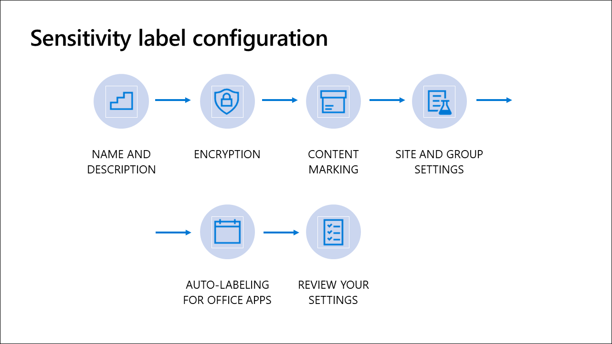
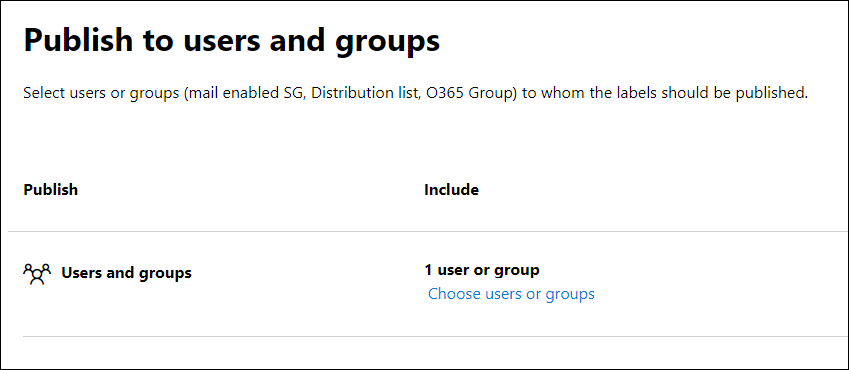
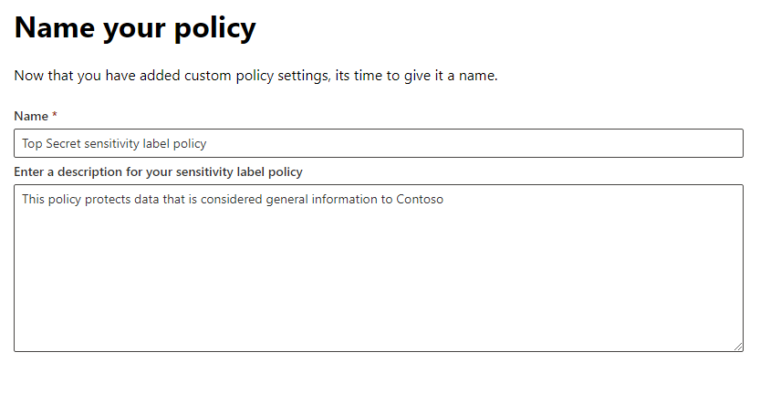

Creating a sensitivity label has no effect on users until it is published. You create sensitivity label policies to publish one or more labels to your Office apps (like Outlook and Word), SharePoint sites, Microsoft 365 groups, and Microsoft Teams. Once published, labels can be applied to protect their content. Here are the steps involved in sensitivity label policy configuration:
- Choose labels to publish
- Publish to users and groups
- Policy settings
- Name and description
- Review your settings

 
 
## Step 1: Choose labels to publish
The first step is selecting one or more existing sensitivity labels to publish. The example below shows the sensitivity label **Top Secret** will be published with this policy.
  

## Step 2: Publish to users and groups
This step involves choosing the users or groups to whom the labels should be published. This governs what users see the label, not where they see the label. The types of groups supported are email enabled-security groups, dynamic distribution groups, and Microsoft 365 Groups. Consider publishing the label to a test group with a few members first. You can add more groups to the policy once you validate it is working correctly.
  

## Step 3: Policy settings
You can choose to have a default label, mandatory label, or require users to justify their actions. 

### Default label
You can select whether you want to apply a default label to documents and email. The options will be a combination of None and the labels you selected for publishing in the **Choose labels to publish** step.

### Justification for removal 
Selecting this option means the user will have to provide justification if a label is removed or if the classification is lowered. An example of lowering a classification might be changing the label from Confidential to Public. Label changes and removals are tracked in **Activity explorer.**

### Require label
Selecting this option means users will be required to apply a label to their email or document, prior to sending or saving.

### Custom help 
Provide users with a link to a custom help page that provides additional information about the label policy. The admin would have to have the help content already created for this capability to work properly.
 
  

## Step 4: Name and description
Now that you have added custom policy settings, it's time to give it a name.

### Name
Enter a friendly name for the label policy.

### Description
Enter a description helpful for admins who manage this label policy. 
 
  

## Step 5: Review your settings
You will be given one last opportunity to review and edit your settings before submission. Submitting the label policy publishes the labels to the users and groups selected during this process.
  

## Learn more
- [What label policies can do](/microsoft-365/compliance/sensitivity-labels?view=o365-worldwide#what-label-policies-can-do?azure-portal=true)
