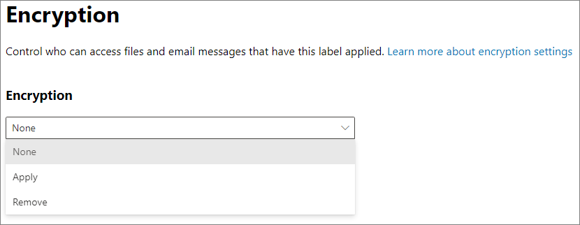
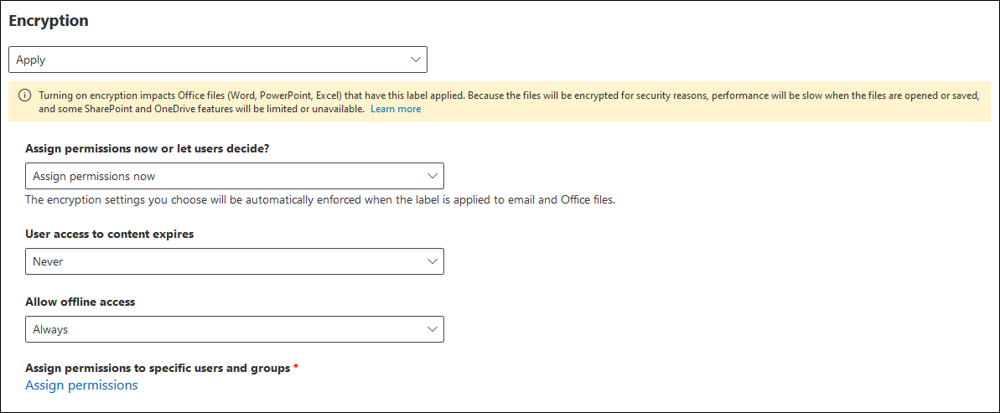
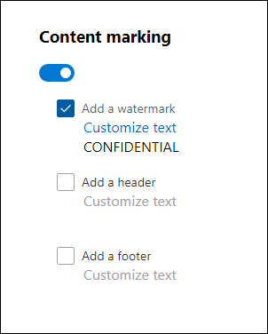
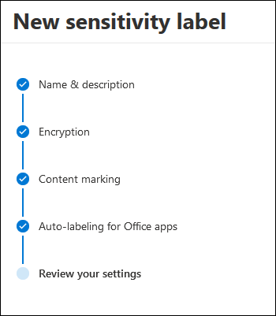
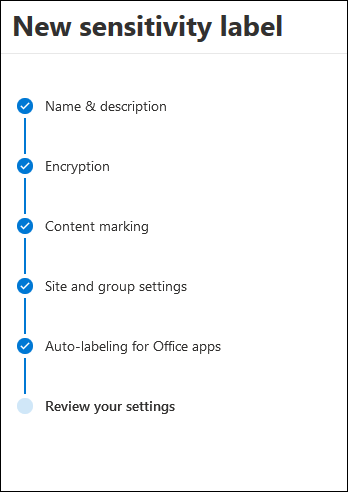
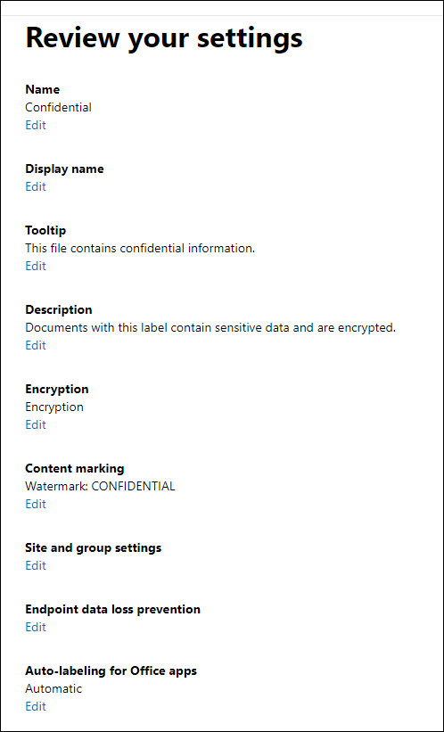

Sensitivity labels are used to classify email messages, documents, sites, and more. When a label is applied, automatically or by the user, the content or site is protected based on the settings you choose. For example, you can create labels that encrypt files, add content marking, and control user access to specific sites. 

The protection settings you choose for this label will be immediately enforced on the files, email messages or sites to which it is applied. Labeled files will be protected wherever they go, whether they are saved in the cloud or downloaded to a computer. 

Here are the steps involved in sensitivity label configuration:
- Name and description
- Encryption
- Content marking
- Site and group settings (if preview enabled)
- Auto-labeling for Office apps
- Review your settings

  

## Step 1: Name & Description
The step consists of providing the following information:
- Name
- Tooltip
- Description

### Name
Enter a friendly name for the sensitivity label.

### Tooltip
Enter text that helps users understand this label's purpose.

### Description
Enter a description that's helpful for admins who manage this label. Adding the author and creation date are best practices.

## Step 2: Encryption
The next step in the creation process is to determine who can access files and email messages that have this label applied. This is accomplished by configuring encryption settings. Encrypting your most sensitive documents and emails helps to ensure only authorized people can access this data. Encryption remains with the document wherever it goes and on whatever device it is accessed from. Encryption uses the Azure Rights Management Service (Azure RMS) from Azure Information Protection. 

The image below shows the three encryption options: **None**, **Apply**, and **Remove**.

 
 
### None
None means that no encryption will be applied to files and email messages with this label applied.

### Apply
Apply turns on encryption, which impacts Office files (Word, PowerPoint, Excel) with this label applied. Because the files will be encrypted for security reasons, performance will be slower when the files are opened or saved, and some SharePoint and OneDrive features may be limited or unavailable. The encryption settings you choose will be enforced when the label is applied to email and Office files.

**Assign permission now or let users decide?** Choosing when to apply permissions is the next step in the process. Options are to assign them now let the users decide when they are going to apply them.
- **Assign permissions now**. Selecting this option means the encryption settings chosen will be enforced when the label is applied to email and Office files. Selecting this option results in the additional configuration choices shown below.
    - **User access to content expires**. Options are never, on a specific date, and a number of days after the label is applied.
    - **Allow offline access**. Options are never, on a specific date, and only for a number of days.
    - **Assign permissions to specific users and groups**. Only the users or groups you choose will be assigned permissions to use the content with this label applied. You can choose from existing permissions (such as Co-Owner, Co-Author, and Reviewer) or customize them to meet your needs. You must assign permissions to at least one user or group.
    

- **Let users assign permissions when they apply the label**. Selecting this option gives the user more control over what happens when the label is applied. These actions vary based on if the label is applied in Outlook or if it is applied in Word, PowerPoint, and Excel. Selecting this option results in the additional configuration choices shown below. You must choose at least one option. 
    - Outlook. The restrictions enforced are equivalent to the Do Not Forward option.
    - Word, PowerPoint, Excel. The user will be prompted to specify permissions.
     

### Remove
None means encryption will be removed on the files and email messages with this label applied.

## Step 3: Content marking
Content marking adds custom headers, footers, and watermarks to email messages or documents when the label is applied. These marks are visible to the user. Content marking does not protect the document in any way. It only informs the viewer of the sensitive nature of the content. You can add one or more of the following text-only content marks:
- Watermark (documents only)
- Header
- Footer

Options to customize the text displayed include font size, font color and alignment.
  

## Step 4: Site and group settings (preview)
When you create sensitivity labels in the Microsoft 365 compliance center, you can now apply them to the following containers: 
- Microsoft 365 groups
- SharePoint sites
- Microsoft Teams

Content in the containers do not inherit the labels for settings such as the label name, visual markings, or encryption.

> [!NOTE]
> This page is only visible if the following preview is enabled: Use sensitivity labels with Microsoft Teams, Microsoft 365 groups and SharePoint sites. A link to more information is provided later in this unit.

The image below shows how the wizard appears if the preview feature has not been enabled.

 

This image below shows how the wizard appears if the preview feature has been enabled.

 
 	 
### Privacy of Microsoft 365 group-connected team sites
Determine who can access a Microsoft 365 group or SharePoint site.
- **None** - Let user choose who can access the site. Keep this default setting when you want to protect content in the container by using the sensitivity label, but still let users configure the privacy setting themselves.
- **Public** - Anyone in the organization can access the site. Choose **Public** if you want anyone in your organization to access the team site or group.
- **Private** - Only members can access the site. Chose **Private** if you want access to be restricted to only approved members in your organization.

### External users access
Control whether the group owner can add guests to the group.

### Unmanaged devices
Specify the type of access users have from unmanaged devices. The options are:
- Allow full access from desktop apps, mobile apps and the web
- Allow limited, web only access
- Block access
 
 

## Step 5: Auto-labeling for Office apps
When Microsoft 365 detects sensitive content in email or documents matching the conditions you specify, it can automatically apply the label or show a message to the user recommending they apply it themselves. 

> [!NOTE]
> This feature is a capability included with:
> - Microsoft 365 E5 
> - Microsoft 365 E5 Compliance 
> - Microsoft 365 E5 Information Protection and Governance 
> 
> Please review Microsoft 365 licensing guidance for security & compliance to identify required licenses for your organization.

Client-side auto-labeling is supported in Office apps on Windows for users who have either the Azure Information Protection unified labeling client or certain early adopter versions of Microsoft 365 Apps for enterprise (formally known as Office 365 ProPlus) installed. 

With service-side labeling, labels are applied to content already saved (in SharePoint Online or OneDrive) or emailed (processed by Exchange Online). In other words, these policies can automatically label files at rest and emails in transit based on the rules you've set. This method is sometimes referred to as auto classification with sensitivity labels. More information on service-side auto-labeling is available in the Automatic classification with sensitivity labels unit of this module.

Here is the information you need to provide to complete this step.

### Conditions
Under what conditions will auto-labeling be initiated? The conditions are defined using Sensitive information types and can vary in complexity. There can be a single condition or groups of conditions. You can also define the desired accuracy level of each sensitive information type and the number of instances it must have to become true. 

### Action
What auto-label action should be taken when content matches the conditions? The two options available follow:
- Automatically apply the label
- Recommend the user apply the label

### Message 
What message should be displayed to the user informing them of the action?
 
 

## Step 6: Review your settings
You will be given one last opportunity to review and edit your settings before submission. Hitting the submit button saves the label. It must be published or auto-applied before it is enforced.
 
 

## Learn more
- [Restrict access to content by using sensitivity levels to apply encryption](https://docs.microsoft.com/microsoft-365/compliance/encryption-sensitivity-labels?view=o365-worldwide?azure-portal=true)
- [When Office 365 applies content marking and encryption](https://docs.microsoft.com/microsoft-365/compliance/sensitivity-labels-office-apps?view=o365-worldwide#when-office-365-applies-content-marking-and-encryption?azure-portal=true)
- [Enable sensitivity labels for Office files in SharePoint and OneDrive](https://docs.microsoft.com/microsoft-365/compliance/sensitivity-labels-sharepoint-onedrive-files?view=o365-worldwide?azure-portal=true)
- [Use sensitivity labels to protect content in Microsoft Teams, Office 365 groups, and SharePoint sites (public preview)](https://docs.microsoft.com/microsoft-365/compliance/sensitivity-labels-teams-groups-sites?azure-portal=true)
- [Support for sensitivity label capabilities in Office apps](https://docs.microsoft.com/microsoft-365/compliance/sensitivity-labels-office-apps?view=o365-worldwide#support-for-sensitivity-label-capabilities-in-apps?azure-portal=true)
