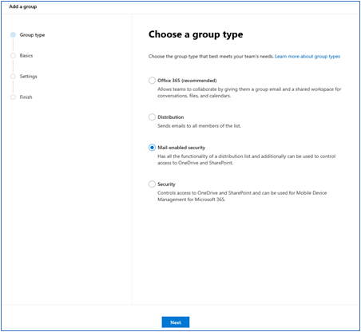
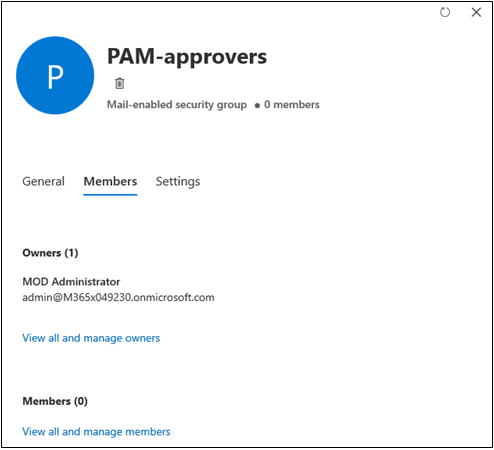
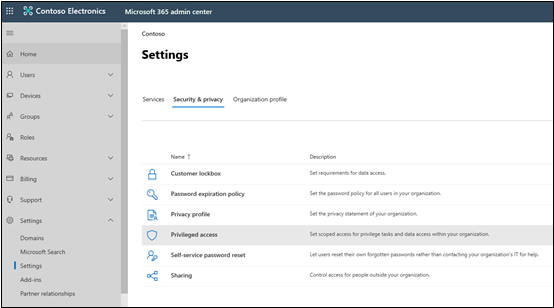
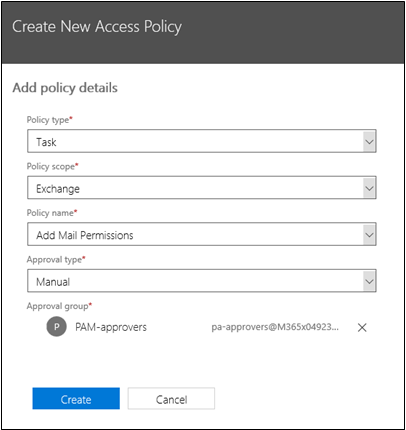
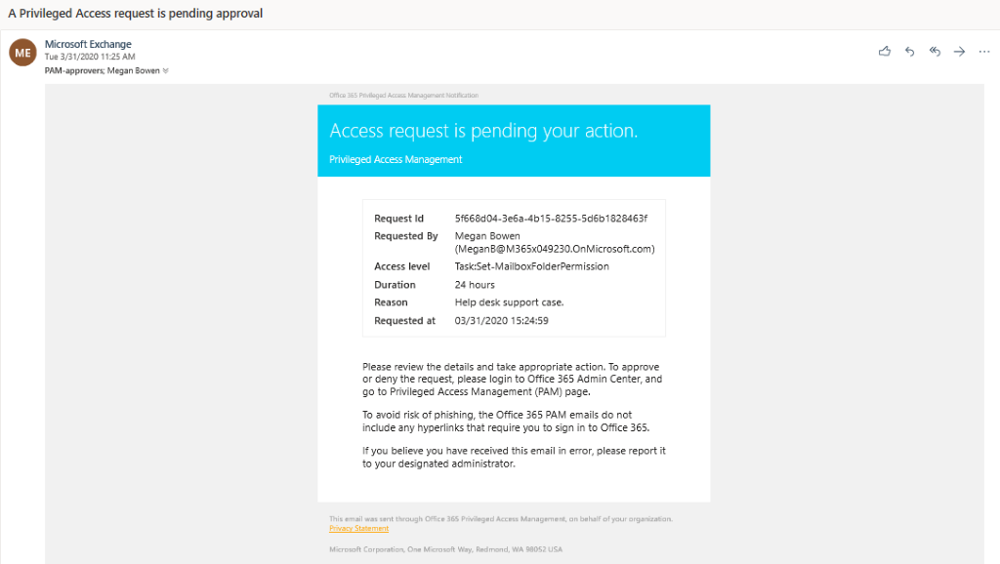
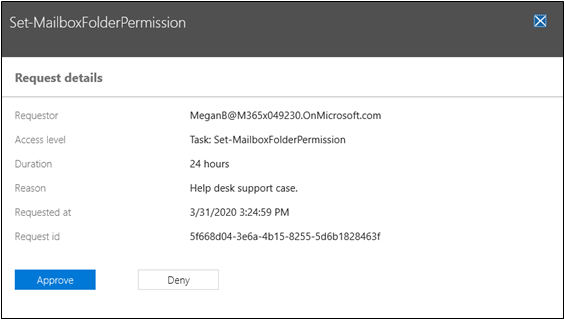
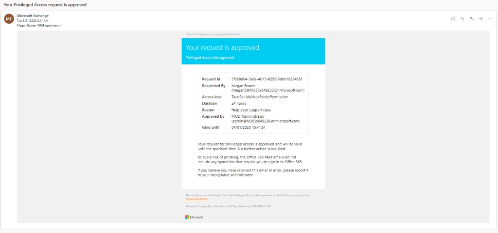

## Overview
The Contoso Corporation is a fictional organization that needs to configure privileged access policies to provide users with just-enough-access to perform elevated tasks, without risking exposure of sensitive data or critical configuration settings.  

This case study will cover the basics for configuring a privileged access policy. This guidance includes four steps: 

1. Creating an approvers group  
1. Enabling privileged access  
1. Creating an access policy  
1. Submitting and approving access policy requests  

## Step 1 – Creating an approvers group 
Contoso IT administrators attended online webinars about privileged access management in Office 365 and decided that access policies will help them meet the updated corporate policy requirements for mitigating risk in the organization. Their plan includes identifying: 
 
- The users who need approval authority for incoming requests for access to elevated and privileged tasks.  
- The users who will manage access requests. 
 
### Licensing 
 
The first step is to confirm that Contoso's licensing includes support for privileged access management. To enable and configure privileged access policies, Contoso IT administrators need to verify that users submitting and responding to privileged access management requests are assigned an appropriate license. Office 365 E5/A5, Microsoft 365 E5/A5, Microsoft 365 E5/A5 Compliance, and Microsoft 365 E5/A5 Insider Risk Management provide the rights for a user to benefit from privileged access management. 
 
### Creating the approver’s group 
1. Contoso IT administrators sign into the  [Microsoft 365 Admin Center](https://admin.microsoft.com/?azure-portal=true). 
 
1. In the admin center, they select **Groups > Groups > Add a group** which opens the **Choose a group type** flyout page. 
 
1. They select **mail-enabled security group** and then complete the **Name**, **Group email address**, and **Description** fields for the new group in the **Add a group wizard**.   
 
         
 
1. When finished, they click the **Create group** button at the end of the wizard.  It may take a few minutes for the group to be fully configured and to appear in the Microsoft 365 admin center. 
 
      
 
1. After the group is created, they select the new approvers group which opens the details page for that group. 
 
1. To add users to the group, they navigate to the **Members** tab, select the **View all and manage members** link, then click **Add members** to add users to the group. 
 
       
 
## Step 2 – Enabling privileged access   
After creating the approvers group, Contoso IT administrators must explicitly enable privileged access in Office 365 with the group you assign as the default approvers group. This procedure is also performed in the  [Microsoft 365 Admin Center](https://admin.microsoft.com/?azure-portal=true).  

1. In the admin center, go to **Settings** > **Settings** > **Security & Privacy** > **Privileged access**. 
  
       

1. To enable privileged access they toggle the **Require approvals for privileged tasks**  control to the **On** setting, assign the approver's group created in Step 1 as the default approvers group, then click **Save**. 

      

 
## Step 3 – Creating an access policy 
With all the prerequisites completed, the IT administrators Contoso are ready to create privileged access policies. Note, you can create and configure up to 30 privileged access policies for your Office 365 organization.  
1. The Contoso IT administrators sign into the [Microsoft 365 Admin Center](https://admin.microsoft.com/?azure-portal=true) and go to **Settings** > **Security & Privacy** > **Privileged access**. This action opens the **Privileged access** flyout page.  
1. On the **Privileged access** flyout page, they click on the **Manage access policies and requests** link which opens a new window where they select **Configure policies**, then **Add a policy**. 
1. On the **Create New Access Policy** page, they complete the fields as required by their organization: 
   - **Policy type**: Task, Role, or Role Group 
   - **Policy scope**: Exchange 
   - **Policy name**: Select from the available policies 
   - **Approval type**: Manual or Auto 
   - **Approval group**: Select the approvers group created in Step 1
 
       

1. When finished, they click **Create**, then **Close**.  

## Step 4 – Submitting and approving access policy requests 
Once enabled, privileged access requires approvals for any task that has an associated approval policy defined. For tasks included in an approval policy, users must request and be granted access approval to have permissions necessary to execute the task.  

After approval is granted, the requesting user can execute the intended task and privileged access will authorize and execute the task on behalf of the user. The approval remains valid for the requested duration (default duration is 4 hours), during which the requester can execute the intended task multiple times. All such executions are logged and made available for security and compliance auditing. 

> [!NOTE]
> Requests for privileged access are valid for up to 24 hours after the request is submitted. If not approved or denied, the requests expire and access is not approved. 

### Requesting elevation authorization to execute privileged tasks 
1. When users need to submit an access policy request, they sign in to the  [Microsoft 365 Admin Center](https://admin.microsoft.com/?azure-portal=true) with their administrator credentials and go to **Settings** > **Security & Privacy** > **Privileged access**.  
 
1. On the **Privileged access** flyout page, they select the **Manage access policies and requests** link, then click **New request**.  
 
1. On the **New access request** page, they complete the required fields:  
 
   - **Request type**: Task, Role, or Role Group 
   - **Request scope**: Exchange 
   - **Request for**: Select from the available policies 
   - **Duration (hours)**: Number of hours of requested access. There is not a limit on the number of hours that can be requested. 
   - **Comments**: Text field to enter your reason for access. 

### View status of elevation requests 
After an approval request is submitted, users can view the status of their request in the admin center by navigating to **Settings** > **Security & Privacy** > **Privileged access** and selecting the **Manage access policies and requests** link. The resulting page will display either **Pending**, **Approved**, **Denied**, or **Customer Lockbox**  status. 
 
    

### Approving or denying an elevation authorization request 
When an approval request is created, members of the approver group receive an email notification similar to the one below:  
 
   
 
Members of the approver group can either approve or deny the request in the Microsoft 365 admin center by navigating to **Settings** > **Security & Privacy** > **Privileged access** and selecting the **Manage access policies and requests** link to view the list of pending requests. Selecting a request opens the **Request details** page for that request and the approver can either select **Approve** or **Deny**. 
 
 

The requestor is subsequently notified of the request approval or denial via email.  
  

   

   
## Learn more
[Privileged access management click thru demo](https://content.cloudguides.com/guides/Privileged Access Management?azure-portal=true)