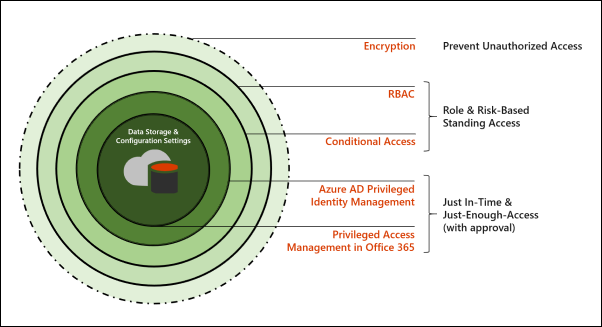
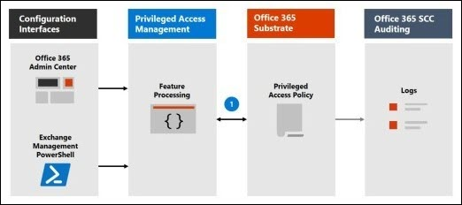
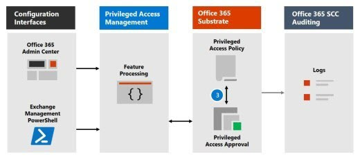

Privileged access management allows granular access control over privileged admin tasks in Microsoft 365, specifically in Exchange Online. It can help protect your organization from breaches that use existing privileged admin accounts with standing access to sensitive data or access to critical configuration settings.  
Privileged access management is based on the principle of Zero Standing Access, which requires users to request just-in-time access to complete elevated and privileged tasks and access requests must be approved by an authorized set of approvers. This configuration gives users just-enough-access to perform the task at hand, without risking exposure of sensitive data or critical configuration settings. Enabling privileged access management in Office 365 allows your organization to operate with zero standing privileges and provide a layer of defense against standing administrative access vulnerabilities in Exchange Online. 

Watch the video below for a quick overview of privileged access management in Office 365. 

> [!NOTE]
> This feature is a capability included with:
>  -	Microsoft 365 E5 
>  -	Microsoft 365 E5 Compliance 
>  -	Microsoft 365 E5 Insider Risk Management 
> 
> Please review [Microsoft 365 licensing guidance for security & compliance](https://docs.microsoft.com/office365/servicedescriptions/microsoft-365-service-descriptions/microsoft-365-tenantlevel-services-licensing-guidance/microsoft-365-security-compliance-licensing-guidance?azure-portal=true) to identify required licenses for your organization.

## Layers of protection 
Privileged access management complements other data and access feature protections within the Office 365 security architecture. Including privileged access management as part of an integrated and layered approach to security provides a security model that maximizes protection of sensitive information and Office 365 configuration settings. As shown in the diagram, privileged access management builds on the protection provided with native encryption of Office 365 data and the role-based access control security model of Office 365 services. When used with [Azure AD Privileged Identity Management](https://docs.microsoft.com/azure/active-directory/active-directory-privileged-identity-management-configure?azure-portal=true), these two features provide access control with just-in-time access at different scopes. 
 
  
 
Privileged access management in Microsoft 365 is defined and scoped at the *task* level, while Azure AD Privileged Identity Management applies protection at the *role* level with the ability to execute multiple tasks. Azure AD Privileged Identity Management primarily allows managing accesses for AD roles and role groups, while privileged access management in Microsoft 365 applies only at the task level. 
 
- **Enabling privileged access management while already using Azure AD Privileged Identity Management**: Adding privileged access management in Office 365 provides another granular layer of protection and audit capabilities for privileged access to Office 365 data. 
- **Enabling Azure AD Privileged Identity Management while already using privileged access management**: Adding Azure AD Privileged Identity Management to privileged access management can extend privileged access to data outside of Microsoft 365 that’s primarily defined by user roles or identity. 
 
## Privileged access management architecture and approval workflow 
 
Each of the following process flows outline the architecture of privileged access and how it interacts with Microsoft 365 auditing and the Exchange Management run space.  

### Step 1: Configure a privileged access policy 
When you configure a privileged access policy with the [Microsoft 365 admin center](https://admin.microsoft.com/?azure-portal=true) or Exchange Online PowerShell, you define the policy and the privileged access feature processes and the policy attributes in the Office 365 substrate. The activities are logged in the Office 365 Security and Compliance Center. The policy is now enabled and ready to handle incoming requests for approvals. 

   

### Step 2: Access request 
In the Microsoft 365 admin center or with the Exchange Online PowerShell, users can request access to elevated or privileged tasks. The privileged access feature sends the request to the Office 365 substrate for processing against the configured privilege access policy and records the activity in the Office 365 Security and Compliance Center logs. 
  
     
 
### Step 3: Access approval 
An approval request is generated and the pending request notification is emailed to approvers. If approved, the privileged access request is processed as an approval and the task is ready to be completed. If denied, the task is blocked and no access is granted to the requestor. The requestor is notified of the request approval or denial via email message.
 
         
 
### Step 4: Access processing 
For an approved request, the task is processed by the Exchange Management runspace. The approval is checked against the privileged access policy and processed by the Office 365 substrate. All activity for the task is logged in the Office 365 Security and Compliance Center. 

    
 
The approval workflow can also be illustrated as follows: 

      
 
## Learn more
- [Introducing privileged access management in Office 365](https://www.microsoft.com/videoplayer/embed/RE4xqtC?azure-portal=true) 
- [What is Azure AD Privileged Identity Management?](https://docs.microsoft.com/azure/active-directory/privileged-identity-management/pim-configure?azure-portal-true)
