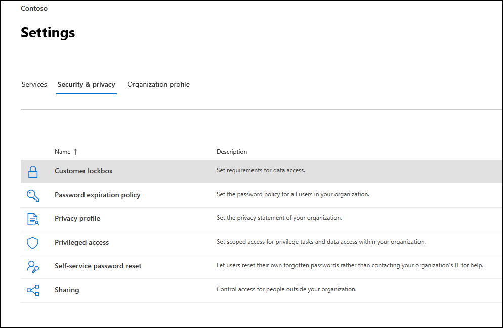
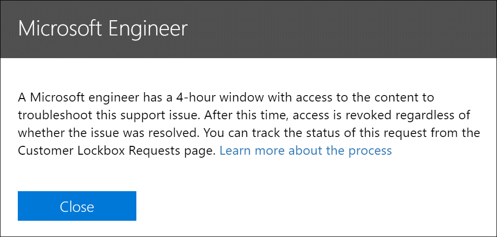

## Turning Customer Lockbox controls on or off
You can turn on Customer Lockbox controls in the Microsoft 365 admin center. When you turn on Customer Lockbox, Microsoft must obtain your organization’s approval before accessing any of your tenants' content.

1. To turn on Customer Lockbox, anyone with a work or school account who has been granted the global administrator role or someone assigned the Customer Lockbox access approver admin role signs in to the [Microsoft 365 admin center](https://admin.microsoft.com?azure-portal=true) and selects **Settings > Settings > Security & privacy**.

    

2. Selecting Customer lockbox opens the Customer lockbox flyout page where you can toggle the setting to be On or Off by using the Require approval for all data requests checkbox and clicking Save changes. 

     

## Approve or deny a Customer Lockbox request
1. To approve or deny a Customer Lockbox request from Microsoft, someone with a work or school account who has been granted the global administrator role or has been assigned the Customer Lockbox access approver role signs in to the [Microsoft 365 admin center](https://admin.microsoft.com?azure-portal=true) and selects **Support > Customer Lockbox Requests**. 

    

1. To display a list of Customer Lockbox requests, the customer selects **Customer Lockbox Requests** from the **Support** menu. The customer can then select the appropriate request and choose either **Approve** or **Deny**.

     

1. A confirmation message about the approval of the Customer Lockbox request is displayed.

     

## Auditing Customer Lockbox requests
Actions related to accepting or denying a Customer Lockbox request and actions performed by Microsoft engineers (when access requests are approved) are logged in the audit log. You can access these logs by using the audit log search tool in the Security & Compliance Center. 

### Audit record for a Customer Lockbox access request
When a person in your organization approves or denies a Customer Lockbox request, an audit record is logged in the Office 365 audit log. This record contains the following information.

| Audit record property  | Description  |
|---|---|
|  Date	 |  The date and time when the Customer Lockbox request was approved or denied. |
|  IP address | 	The IP address of the machine the approver used to approve or deny a request.  |
|  User |  The service account BOXServiceAccount@[tenantforest].prod.outlook.com. |
|  Activity |  **Set-AccessToCustomerDataRequest**; this is the auditing activity that is logged when you approve or deny a Customer Lockbox request. |
|  Item |  The GUID of the Customer Lockbox request |
	
### Audit record for an action performed by a Microsoft engineer
The actions performed by a Microsoft engineer after a Customer Lockbox request is approved (and that may result in accessing customer content) are logged in the audit log. These records contain the following information.

| Audit record property  | Description  |
|---|---|
|  Date	 |  The date and time when the action was performed. Note that the time that this action was performed will be within 4 hours of when the Customer Lockbox request was approved. |
|  IP address | The IP Address of the machine Microsoft engineer used. |
|  User |  Microsoft Operator; this value indicates that this record is related to a Customer Lockbox request.|
|  Activity |  Name of the activity performed by the Microsoft engineer. |
|  Item |  \<empty\> |

## Searching the audit log
Before you can search the audit log, you must first turn on audit logging. To turn it on, go to the [Security & Compliance Center](https://protection.office.com?azure-portal=true), then click **Search > Audit log search > Turn on auditing.** If you do not see the link for **Turn on auditing**, then auditing has already been turned on for your organization. After you turn it on, a message is displayed that says the audit log is being prepared and that you can run a search in a couple of hours after the preparation is complete. You only have to do this once. For more information, see [Turn audit log search on or off](https://docs.microsoft.com/microsoft-365/compliance/turn-audit-log-search-on-or-off?view=o365-worldwide?azure-portal=true).

You also have to be assigned the View-Only Audit Logs or Audit Logs role in Exchange Online to search the audit log. By default, these roles are assigned to the Compliance Management and Organization Management role groups on the **Permissions** page in the [Exchange admin center](https://outlook.office365.com/ecp/?azure-portal=true). Individuals with work or school accounts that are assigned the global admin role are automatically added as members of the Organization Management role group in Exchange Online. 

> [!NOTE]
> You must assign the permissions in Exchange admin center and not on the Permissions page in the Security & Compliance Center. This is because the underlying cmdlet used to search the audit log is an Exchange Online cmdlet.

Once auditing has been turned on, an administrator with the appropriate permissions can perform the following steps:
1.	Run an audit log search.
2.	View the search results.
3.	Filter the search results.
4.	Export the search results to a file. 

For more information about the process and the types of activities you can search for, see [Search the audit log in the Security & Compliance Center](https://docs.microsoft.com/microsoft-365/compliance/search-the-audit-log-in-security-and-compliance?view=o365-worldwide?azure-portal=true).
