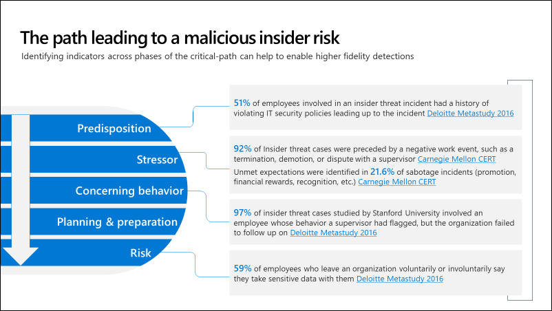
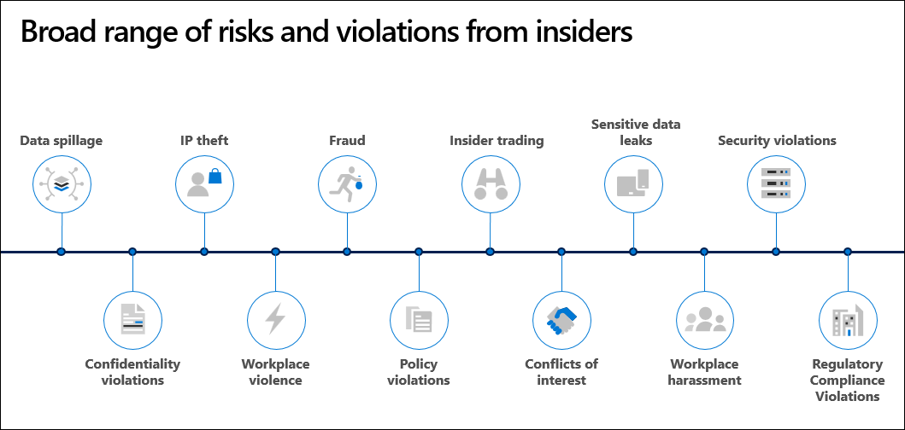
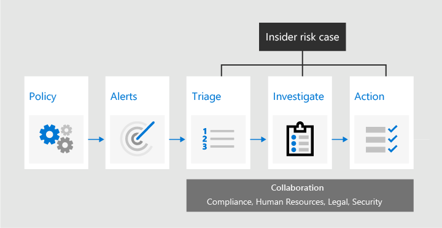

In March of 2019, a large auto manufacturer with state-of-the-art, proprietary operations and technology filed a lawsuit against four former employees and a competitor for corporate espionage. The lawsuit was filed after discovering that the employees had downloaded proprietary warehouse schematics and operational procedures before leaving the company and shared them with the competitor.

Trusting employees is key to fostering a dynamic and productive workplace. But with trust also comes risk. Companies need to be able to quickly identify and manage risk from insiders (employees or contractors with corporate access) to minimize the negative impact to their business. Insider threats and risks from illegal, inappropriate, unauthorized, or unethical behavior and actions are a major issue for all companies and can easily go undetected until it is too late. A survey by Crowd Research Partners in 2018 indicated that 90% of organizations feel vulnerable to insider risks and 53% confirmed insider risks against their organization in the previous 12 months. According to a Carnegie Mellon CERT study, 92% of insider threat cases were preceded by a negative work event, such as a termination, demotion, or dispute with a supervisor. And in 2016, Deloitte reported that 59% of employees who leave an organization voluntarily or involuntarily say they take sensitive data with them and that 51% of employees involved in an insider threat incident had a history of violating IT security policies leading up to the incident.

The financial impact of insider threats is substantial, as companies suffer market, legal, reputational, and productivity losses. According to the Ponemon Institute, the average cost of an insider incident arising from negligence is over USD307,000. If the insider is malicious, it's over USD750,000. Aside from financial loss, the impacts of insider risk can include damage to brand and reputation, competitive disadvantage, noncompliance with regulations, and loss of market share.

Traditional approaches to identifying insider risks such as user behavior analytics, monitoring user activity, and data loss prevention can suffer from limitations such as complex deployment scenarios, limited insights, and a lack of workload integration beyond SecOps.

The insider risk management solution in Microsoft 365 leverages the Microsoft Graph, security services and connectors to human resources (HR) systems like SAP, to obtain real-time native signals such as file activity, communications sentiment, abnormal user behaviors, and resignation date. A set of configurable policy templates tailored specifically for risks – such as digital IP theft, confidentiality breach, and HR violations – use machine learning and intelligence to correlate these signals to identify hidden patterns and risks that traditional or manual methods might miss. These built-in policy templates allow you to identify and mitigate risky activities while balancing employee privacy versus organization risk with privacy-by-design architecture. Finally, end-to-end integrated workflows ensure that the right people across security, HR, legal, and compliance are involved to quickly investigate and take action once a risk has been identified.

Watch the video below to learn how insider risk management can help your organization prevent, detect, and contain risks while prioritizing your organization values, culture, and employee experience:
>
> [!VIDEO https://www.microsoft.com/videoplayer/embed/RE4xnQE]

> [!NOTE]
> This feature is a capability included with:
>
> - Microsoft 365 E5
> - Microsoft 365 E5 Compliance
> - Microsoft 365 E5 Insider Risk Management
>
> Please review [Microsoft 365 licensing guidance for security & compliance](/office365/servicedescriptions/microsoft-365-service-descriptions/microsoft-365-tenantlevel-services-licensing-guidance/microsoft-365-security-compliance-licensing-guidance?azure-portal=true) to identify required licenses for your organization.

## Risk Pain Points in the Modern Workplace

Managing and minimizing risk in your organization starts with understanding the types of risks found in the modern workplace. Some risks are driven by external factors such as bad actors who try to steal employee credentials through brute force or phishing attacks. Other risks are driven by internal events and employee activities that can be eliminated and avoided. Some examples of internal risks from employees include:

- Intellectual property (IP) theft
- Espionage
- Leaks of sensitive business assets
- Confidentiality violations
- Sabotage
- Fraud
- Insider trading
- Code-of-conduct violations
- Regulatory compliance violations

Insider risks vary by industry. In healthcare, internal fraud is the most frequently cited type of risk, while sabotage represents the greatest risk to IT businesses.

The path leading to a malicious insider risk varies. It may be an employee who has a history of violating IT security policies, a negative work event such as termination or a dispute with a supervisor, or employees who take sensitive data before leaving the company voluntarily or involuntarily.

## Common insider risk scenarios

The insider risk management solution in Microsoft 365 can help you detect, investigate, and take action to mitigate internal risks in your organization in common scenarios, such as:

- **Data theft by departing employee.** When employees leave an organization, either voluntarily or as the result of termination, there is often legitimate concerns that company, customer, and employee data are at risk. Employees may innocently assume that project data isn't proprietary, or they may be tempted to take company data for personal gain and in violation of company policy and legal standards.
- **Leak of sensitive or confidential information.** In most cases, employees try their best to properly handle sensitive or confidential information. But occasionally employees make mistakes and information is accidentally shared outside your organization or in violation of your information protection policies. Sometimes employees may intentionally leak or share sensitive and confidential information with malicious intent and for potential personal gain.
- **Actions and behaviors that violate corporate policies.** Employee-to-employee communications are often a source of inadvertent or malicious violations of corporate policies. These violations can include offensive language, threats, and cyber-bullying between employees. This type of activity contributes to a hostile work environment and can result in legal actions against both employees and the larger organization.

## Insider risk management workflow

Using policy templates with pre-defined conditions and comprehensive activity signaling across the Microsoft 365 service, you can use actionable insights to quickly identify and resolve risky behavior.

Identifying and resolving internal risk activities and compliance issues with insider risk management in Microsoft 365 uses the following workflow:

**1. Policies.** Insider risk management policies determine which employees are in-scope and which types of risk indicators are configured for alerts.

**2. Alerts.** Insider risk management alerts are automatically generated by risk indicators defined in insider risk management policies. These alerts give compliance analysts and investigators an all-up view of the current risk status and allow your organization to triage and take actions for discovered risks.

**3. Triage.** Reviewers can quickly identify insider risk alerts and examine each to evaluate and triage. Alerts are resolved by opening a new case, assigning the alert to an existing case, or dismissing the alert.

**4. Investigate.** Cases are manually created from alerts in the situations where further action is needed to address an issue for an employee.

**5. Action.** After investigating the details of a case, you can take action by sending the employee a notice, resolving the case as benign, or escalating to a data or employee investigation.

## Learn more

- [Crowd Research Partners, Insider Threat Report](https://crowdresearchpartners.com/portfolio/insider-threat-report/?azure-portal=true)
- [Carnegie Mellon CERT study: The "Big Picture" of Insider IT Sabotage Across U.S. Critical Infrastructures](https://resources.sei.cmu.edu/asset_files/TechnicalReport/2008_005_001_14981.pdf?azure-portal=true)
- [Carnegie Mellon University: Insider Threats in Healthcare](https://insights.sei.cmu.edu/insider-threat/2019/02/insider-threats-in-healthcare-part-7-of-9-insider-threats-across-industry-sectors.html?azure-portal=true)
