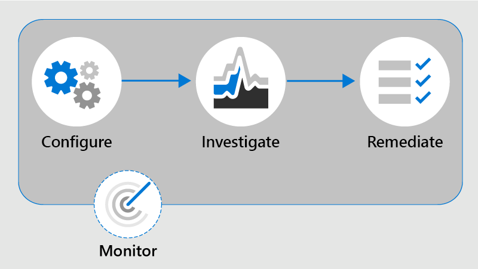

The workflow for identifying and resolving compliance issues with communication compliance in Microsoft 365 can be broken down into four phases:
1. Configure communication compliance policies.
1. Investigate issues detected as matching your communication compliance policies.
1. Remediate the compliance issues you’ve investigated.
1. Monitor to continually evaluate and improve your compliance posture.

 

### Configure
In this first phase, you identify your compliance requirements and configure communication compliance policies. The built-in policy templates enable you to quickly create and configure a new compliance policy. The templates can be customized so that you can modify and update policies as your requirements change. For example, you may want to quickly test a policy for offensive language and anti-harassment on communications for a small group of users before configuring a policy for all users in your organization.

### Investigate
In the second phase, you use the Microsoft 365 compliance center to look deeper into the issues detected as matching your communication compliance policies. The communication compliance dashboard enables you to leverage the following actions:
- **Alerts**: When a message matches a policy, an alert is automatically generated. For each alert, you can see the status, the severity, the time detected, and if a case is assigned and its status. Alerts are listed in order of severity and displayed on the communication compliance home page and the **Alerts** page.
- **Issue management**: For each alert, you can take investigative actions to help remediate the issue detected in the message.
- **Document review:** During the investigation of an issue, you can use several types of views to help properly evaluate the detected issue. The views include a conversation summary, text-only, annotated, and detail views of the communication conversation.
- **Reviewing user activity history**: View the history of user message activities and remediation actions for policy matches such as past notifications and escalations.
- **Filters**: Use filters such as sender, recipient, date, and subject to quickly narrow down the message alerts you want to review.

### Remediate
The third phase is to remediate communication compliance issues you've investigated using the following options:
- **Resolve**: After reviewing an issue, you can remediate by resolving the alert. Resolving an alert removes it from the pending alert queue, and the action is preserved as an entry in the **Resolved** queue for the matching policy. Alerts are automatically resolved after marking the alert as a false positive, sending a notice to an employee about the alert, or opening a new case for the alert.
- **Tag a message**: As part of the resolution of an issue, you can tag the detected message as compliant, non-compliant, or as questionable as it relates to the policies and standards for your organization. Tagging can help you micro-filter policy alerts for escalations or as part of other internal review processes.
- **Notify the user**: Users often violate a communication compliance policy by accident or without intent. You can use the notify feature to provide a warning notice to the user and to resolve the issue.
- **Escalate to another reviewer**: Sometimes, the initial reviewer of an issue needs input from other reviewers to help resolve the incident. You can easily escalate message issues to reviewers in other areas of your organization as part of the resolution process.
- **Mark as a false positive**: Messages incorrectly detected as matches of compliance policies will occasionally slip through to the review process. You can mark these types of alerts as false positives which automatically resolves the issue.
- **Create a case**: In the most serious situations, you may need to share communication compliance information with other reviewers in your organization. Communication compliance is tightly integrated with other Microsoft 365 compliance features to help you with end-to-end risk resolution. For example, escalating a case for investigation allows you to transfer data and management of the case to Advanced ' in Microsoft 365. Advanced ' provides an end-to-end workflow to preserve, collect, review, analyze, and export content that's responsive to your organization's internal and external investigations. It allows legal teams to manage the entire legal hold notification workflow. To learn more about Advanced ' cases, see [Overview of Advanced ' in Microsoft 365](/microsoft-365/compliance/overview-'-20?azure-portal=true).
### Monitor
As alerts are generated and investigation and remediation actions are implemented, existing policies may need review and some customization, and new policies may need to be created. Use communication compliance dashboards, reports, export logs, and events recorded in the unified audit logs to continually evaluate and improve your compliance posture. 
